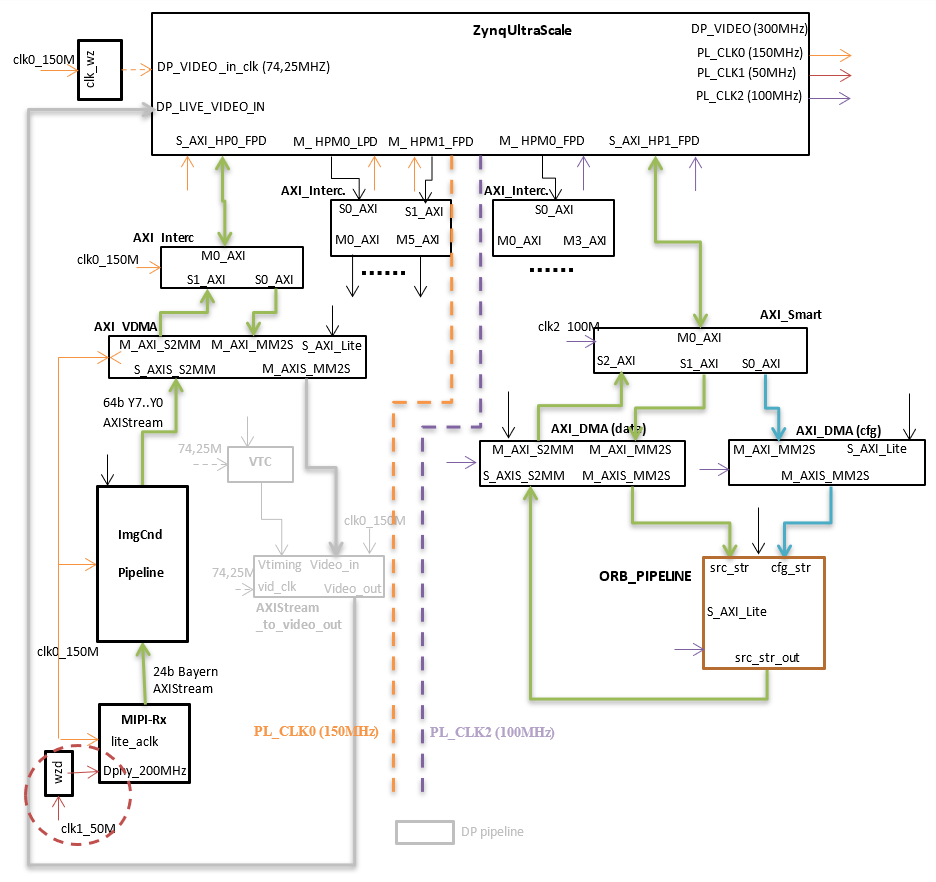
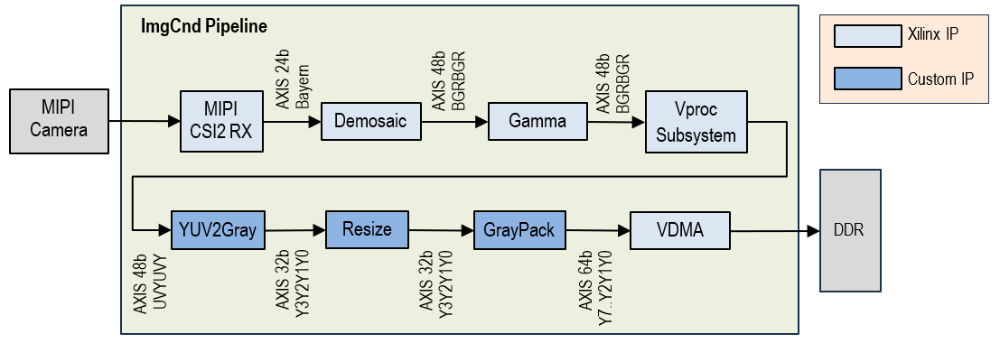
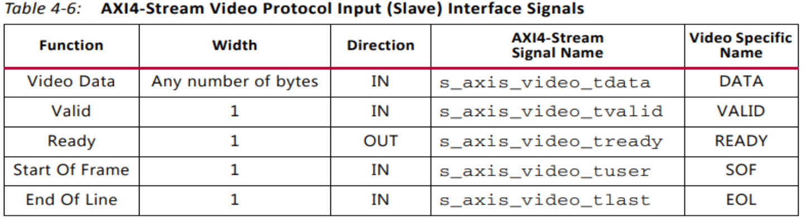
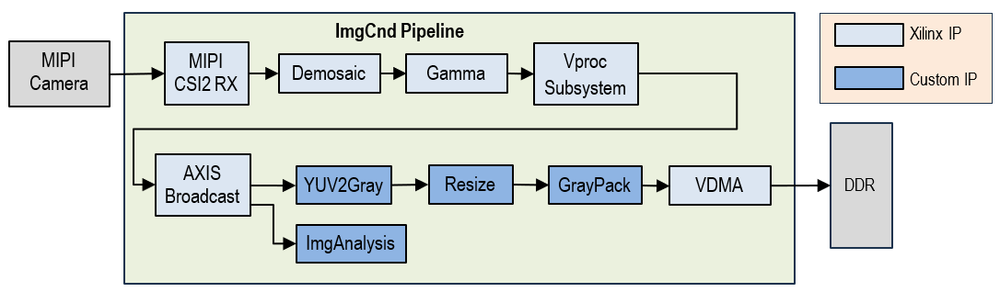
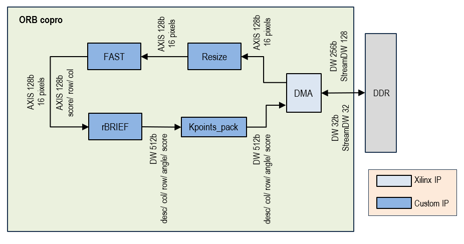

# VBN: HW_stack
- [VBN: HW\_stack](#vbn-hw_stack)
  - [Descripción](#descripción)
    - [ImgCnd pipeline](#imgcnd-pipeline)
      - [Stream de video:](#stream-de-video)
      - [Componentes del pipeline (IPs):](#componentes-del-pipeline-ips)
    - [ORB copro](#orb-copro)

**IMPORTANTE:**
Los testbench HLS deberían estar en el repo !!!

## Descripción
El hardware de VBN está basado en el MPSoC Zynq UltraScale+.
Ver [documento de diseño detallado](./pdfs/3.ac^2SLAM_arquitectura.pdf).

Consta de dos bloques:
- SoC (**PS**) con procesadores ARM CortexA53 @1.2GHz, L1 32KB, L2 1MB (compartida) e incluye diversos interfaces y periféricos (UART, CAN, ....) así como las infraestructuras de interconexión con la lógica programable 
- Lógica programable (**PL**) que implementa los bloques necesarios para la catura de imagen (ImgCnd) y para la aceleración del cálculo de los descriptores ORB (ORB copro).

En la siguiente figura puede verse los detalles de implementación de la PL.

Cada pipeline funciona a una frecuencia distinta y la configuración de sus IPs se realiza por software a través de interfaces AXILite.
Además es posible añadir un tercer pipeline para visualización de las imágenes capturadas a través de DisplayPort.

- **ImgCnd_pipeline**: realiza la captura y acondicionamiento de las imágenes y las envía a la DDR para su consumo por el Sw.
- **ORB_copro**: recibe imágenes en niveles de gris, realiza la extracción de los descriptores ORB y los envía a la DDR para su procesamiento por el Sw.

Ambos están conectados a la DDR mediante interfaces de High Performance (HP) que soportan transferencias a gran velocidad. 

Ver [**_análisis_**](./pdfs/3.ac^2SLAM_arquitectura.pdf) inicial para diseño del hardware. Incluye estimaciones de ocupación.

### ImgCnd pipeline
Este pipeline realiza la captura y el acondicionamiento de las imágenes que envía la cámara [modelo](https://github.com/user/repo/camara.pdf) a través de un interfaz MIPI.

Ver [**_análisis_**](./pdfs/4.Diseño_ImgConditioning.pdf) para configuración de IPs, depuración con PYNQ y proyecto de referencia utilizado.

#### Stream de video:
Una vez decodificado el MIPI stream, las imágenes se transmiten dentro del pipeline siguiendo el [protocolo de video de Xilinx para AXI-Stream](https://docs.amd.com/v/u/en-US/ug1037-vivado-axi-reference-guide) (Video IP: AXI Feature Adoption). Básicamente los pixels se empaquetan en el bus de datos del AXIS y se utilizan las señales `tuser` y `tlast` para indicar el inicio de frame (`SOF`) y el fin de línea (`EOL`) respectivamente. Cualquier IP que se añada al pipeline debe soportar este protocolo.

#### Componentes del pipeline (IPs):

Ver [documento de diseño](./pdfs/4.Diseño_ImgConditioning.pdf) del ImgCnd pipeline.

- [MIPI CSI-2 Receiver Subsystem IP](https://docs.xilinx.com/r/en-US/pg232-mipi-csi2-rx): receptor de datos vía MIPI, realiza la decodificación de las imágenes y genera un stream de video según la especificación Xilinx AXI Video Stream.
- [Demosaic IP](https://docs.amd.com/r/en-US/pg286-v-demosaic/Introduction): transforma la imagen en formato RAW10 (Bayern pattern) a formato BGR888 y empaqueta los pixels de dos en dos (48b). 
- [Gamma_LUT IP](https://docs.amd.com/r/en-US/pg285-v-gamma-lut): realiza el ajuste gamma de la imagen y procesa los pixels a 2pixels/ciclo.
- [Video Processing Subsystem IP](https://docs.xilinx.com/r/en-US/pg231-v-proc-ss): realiza la conversión del espacio de color: BGR8 a YUV. Ver [**_análisis_**](./pdfs/4.Diseño_ImgConditioning.pdf) para configuración en modo "color space conversion".

[*Para incluir un link a un issue del mismo proyecto ver*](https://stackoverflow.com/questions/16539687/github-readme-reference-issue)
- [YUV2Gray IP](https://github.com/embention/DAA/tree/develop/items/fpga_orb/items/fpga_yuv2gray_pack): genera un stream de 32b con la componente Y de cada pixel empaquetados de 4 en 4 como Y3Y2Y1Y0.
- [Resize IP](https://github.com/embention/DAA/tree/develop/items/fpga_orb/items/fpga_resize_scalern1): es el mismo IP utilizado en el ORB_copro. Realiza el re-escalado de la imagen a 640x480 pixels. Trabaja a 4pixels/ciclo. [issue #70](https://github.com/embention/DAA/issues/70).
- [GrayPack IP](https://github.com/embention/DAA/tree/develop/items/fpga_orb/items/fpga_yuv2gray_pack): empaqueta los pixels de 8 en 8 (64b) para su envío a través del VDMA
- [VDMA IP](https://docs.amd.com/v/u/en-US/ds799_axi_vdma): realiza la transferencia de la imagen (640x480, 8bits/pixel) vía DMA a la memoria DDR. Consta de un único canal de escritura. Ver [**_análisis_**](./pdfs/5.Integración_Acel-SwPipeline.pdf) para driver de acceso a buffer DMA.

*Módulos adicionales (por integrar)*
- [ImgAnalysis IP](https://github.com/embention/DAA/tree/develop/items/fpga_orb/items/fpga_yuv2gray_pack): calcula las estadísticas de la imagen para ser empleadas en el ajuste de la cámara (tiempo de exposición). Este IP no genera stream de salida. Los estadísticos que calcula son accesibles por el software vía interfaz AXILite. [issue #260](https://github.com/embention/DAA/issues/260), [issue #255](https://github.com/embention/DAA/issues/255).

En ese caso el pipeline quedaría de la siguiente forma:

Es necesario añadir el [IP AXIBroadcaster](https://docs.amd.com/r/en-US/pg085-axi4stream-infrastructure/AXI4-Stream-Broadcaster?tocId=lTRZ8UtIrjz6JIc8NcwYXg) que duplica el stream de entrada en dos stream de salida idénticos. El primero alimenta el pipeline original y el segundo se conecta al IP de análisis. 

### ORB copro
Este pipeline procesa las imágenes (640x480, 8b/pixel) para extraer sus descriptores a distintas escalas. Su diseño se basa en el proyecto [ac^2SLAM](https://github.com/SLAM-Hardware/acSLAM). Ver [**_análisis_**](./pdfs/1.ORB-SLAM.pdf) de diseño de coprocesador ORB y artículos de [estado del arte](https://github.com/DAA/docs/pdfs/refs/).

Los IPs de este proyecto están parametrizados para trabajar a distinto nivel de paralelismo (npixels/ciclo) y con distinto nivel de ocupación en la FPGA. Ver [**_análisis_**](./pdfs/3.ac^2SLAM_arquitectura.pdf) de ocupación y selección de modelo de FPGA. 

Consta de los siguientes IP:
- Resize IP: realiza el down-scale de las imágenes. La escala y el tamaño de la imagen de entrada es configurable a través del interfaz AXILite. La versión implementada trabaja a 16pixels/ciclo.

- FAST IP: genera 2 streams: uno con el score de las features (128b que incluyen el score y sus coordenadas) y otro con la imagen suavizada (blur).

- rBRIEF IP: calcula el descriptor de la feature y lo transmite junto con su orientación (ángulo) y el score. Cada descriptor asociado a un keypoint ocupa 512b.

- [Kpoints_pack IP](https://github.com/embention/DAA/tree/develop/items/fpga_orb/items/fpga_kpoints_pack): reorganiza la información en el stream para facilitar el acceso por el software. Ver [issue #496](https://github.com/embention/DAA/issues/496) de diseño y verificación del IP.

