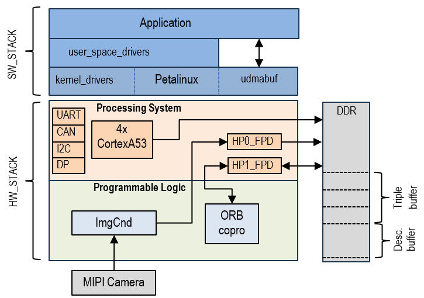

# Plataforma VBN para MVP
- [Descripción](#descripción)
- [Requisitos](#requisitos)
- [Implementación del Hw](#implementación-del-hw)
- [Compilación del Sw](#compilación-del-sw)
- [Anaĺisis y optimizaciones](#análisis-y-optimizaciones)


## Descripción 
En esta parte se documenta la plataforma VBN para el **MVP** (Minimum Viable Product). La arquitectura que da soporte al proyecto esta basada en el SO Linux y el SoC de la familia Zynq UltraScale+. En la figura 1 se muestran los componentes del Sw y Hw de la arquitectura.




### VBN: hw_stack
El hardware de VBN está basado en el MPSoC Zynq UltraScale+.
Consta de dos bloques:
- SoC (**PS**) con procesadores ARM CortexA53 @1.2GHz, L1 32KB, L2 1MB (compartida) e incluye diversos interfaces y periféricos (UART, CAN, ....) así como las infraestructuras de interconexión con la lógica programable 
- Lógica programable (**PL**) que implementa los bloques necesarios para la catura de imagen (ImgCnd) y para la aceleración del cálculo de los descriptores ORB (ORB copro).

Además se dispone de una memoria externa DDR. En esta memoria hay varias zonas compartidas para el intercambio de datos entre PS y PL: un **Triple buffer** para la captura y transferencia de imágenes hacia la PL, y un **Data buffer** para el paso de los descriptores hacia la PS.

La PL implementa dos pipelines de procesamiento:

- **ImgCnd_pipeline**: realiza la captura y acondicionamiento de las imágenes y las envía a la DDR para su consumo por el Sw.
- **ORB_copro**: recibe imágenes en niveles de gris, realiza la extracción de los descriptores ORB y los envía a la DDR para su procesamiento por el Sw.

Ambos están conectados a la DDR mediante interfaces de High Performance (HP) que soportan transferencias a gran velocidad. 

Ver [HW_stack: Descripción detallada](./HW_stack.md)


### VBN: sw_stack

El sw_stack consta de tres capas:
- En el nivel más bajo se encuentra el sistema operativo Petalinux donde se integran diversos drivers que permiten manejar los periféricos del SoC (I2C, UART, CAN, etc...) así como un driver para manejar las zonas de memoria compartida entre el PS y la PL ([udmabuf](https://github.com/ikwzm/udmabuf)).
- En un segundo nivel se encuentran los drivers que permiten manejar los IP de la PL. Estos drivers trabajan en el espacio de usuario y modifican los registros de los IPs mapeados en memoria. Normalmente estos drivers los proporciona Xilinx o la herramienta que implementa los IPs (p.ej: Vitis_HLS).
- En el tercer nivel está la aplicación de usuario. En este caso basada en el software ORB_SLAM (link).


Ver [SW_stack: descripción detallada](./SW_stack.md)

## Requisitos
Para la implementación de este proyecto son necesarias las siguientes herramientas:
- Vivado 2020.1
- Vitis  2020.1
- Vitis_HLS 2020.1
- Vivado_HLS 2019.1 (para ORB copro)
- Placas compatibles: Alinx AXU15EG,  ...
- Cámaras compatibles: IMX296LQR-C 


## Implementación del Hw
Instrucciones para la generación del proyecto vivado y su implememtación

## Compilación del Sw
Instrucciones para la generación del proyecto Petalinux y para la compilación de la applicación
### Petalinux project
Situarse dentro del directorio del proyecto de petalinux (items/sw_plnx/code/vbn_plnx/).

Ejecutar el siguiente comando dando la ruta del directorio donde se encuentra el XSA (no la ruta al xsa):
```
petalinux-config --get-hw-description [XSA dir]
```
En el apartado "Subsystem AUTO Hardware Settings" se encuentra la configuracion de la SD, el puerto serie y el ethernet.

El siguiente paso a ejecutar es:
```
petalinux-config -c kernel
```
- Si se requiere utilizar SSD hay que habilitarlo poniendo a "y" el siguiente campo: Devices Drivers > NVME Support > NVM Express block device.
- Si no hay ningun USB habilitado hay que desactivar el siguiente campo: Devices Drivers > USB support.

El siguiente paso a ejecutar es:
```
petalinux-config -c rootfs
```
Incluir cualquier software que sea necesario.

El siguiente paso a ejecutar es: 
```
petalinux-config -c u-boot
```
Desactivar el siguiente campo, si no hay ningun USB habilitado: Command line interface > Device access commands > UMS usb mass storage.

Finalmente hay que compilar y enpaquetar:

```
petalinux-build
petalinux-package --boot --force --fsbl images/linux/zynqmp_fsbl.elf --fpga images/linux/system.bit --u-boot
```

y en el directorio images/linux/ ya se encontraran los archivos necesarios: boot.scr, BOOT.bin e image.ub.


### App compilation

Toda las compilaciones se realizan con los scripts items/sw_gnssdenied/code/project/scripts/cross_build_X.sh.
Para ejecutarlos se requiere tener los sources de linux para Aarch64.
Antes de lanzarlos se requiere setear como variables de entorno las siguientes:
```
export COPROC=1
export VBN_THREAD=1
export VIEWER_DEBUG=0
export REMOTE_VIEWER=0
export VIEWER_CLIENT=0

export CROSS_ENVIROMENT=/usr/aarch64-xilinx-linux
export COMPILER_PREFIX=aarch64-linux-gnu-
export COPROC_VERBOSE="-DVERBOSE"
```
Los valores dependen de la configuracion que se quiera. 

El orden recomendado de compilacion es el siguiente:
- coproc
- wvlibs
- vproto
- orb_slam
- test


### Licencia Vivado

Documento para la gestion de las licencias:
https://docs.google.com/document/d/1DPxRjL48_FUIERWdWsWKBNW0nTGDu82N/edit?usp=drive_link&ouid=101102863740257825206&rtpof=true&sd=true

## Análisis y optimizaciones

### Análisis inicial
La primera versión de la plataforma incluye 3 pipelines:
- pipeline de captura/acondicionamiento (Imgcnd pipeline)
- pipeline del coprocesador ORB (ORB copro)
- pipeline software, básicamente corresponde con el hilo de tracking de SLAM. Consta de 4 etapas: ORB extraction / Pose prediction/ LM track / New KF decision. La etapa ORB extraction incluye el manejo del copro ORB.

Ver el [Documento de análisis inicial (30/04/2024)](./pdfs/7.RevisiónArquitectura.pdf), [issue #101](https://github.com/embention/DAA/issues/101).

**Comparativa tiempos de ejecución (ms)**

- Imagen entrada: 1440x1080

- Imagen procesada: 640x480, 8 escalas


<table><tr><th colspan="1" rowspan="2" valign="top"><b>pipe</b></th><th colspan="1" rowspan="2" valign="top"><b>etapa</b></th><th colspan="2" valign="top"><p><b>Jetson Orin</b></p><p>12x cortexA78@2.2GHz, L1 64K, L2 256K, L3 2MB</p></th><th colspan="4" valign="top"><p><b>Zynq UltraScale+</b></p><p>4x cortexA53@1.2 GHz L1 32K, L2 1MB(shared)</p></th></tr>
<tr><td colspan="1" valign="top"><p>1.1Ghz</p><p>(15w)</p></td><td colspan="1" valign="top"><p>2.2Ghz</p><p>(60w)</p></td><td colspan="1" valign="top"><p>1Ghz</p><p>Sw only</p></td><td colspan="1" valign="top"><p>1Ghz</p><p>copro</p></td><td colspan="1" valign="top"><p>1.2Ghz</p><p>Sw only</p></td><td colspan="1" valign="top"><p>1.2Ghz</p><p>copro</p></td></tr>
<tr><td colspan="1" rowspan="2"><b>CAPTURA</b></td><td colspan="1">Captura/ Acond./ Color conv./ Escalado/ VDMA</td><td colspan="1"></td><td colspan="1"></td><td colspan="1"></td><td colspan="1"></td><td colspan="1"></td><td colspan="1"></td></tr>
<tr><td colspan="1"><b>Total</b></td><td colspan="1"></td><td colspan="1"></td><td colspan="1"><b>13-17</b></td><td colspan="1"><b>13-17</b></td><td colspan="1"><b>13-17</b></td><td colspan="1"><b>13-17</b></td></tr>
<tr><td colspan="1" rowspan="6"><b>TRACKING</b></td><td colspan="1">ORB</td><td colspan="1" rowspan="2">38.62</td><td colspan="1" rowspan="2">19.36</td><td colspan="1" rowspan="2">171.95</td><td colspan="1" rowspan="2">25.25</td><td colspan="1" rowspan="2">135.07</td><td colspan="1" rowspan="2">27.75</td></tr>
<tr><td colspan="1">Octree</td></tr>
<tr><td colspan="1">Pose Pred.</td><td colspan="1">27.54</td><td colspan="1">13.06</td><td colspan="1">76.38</td><td colspan="1">102.15</td><td colspan="1">63.58</td><td colspan="1">71.67</td></tr>
<tr><td colspan="1">LM track</td><td colspan="1">4.48</td><td colspan="1">2.45</td><td colspan="1">13.46</td><td colspan="1">19.76</td><td colspan="1">10.08</td><td colspan="1">13.57</td></tr>
<tr><td colspan="1">KF decision</td><td colspan="1">0.14</td><td colspan="1">0.08</td><td colspan="1">0.35</td><td colspan="1">0.39</td><td colspan="1">0.33</td><td colspan="1">0.29</td></tr>
<tr><td colspan="1"><b>Total</b></td><td colspan="1"><b>70.78</b></td><td colspan="1"><b>34.96</b></td><td colspan="1"><b>262.14</b></td><td colspan="1"><b>147.55</b></td><td colspan="1"><b>209.06</b></td><td colspan="1"><b>107.27</b></td></tr>
</table>


### Optimizaciones Pipeline ImgCnd

| ID | Feature/Bottleneck | Opciones | Comentario | Impactorend. |
| --- | --- | --- | --- | --- |
| CA1 | Escalado presenta errores en la imagen de salida para escala=2.25Se utilizó scale=2 obligando a reducir el tamaño de la imagen original 1280x960 (reducción del FOV) | (a) Sustituir IP_scaler por IP_Vproc(scale). (b) Depurar IP_scaler | Análisis del IP, para correcta configuración | NIP |
| CA2 | Gamma, Brillo y Contraste fijos. | Ajustable por Sw en tiempo de ejecución | Aumenta la complejidad del Driver Sw | El ajuste se realiza entre frames NI |
| CA3 | Captura de la imagen bajo demanda del Sw. El tiempo de captura se suma al tiempo de procesamiento. | Captura en modo contínuo sobre un triple buffer. El Sw toma la última imagen disponible. El tiempo de captura se solapa con el tiempo de procesamiento. | Aumenta la congestión en el acceso a la DDR compartida. En principio, los buses son capaces de soportar +4 transf. fullHD simultáneas | Elimina el tiempo de Cap/Acond. |
| CA4 | Corrección de distorsiones y vignetting | (a) realizar por Sw (b) realizar por Hw | (a) Utiliza funciones OpenCV (b) Estudiar si es posible con el IP V_proc | (a) Añade tiempo al pipeline Sw (TBD) (b) NIP|
| CA5 | Reescalado de la imagen de entrada a resolución 640x480 por medio de un IP hw| Añadir una nueva etapa al pipeline ImgCnd | (a) Utiliza funciones OpenCV (b) custom IP (HLS) | Se reduce el tiempo del Sw_pipeline|

### Optimizaciones Pipeline ORB copro

| ID | Feature/Bottleneck | Opciones | Comentario | Impactorend. |
| --- | --- | --- | --- | --- |
| OR1 | Resize no funciona bien a ciertas escalas. Genera más pixels de los esperados (desajuste en la conversión de float a int en la FPGA) | El resto del pipeline trabaja con las mismas dimensiones de imagen que genera Resize por lo que el problema no se traslada al Sw. | No impacta negativamente el resultado | NIP |
| OR2 | HEAP (ordena los keypoints en función del fast score) no funciona correctamente. No incluído en el pipeline. | (a) Depurar e incluirlo en el pipeline. (b) Utilizar otra forma de priorizar los keypoints. P.ej: Octree| (a) Aumenta el consumo de recursos FPGA. Difícil de estimar el esfuerzo necesario. (b) Aumento de la latencia del Sw.| TBD |
| OR3 | Rsz trabaja sobre 16 pixels simultáneamente (n=4) y tamaño máximo de imagen a resolución completa. | Reducir el nivel de paralelismo de Rsz a 4pixels (n=1) y resolución máxima de 640x480 | Reduce el consumo de recursos FPGA, aumenta el tiempo de proceso de cada escala. Puede ser interesante para utilizar FPGAs más pequeñas. | TBD |
| OR4 | Reset automático (cableado en el hw) del Pipeline ORB. | Añadir reset Sw mediante GPIO. Si falla el rst automático solo queda la opción de reiniciar. | Mínimo en recursos y sw. | NIP |
| OR5 | El Copro genera más keypoints que su equivalente Sw. Ralentiza el octree | Limitar el número de keypoints a los que N con mayor score. | Es necesario incluir el HEAP | TBD |
| OR6 | Reducir la latencia en el procesamiento de cada escala | (a) Aumentar la frecuencia de funcionamiento del pipeline (actualmente 100MHz). (b) Realizar la extracción ORB simultáneamente a la adquisición. Hay propuestas al respecto) | (a) Es necesario estimar cual es el retardo asociado a las transacciones DMA y ver si tiene sentido acelerar más el procesamiento. (b) Supone el rediseño completo del coprocesador. Alta complejidad y tiempo de desarrollo muy alto | (a) Impacto pequeño ya que el T está asociado principalmente a la transf. de datos. (b) TBD |

### Pipeline Sw

Tras la incorporación del copro ORB la función PosePrediction se ha convertido en el cuello de botella del pipeline Sw. [Doc](./pdfs/7.2.Análisis_PosePrediction.pdf),  [issue #109](https://github.com/embention/DAA/issues/109).

| ID | Feature/Bottleneck | Opciones | Comentario | Impactorend. |
| --- | --- | --- | --- | --- |
| PI1 | PosePrediction se ha convertido en el cuello de botella del pipeline Sw | a) reescribir código para aprovechar caches b) acelerar con NEON y recompilar con optimizaciones c) multihebra openMP |  | TBD |


### Sincronización de los pipelines

En la primera versión de la arquitectura los 3 pipelines trabajan de forma secuencial. Hay varias opciones de mejora sincronizando el funcionamiento en paralelo de los pipelines:

- **SY1**: la captura se realiza de forma continua y en paralelo con el resto (propuesta en CA3). [Doc](./pdfs/7.1.AXI_VDMA_sincronizaciónPLPS.pdf), [issue #143](https://github.com/embention/DAA/issues/143).

        (ImgCnd / ORB_copro) => Sw_pipeline 

    
- **SY2**: El pipeline Sw se mapea sobre varias CPUs para segmentarlo

        ImgCnd / CPU1(ORB) / CPU2 (Sw_pipeline)
- **SY3**: El ORB copro genera los datos en un formato más facilmente accesible por el pipeline Sw. [Doc](./pdfs/7.3.AlineaciónMemoria_CoproSW.pdf), [issue #496](https://github.com/embention/DAA/issues/496).


| ID | Feature/Bottleneck | Opciones | Comentario | Impactorend. |
| --- | --- | --- | --- | --- |
| SY1CA3 | Segmentar Captura y ORB copro | Captura en modo contínuo sobre un triple buffer. El Sw toma la última imagen disponible. El tiempo de captura se solapa con el tiempo de procesamiento. | Aumenta la congestión en el acceso a la DDR compartida. En principio, los buses son capaces de soportar +4 transf. fullHD simultáneas | Elimina el tiempo de Cap/Acond. |
| SY2 | Pipeline Sw mapeado en varios cores | Octree (core1) /Pose (core2) /LM,KF (core3) | Podría considerarse utilizar OpenMP | TBD |
| SY3 | Formatear los datos que genera el ORB_copro para acelerar el acceso desde el pipeline_Sw | Añadir una nueva etapa al ORB_copro de postprocesamiento de los datos de salida | | TBD|