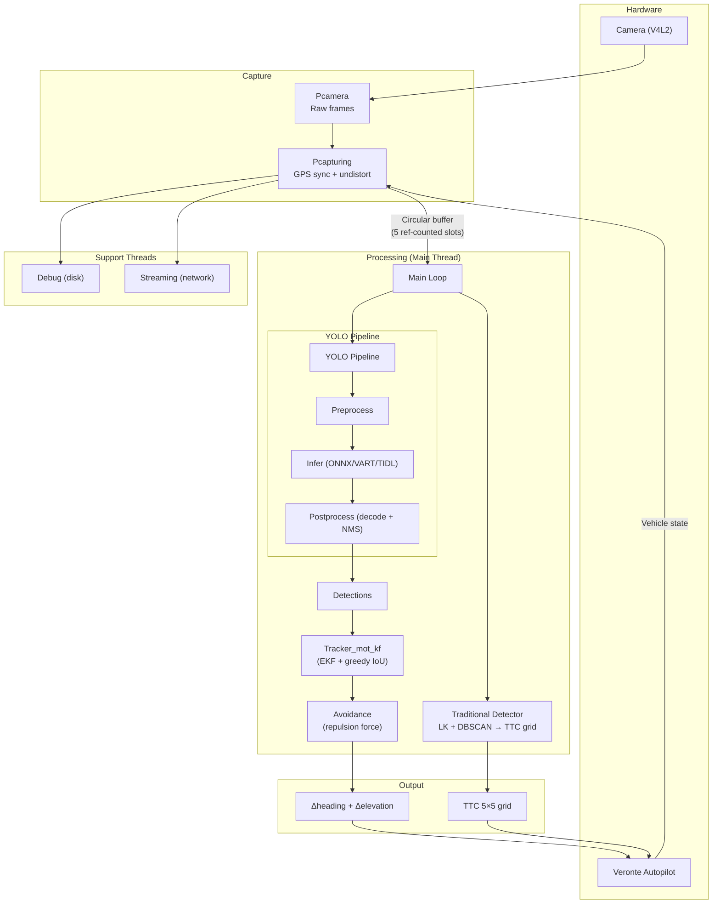
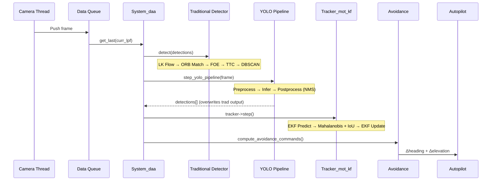
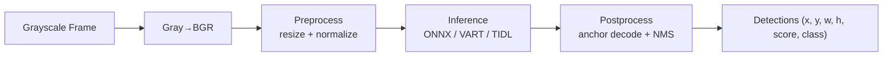
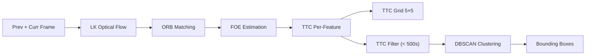
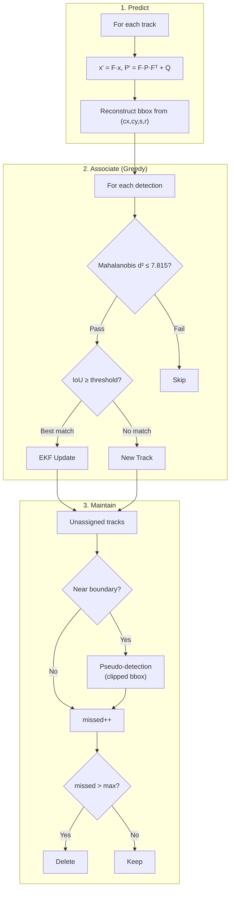
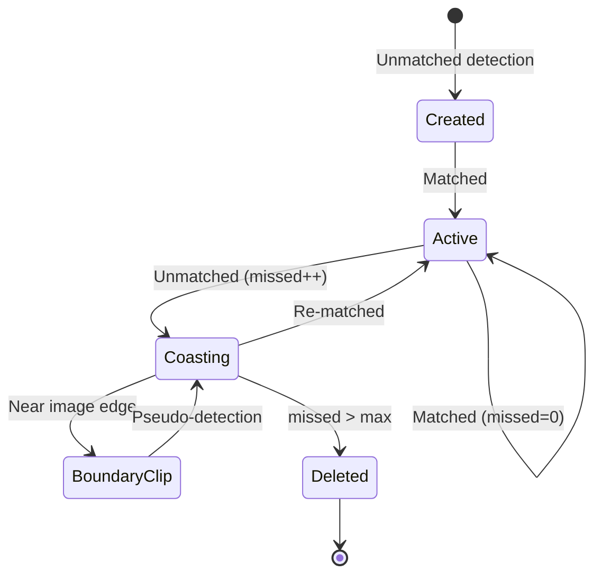
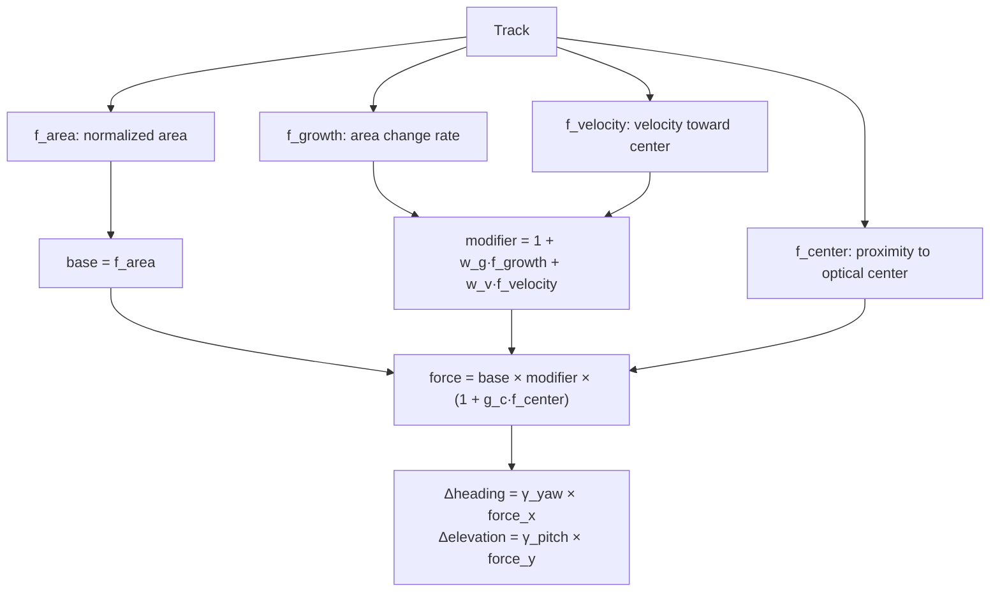

# System_daa — Architecture Documentation

## Overview

`System_daa` is the core **Detect and Avoid (DAA)** module for a UAV platform. The entire image processing pipeline is designed for a **single forward-facing camera at 640×480 px** (grayscale). It runs a YOLO deep learning detector, tracks detections with a multi-object EKF tracker, and computes repulsion-based avoidance commands (`delta_heading`, `delta_elevation`) sent to the autopilot.

> **Traditional pipeline (deactivated)**: The codebase contains a second detection path based on optical flow + DBSCAN clustering that produces bounding boxes and a 5×5 TTC grid. However, this pipeline's bounding-box output is **overwritten** by the YOLO postprocessor before reaching the tracker — only the TTC grid is still sent to the autopilot. See [Traditional Detection Pipeline](#traditional-detection-pipeline) for reference and [Known Limitations](#known-limitations).

---

## Table of Contents

- [Overview](#overview)
- [System Diagram](#system-diagram)
- [Frame Processing Pipeline](#frame-processing-pipeline)
- [Detection Pipelines](#detection-pipelines)
  - [YOLO Pipeline](#yolo-pipeline)
  - [Traditional Detection Pipeline (Deactivated)](#traditional-detection-pipeline-deactivated)
    - [FOE and TTC](#foe-and-ttc)
    - [DBSCAN Clustering](#dbscan-clustering)
- [EKF Tracker (Tracker_mot_kf)](#ekf-tracker-tracker_mot_kf)
- [Avoidance — Repulsion Force Model](#avoidance--repulsion-force-model)
- [Execution Modes](#execution-modes)
- [Configuration](#configuration)
- [Build System](#build-system)
- [Key Files](#key-files)
- [Known Limitations](#known-limitations)

---

## System Diagram



---

## Frame Processing Pipeline



---

## Detection Pipelines

### YOLO Pipeline



**Preprocessing per backend**:

| Transform | ONNX | VART (FPGA) | TI (Jacinto) |
|-----------|------|-------------|--------------|
| Resize | Letterbox | Letterbox | Direct stretch |
| Normalize | ÷255 → [0,1] | ÷255 → [0,1] | None (0–255) |
| Layout | HWC → CHW | HWC | HWC → CHW |

**Postprocessing backends** (selected at compile time via CMake):

| Backend | Target | Notes |
|---------|--------|-------|
| `Postprocessing_hw_vart.cpp` | Xilinx FPGA | 3-scale YOLO anchor decode |
| `Postprocessing_ti.cpp` | TI Jacinto | 3-scale, step = 5+num_classes |
| `Postprocessing_ti_mobilenet.cpp` | TI (MobileNet) | Direct coordinate decode |
| `Postprocessing_sw_onnx.cpp` | CPU/GPU | 2-tensor output [200,5]+[200] |
| `Postprocessing_sw_onnx_decoded.cpp` | CPU/GPU | Pre-decoded by model |

All backends use standard greedy NMS.

### Traditional Detection Pipeline (Deactivated)

> **This pipeline's bounding-box output is currently overwritten by the YOLO postprocessor.** Only the 5×5 TTC grid is still used (sent to the autopilot). The section is kept for reference.



#### FOE and TTC

**FOE (Focus of Expansion)** is the vanishing point where optical flow vectors converge, indicating the vehicle's motion direction. Computed from matched ORB feature correspondences with RANSAC outlier rejection and Huber-weighted least squares. 

For each matched feature pair, **TTC (Time-to-Contact)** is computed as:

$$\text{TTC}_i = \frac{\|p_\text{curr} - \text{FOE}\|}{\|p_\text{curr} - p_\text{prev}\| + \epsilon} \times \Delta t$$

where $\Delta t = 33$ ms (hardcoded, assumes ~30 FPS). A **5×5 TTC grid** (median TTC per cell) is computed separately and sent to the autopilot.

#### DBSCAN Clustering

Features with TTC below a configurable threshold (default **500 s**) are clustered using DBSCAN. Each feature point (`Cluster_point_of`) carries: normalized 2D pixel coordinates $(x, y)$, optical flow magnitude (`flow_mag`), TTC, and Lab color channels $(L, a, b)$.

Two distance metrics are implemented in `Dbscan_cluster::dist()`:

**Active version** — spatial + Lab color:

$$d^2 = \left(\frac{\Delta x}{W}\right)^2 + \left(\frac{\Delta y}{H}\right)^2 + \left(\frac{\Delta L}{255}\right)^2 + \left(\frac{\Delta a}{255}\right)^2 + \left(\frac{\Delta b}{255}\right)^2$$

**Disabled version** (commented out) — adds optical flow magnitude and TTC, weighted by `ttc_weight`:

$$d^2 = \left(\frac{\Delta x}{W}\right)^2 + \left(\frac{\Delta y}{H}\right)^2 + \left(\frac{\Delta L}{255}\right)^2 + \left(\frac{\Delta a}{255}\right)^2 + \left(\frac{\Delta b}{255}\right)^2 + w_{\text{ttc}}\left(\frac{\Delta f_{\text{mag}}}{10}\right)^2$$

> **Note:** Lab channels are currently set to zero when constructing cluster points, so only the spatial dimensions $(x, y)$ are effectively active. The disabled version can be re-enabled via the `ttc_weight` configuration parameter.

Clusters are interpreted as:

- Cluster 0 → noise, Cluster 1 → background (both discarded)
- Clusters 2+ → detected moving objects → axis-aligned bounding boxes (with 12 px padding)

---

## EKF Tracker (Tracker_mot_kf)

SORT-like multi-object tracker with Mahalanobis gating.

### State Vector

$$\mathbf{x} = [c_x,\ c_y,\ \ln(A),\ v_x,\ v_y,\ \dot{s}]^T$$

Constant-velocity motion model. Log-area ensures positivity ($A = e^s$). Aspect ratio tracked separately via EMA in log-space ($\beta \approx 0.9$).

### Per-Frame Cycle



### Track Lifecycle



### Key Parameters

| Parameter | Config Key | Default |
|-----------|-----------|---------|
| IoU threshold | `TrackIoUThreshold` | ~0.3 |
| Max missed frames | `TrackMaxMissedFrames` | ~5-10 |
| Aspect ratio EMA β | `TrackBetaAspectRatio` | ~0.9 |
| Process noise xy | `TrackEKFsigmaPos` | 2.5 |
| Process noise area | `TrackEKFsigmaArea` | 80 |
| Meas. noise xy | `TrackEKFsigmaMeasPos` | 3.0 |
| Meas. noise area | `TrackEKFsigmaMeasArea` | 200 |
| Initial P₀ | — | diag(50, 50, 0.5, 200, 200, 0.25) |

---

## Avoidance — Repulsion Force Model



**Threat levels** (from repulsion force norm):

| Status | Norm |
|--------|------|
| `no_threat` | < 0.1 |
| `low_threat` | ≥ 0.1 |
| `medium_threat` | ≥ 0.25 |
| `high_threat` | ≥ 0.5 |
| `critical_threat` | ≥ 0.75 |

---

## Execution Modes

| Mode | Input | Processing |
|------|-------|------------|
| 0 (Live) | `Pcamera` (V4L2) | Full DAA pipeline |
| 1 (Prerecorded) | `Pcameraemulation` | Full DAA on recorded data |
| 2 (Recording) | `Pdebugrecords` | Capture only, no DAA processing |

The system waits for an execution flag from the autopilot before starting the main loop.

---

## Configuration

YAML-style `key: value` parsed by `Simple_config_parser` singleton.

| Config File | Platform | Notes |
|-------------|----------|-------|
| `daa_jetson_config.yaml` | Jetson TX2/Xavier | GPU, NMS=0.4, 2048 MB |
| `daa_fpga_config.yaml` | Xilinx FPGA | DPU, NMS=0.05, 500 MB |
| `camera.yaml` | All | fx=fy=320, cx=320, cy=240, 640×480 |

**Key parameters**: Image 640×512→416×416, score threshold 0.5, max tracks 200, max correction ±15°, TTC grid 5×5.

---

## Build System

```bash
./cross_build_daa.sh <test_name>   # cmake -D SRC_MAIN=test/<test_name>/main.cpp
```

| Flag | Target | Backend |
|------|--------|---------|
| `CMAKE_DAA_TEXAS=1` | TI Jacinto EV | ONNX Runtime (TIDL EP) |
| `CMAKE_DAA_TEXAS=0` | Software/Jetson | ONNX Runtime (CPU/CUDA) |

**Dependencies**: C++17, OpenCV 4.4, Eigen3, ONNX Runtime, sw_vproto, liborb_coproc

### Test Executables

| Test | Purpose |
|------|---------|
| `daa/` | Full DAA system (primary application) |


---

## Key Files

| Component | File |
|-----------|------|
| Entry point | `DAA/items/sw_daa/code/test/plnx/daa/main.cpp` |
| Core system | `sw_perception: System_daa.h / .cpp` |
| YOLO inference | `sw_perception: Yolo_inference.h + backend .cpp` |
| Preprocessing | `sw_perception: Preprocessing.h + backend .cpp` |
| Postprocessing | `sw_perception: Postprocessing.h + backend .cpp` |
| Traditional det. | `sw_perception: Object_detector_lk_clust.h / .cpp` |
| Tracker | `sw_perception: Tracker_mot_kf.h / .cpp` |
| Track object | `sw_perception: Trackable_kf_detection.h / .cpp` |
| EKF engine | `sw_perception: Ekfnst.h / .cpp` |
| Config parser | `sw_perception: Simple_config_parser.h` |
| Data struct | `sw_perception: Data.h (Llhpframe)` |

---
