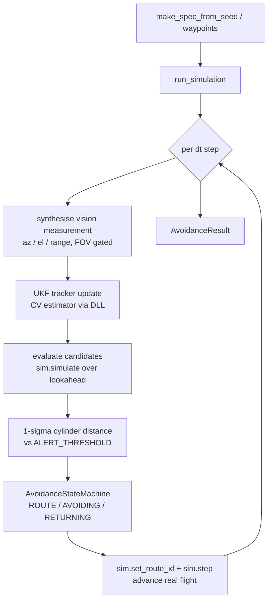
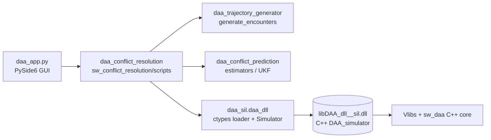

# DAA Avoidance Simulator — `sw_conflict_resolution`

This document describes the contents of the `sw_conflict_resolution`
package, the desktop application `daa_app.py`, and how the whole thing
connects to the C++ simulator that is compiled into a shared library
(`libDAA_dll__sil.dll` on Windows / `libDAA_so__sil.so` on Linux).

---

## 1. What the package is

`sw_conflict_resolution` is the **avoidance** half of the DAA software
(the **prediction** half lives in `sw_conflict_prediction`). It takes an
encounter between an *ownship* and an *intruder*, tracks the intruder
from synthesised vision measurements, decides whether the ownship will
lose well-clear, and — if so — commits an avoidance maneuver and flies
it, returning to the original route once the conflict has cleared.

The package is split into two layers:

| Layer | Location | Role |
| ----- | -------- | ---- |
| Headless engine | `sw_conflict_resolution/scripts/` | GUI-free simulation, reusable in Monte-Carlo loops |
| Desktop app | `sw_conflict_resolution/app/` | PySide6 GUI front-end + PyInstaller packaging |

All simulation logic lives in the `scripts/` layer; the `app/` layer is
a thin GUI wrapper that calls into it.

---

## 2. The headless engine (`scripts/`)

Installed as the importable package `daa_conflict_resolution` (see the
package mapping in [pyproject.toml](pyproject.toml) at the `sw` root).

| Module | Responsibility |
| ------ | -------------- |
| `avoidance_core.py` | The simulation loop. Per step it synthesises a vision measurement, runs the UKF tracker, evaluates candidate trajectories over the look-ahead horizon, and drives the C++ `DAA_simulator` through the avoidance state machine. Public entry points: `run_simulation`, `run_simulation_from_spec`, `make_spec_from_seed`. |
| `candidate_trajectories.py` | Defines the *candidate maneuvers* the ownship may take (baseline / do-nothing, lateral shift, vertical climb/descend, speed reduction, return-to-route). Each candidate is just a different `RouteTransform` (affine `shift` + `speed_scale`) projected non-destructively through `sim.simulate(...)`. Generators are **stateless** — the committed transform lives in the C++ simulator. |
| `avoidance_state_machine.py` | The `ROUTE → AVOIDING → RETURNING` decision logic. Picks which candidate is flown each step, handles temporal hysteresis, energy-cost ranking and (optionally) closed-loop stacked escapes. Maneuver-set-agnostic: it relies only on the `[baseline, *avoidances, return_to_baseline]` ordering convention. |
| `encounter_classifier.py` | ICAO Annex 2 §3.2 case selection (cases 1–16). Given ownship/intruder kinematics at first alert, returns the geometry, prescribed maneuver tag, diagnostics, and the set of compliant candidate-generator names. |
| `batch_avoidance.py` | Monte-Carlo driver. Runs `run_simulation_from_spec` across a range of integer seeds (in a `ProcessPoolExecutor`) and writes a per-encounter CSV report. `_run_one` and `CSV_FIELDS` are reused directly by the GUI. |
| `visualize_avoidance.py` | 3-D matplotlib replay (`animate`) of a recorded run: true/estimated trajectories, candidate look-aheads, protection cylinder, 1-σ uncertainty ellipsoid, ALERT / AVOIDING banners, and the active route-transform side panel. |

### Simulation flow (single encounter)



---

## 3. The desktop application (`daa_app.py`)

[sw_conflict_resolution/app/daa_app.py](sw_conflict_resolution/app/daa_app.py)
is a **PySide6 GUI** that wraps the headless engine. It exposes three
tabs:

1. **Parameters** — edits the detection / maneuver / estimator /
   envelope knobs (cylinder size, look-ahead, lateral & vertical shift,
   accel and velocity limits, UKF noise, FOV, energy-cost ratios, …).
   These are held in the `ParamSet` container and forwarded to the
   engine via `ParamSet.as_sim_kwargs()` / `as_batch_kwargs()`.
2. **Single seed** — runs `run_simulation_from_spec` for one seed in a
   background `QThread` (`SingleSimWorker`), shows the text
   classification summary, then pops the 3-D matplotlib animation.
3. **Monte Carlo** — runs `batch_avoidance._run_one` across a seed range
   or random sample inside a `ProcessPoolExecutor` (wrapped in a
   `QThread`), with a live progress bar, results table and CSV export.

Key GUI-integration details:

- `matplotlib.use('QtAgg', force=True)` so the visualiser shares the Qt
  event loop (otherwise `FuncAnimation` is garbage-collected).
- `multiprocessing.freeze_support()` is called before any `QApplication`
  — required for spawn-based child workers under a frozen executable.
- Custom encounters (user-supplied waypoints) are run through
  `CustomSimWorker`, which calls `run_simulation` directly and bypasses
  the seeded generator.

### Running from source

```powershell
# from the sw workspace root, with the venv created (uv sync / pip install -e .)
.\.venv\Scripts\Activate.ps1
.\.venv\Scripts\python sw_conflict_resolution\app\daa_app.py
```

---

## 4. The DLL and how it is compiled

The ownship's **real flight** is not integrated in Python. It is driven
by a C++ component, `DAA::DAA_simulator`, which owns the route
(`Route_tracker`), the kinematic integrator (`Virtual_ownship`), the
active `Route_transform`, and an embedded CV-UKF intruder tracker.

### 4.1 The C API

The C++ classes are exposed through a flat `extern "C"` API in
[sw_daa_SIL/code/project/DAA_dll/include/DAA_dll.h](sw_daa_SIL/code/project/DAA_dll/include/DAA_dll.h).
The simulator slice uses an opaque handle `Daa_simulator` with
`daa_sim_*` entry points:

- `daa_sim_create` / `daa_sim_destroy` — lifecycle
- `daa_sim_push_route` — load the route waypoints `(N, 4)` = `[N, E, D, dt]`
- `daa_sim_simulate` / `daa_sim_simulate_and_score` — non-destructive
  look-ahead projection of a hypothetical transform (used for candidate
  evaluation)
- `daa_sim_set_route_xf` — commit a transform (`shift` + `speed_scale`)
- `daa_sim_step` — advance the real flight by one `dt`

### 4.2 Building it

The shared library is built from
[sw_daa_SIL/code/project/CMakeLists.txt](sw_daa_SIL/code/project/CMakeLists.txt),
which pulls in the core DAA C++ library
(`sw_daa/code/daa/code`) plus the required **Vlibs** modules
(`base`, `blocks`, `gnc`, `dynamics`, `geomodel`, `first`, …). Two
library targets matter here:

- `DAA_dll` → `libDAA_dll__sil.dll` (Windows)
- `DAA_so`  → `libDAA_so__sil.so` (Linux)

Typical Windows build (the terminal already shows this workflow):

```powershell
cd sw_daa_SIL\code\project\build
cmake .. -G Ninja
ninja DAA_dll__sil      # produces build\bin\libDAA_dll__sil.dll
```

### 4.3 Loading it from Python

[sw_daa_SIL/scripts/daa_dll.py](sw_daa_SIL/scripts/daa_dll.py) (installed
as the package `daa_sil`) is the shared ctypes loader. It:

- selects the platform DLL name,
- searches `sw_daa_SIL/code/project/build/bin` (dev tree), then the
  module folder, then the PyInstaller `_MEIPASS` / executable dir
  (frozen),
- caches a process-wide `ctypes.CDLL` singleton,
- and exposes the high-level `Simulator` class that binds the
  `daa_sim_*` API (`push_route`, `simulate`, `set_route_xf`, `step`).

`avoidance_core.py` imports it simply as:

```python
from daa_sil import daa_dll as _daa_dll
sim = _daa_dll.Simulator(dt=..., sim_dt_max=..., k_xt=..., p0=..., v0=..., ...)
```

---

## 5. Dependencies between packages

The avoidance engine sits on top of three sibling in-repo packages and
the compiled DLL:



| Dependency | Provided by | Used for |
| ---------- | ----------- | -------- |
| `daa_trajectory_generator` | `sw_trajectory_generator/scripts` | `generate_single_encounter` — builds the seeded encounter (ownship + intruder waypoints). Backed by the in-repo `cam_track_gen` wheel. |
| `daa_conflict_prediction` | `sw_conflict_prediction/scripts` | UKF estimators (`estimators/`). The CV estimator is embedded inside the DLL; the Python estimators mirror / validate it. |
| `daa_sil` | `sw_daa_SIL/scripts` | `daa_dll.Simulator` — the ctypes bridge to the C++ simulator. |
| `libDAA_dll__sil.dll` | `sw_daa_SIL/code/project` (CMake) | The actual flight integration + CV-UKF tracker. |

### Package mapping

All five `scripts/` folders are exposed as top-level importable packages
via [pyproject.toml](pyproject.toml) (`[tool.setuptools.package-dir]`),
so modules import each other by qualified name with no `sys.path` hacks.
Install editable with `uv sync` or `pip install -e .` from the `sw`
root.

### Third-party runtime dependencies

`numpy`, `scipy`, `pandas`, `matplotlib==3.10.8`, `networkx`, `h5py`,
`PySide6` (GUI), and the local `cam_track_gen` wheel. `pyinstaller` is an
optional `[build]` extra.

---

## 6. Packaging a standalone executable

The GUI is shipped as a **folder bundle** built with PyInstaller from
[sw_conflict_resolution/app/daa_app.spec](sw_conflict_resolution/app/daa_app.spec).

Before building, the DLL must exist at
`sw_daa_SIL\code\project\build\bin\libDAA_dll__sil.dll` (or be copied
into `sw_conflict_prediction\scripts\estimators\`); the spec looks in
both locations.

```powershell
.\.venv\Scripts\Activate.ps1
pyinstaller sw_conflict_resolution\app\daa_app.spec --clean --noconfirm
# -> dist\daa_app\daa_app.exe  (+ DLL, Qt, numpy, matplotlib runtime)
```

What the spec does:

- bundles the located shared library at the bundle root (`daa_dll.load()`
  adds `_MEIPASS` to its search list when frozen),
- explicitly injects the five project source trees as proper dotted
  packages (PyInstaller's import tracer does not follow the editable
  PEP 660 meta-path finder, so the remapped `package-dir` layout would
  otherwise be silently omitted).

**Folder mode is required** (not `--onefile`): one-file re-extracts to
`%TEMP%` on every launch (slow) and breaks both the `ctypes.CDLL` lookup
and the Windows spawn-based multiprocessing workers.
