# IT.980 - Use of AI Training Infrastructure

## Purpose and scope

The detection model is part of the Detect and Avoid (DAA) Project. Its goal is air-to-air aircraft detection, meaning both our aircraft and the aircraft to be detected are in the air. Processing must be performed onboard, as it must be capable of operating autonomously in scenarios where connectivity with the ground pilot is lost. This limits the available computing resources and the maximum allowable latencies. The aircraft to be detected are called intruders, and the aircraft that carries the DAA system is called the ownship.

## Activity description

### Infrastructure
To carry out the set of tasks associated with AI — training, visualization and data cleaning, data storage, etc. — a hardware/software infrastructure usable by the entire Vision department has been prepared.

### Hardware
The infrastructure relies on:

- Vision server: A machine with an **RTX 5090**, ideal for training and data processing, with 16 GB of RAM. This must be taken into account because RAM is the main bottleneck: if the server is used to process data or perform other tasks while a training is running, the server may run out of RAM and the training may die. To mitigate this, the SWAP space has been increased as a backup to alleviate the RAM problem.
- The machine mounts a 32 TB NAS storage through a 10 GbE optical-fiber link. The NAS is mounted at */mnt/Pool_IA/IA_Dataset/*.
- NAS server: A machine with **32 TB** of storage accessible from any Vision machine. It also has a more powerful CPU and more RAM than the Vision server, specifically 64 GB of RAM. It is ideal for processing tasks that do not require a GPU, thanks to the more powerful CPU and the direct access to NAS data.

### Software
On the software side of the infrastructure there are tools deployed continuously as services using Docker containers on the NAS server, as well as others to be integrated into each repository or launched manually.

- CVAT: Deployed on the NAS, it allows annotation or correction of annotations. The access credentials are root-root for user and password. Currently no other users or more sophisticated credentials exist, since it is deployed on the intranet and its use is restricted to a few people, so personalized users are not required. The service deployment already contains all elements needed to deploy AI models that would be integrated into CVAT and would enable semi-automatic annotation on the platform itself; however, no model has been deployed and the server does not have a GPU.
- MLflow: Deployed on the NAS, it allows visualization, monitoring and versioning of trainings.
- DVC: A tool to be integrated into each repository, it is the equivalent of GIT for data tracking. It is used together with Git for data versioning. It works by computing hashes of the data and storing in git a pointer to the file location plus the hash, so that the pointer allows locating the data and the hash allows verifying that the data is the same as when it was stored in git. It uses the NAS for data storage and for the working cache (location where data is stored while `dvc push` has not been run, equivalent to `git push`. **Important**: it is important to run `dvc push` before **`git commit`** so that the data is sent to the remote storage and Git correctly tracks the hash file). DVC can be used as a manual data-tracking tool via terminal `add/remove` commands, but in the project the `DVC.yaml` file is used, which allows defining data-processing sequences. DVC helps define the dependencies of each sequence (*stages*), hashing not only the output data but also the input data, the execution parameters and the execution scripts; this way, if any of them changes, DVC will re-process all the necessary stages.
- It is important to keep in mind that modifications, improvements or fixes to scripts will be detected as changes by DVC, which will try to re-process the necessary stages. To avoid this unnecessary behavior, stages can be frozen by adding *frozen: true* to those stages that are considered consolidated and do not need to be re-executed automatically when dependencies change — for example, the consolidation of a dataset.
- Fiftyone: a platform to be integrated into each repository.

**Important note**: All services deployed as Docker on the NAS use volumes so that the data stored in the platforms is accessible from outside the containers, enabling backups, container migration, etc.

**Important note**: In the [README.md of sw_ai_detection](https://github.com/embention/DAA/blob/develop/items/sw/sw_daa/items/sw_ai/items/sw_ai_detection/docs/README.md) there is more information about the infrastructure deployment, including a script that creates the NAS paths if they do not exist and configures DVC for each project to use those paths. **This script will be moved to _sw_perception in the future.**

#### Connectivity scheme



#### Access routes

| Service  | Deployment  | Access                   | Notes                                                 | Purpose                                            |
| -------- | ----------- | ------------------------ | ----------------------------------------------------- | -------------------------------------------------- |
| CVAT     | NAS         | http://192.168.2.1:8080  |                                                       | Data annotation and curation                       |
| MLFlow   | NAS         | http://192.168.2.1:5000/ |                                                       | Experiment tracking                                |
| Fiftyone | Repository  | http://localhost:5151/   | To access the GUI: *fiftyone app launch --remote*     | Data visualization and selection                   |
| DVC      | Repository  | -                        |                                                       | Data tracking and processing-flow management       |

### Troubleshooting
- NAS not available: If the NAS reboots or shuts down, when it is back online the Vision server may not automatically remount the NAS. In those cases, the simplest fix is to reboot the Vision server.
- CVAT user: If you cannot log in with the access credentials, the user may not be created. To fix it, follow the CVAT superuser registration guide https://docs.cvat.ai/docs/administration/community/basics/admin-account/

## Training pipeline

### Example of usage with the first dataset
The dataset comes from the [Amazon Airborne Object Tracking Dataset](https://www.aicrowd.com/challenges/airborne-object-tracking-challenge), divided into 3 parts (`part1`, `part2`, `part3`). Each part contains a `groundtruth.json` file in the native Airborne format that is converted to **extended COCO** format (with support for `videos` and `tracks` in addition to `images`, `annotations` and `categories`) using the `src.dataset.airborne_tracking_dataset_to_coco` module.

#### Classes

| Class        |
| ------------ |
| `airborne`   |
| `helicopter` |
| `bird`       |
| `drone`      |
| `flock`      |

> **Note**: The classes `drone`, `flock` and `airborne` are excluded from the training dataset via filtering in FiftyOne (see preprocessing section).

#### Annotation attributes
Each detection includes the following additional attributes:

| Attribute | Type | Description |
|---|---|---|
| `range_m` | Numeric | Distance to the intruder in meters |
| `is_above_horizon` | Categorical (-1/0/1) | Position relative to the horizon |
| `size_category` | Categorical | Size category computed from the bbox area |

The `size_category` thresholds are defined in `configs/dvc_config.yaml`:

| Category  | Area range (px²)    |
| --------- | ------------------- |
| `small`   | ≤ 200               |
| `medium`  | 200 – 2500          |
| `large`   | > 2500              |

#### Filtering

The following filters are applied to the original dataset via tagging in FiftyOne:
- **Excluded classes**: `drone`, `flock`, `airborne` — categorized as noisy or not relevant for the use case.
- **Excluded range**: Objects with `range_m > 3000` — frequently mislabeled or too small to be useful.

These filters are applied as tags in FiftyOne (version 10), and a filtered version (version 11) is created that excludes the tagged samples.

#### Dataset preprocessing
- **Temporal downsampling**: 1 in every 10 frames per video is kept to reduce redundancy between consecutive frames.
- **Cropping**: A sliding window of **960×960 px** with **25% overlap** is applied over the original images. Background patches (without annotations) are generated with a ratio of `bg_ratio=0.15` with respect to the annotated patches. Only fully visible bboxes are kept (`min_visibility=1.0`). Background patches are extracted only from annotated images (`bg_source=annotated`).

#### Splits
The split is performed **by flight ID** to avoid data leakage (frames from the same flight never appear in different splits):

| Split | Proportion |
|---|---|
| Train | 70% |
| Eval  | 15% |
| Test  | 15% |

In addition, **mini** balanced subsets are generated for fast iteration; no training has been performed with them yet, with the following per-class targets:

| Split      | Target per class (airplane/helicopter/bird) | Empty images |
|---|---|---|
| Mini train | 10,000 | 3,000 |
| Mini eval  | 2,000  | 600   |
| Mini test  | 2,000  | 600   |

#### Storage

- **Original images**: NAS at `/mnt/Pool_IA/IA_Dataset/datasets/airborne-obj-detection-dataset/`
- **Cropped images**: `/mnt/Pool_IA/IA_Dataset/datasets/airborne-obj-detection-dataset/airborne_cropped_images/`
- **COCO annotations**: Versioned with DVC in the `data/` directory of the repository.

### Data preprocessing (DVC)

The data pipeline is orchestrated with **DVC** and defined in `dvc.yaml`. Each stage has its dependencies (scripts, input data, parameters) hashed, so DVC detects changes and re-executes only what is necessary. Consolidated stages have `frozen: true` to avoid unnecessary re-executions.

#### Pipeline diagram

The execution diagram of the different stages is shown below:


> **Note**: The diagram can be obtained with the command `dvc dag --dot | dot -Tsvg -o dag.svg` or `dvc dag --dot | dot -Tpng -o dag.png`.
> Graphviz must be installed to convert to image.

#### Stage detail

The pipeline is described in the file [dvc.yaml](items/dvc.yaml):

| Stage                                 | Module                                             | Description                                                                       | Key parameters                                                                                              |
| ------------------------------------- | -------------------------------------------------- | --------------------------------------------------------------------------------- | ----------------------------------------------------------------------------------------------------------- |
| `00_airborne_to_coco`                 | `src.dataset.airborne_tracking_dataset_to_coco`    | Converts native `groundtruth.json` to extended COCO format (for each part1/2/3)   | `--classes airborne helicopter bird drone flock ufo`                                                        |
| `00_merge_coco_annotations`           | `src.dataset.merge_coco_annotations`               | Merges the 3 COCO parts into a single file with ID remapping                      | Rebases image paths to the NAS                                                                              |
| `01_tmp_remove_images_not_in_storage` | `src.dataset.remove_images_not_in_storage`         | Removes references to images not present on disk                                  | -                                                                                                           |
| `02_downsample_videos`                | `src.preprocessing.downsampling_videos`            | Reduces frames per video by keeping 1 in every N                                  | `--keep-every 10`                                                                                           |
| `03_add_size_metadata`                | `src.preprocessing.add_size_metadata`              | Computes `area` and `size_category` per annotation                                | `--small-threshold 200 --medium-threshold 2500`                                                             |
| `03_coco_to_fiftyone`                 | `src.fiftyone.load_data_to_fiftyone`               | Loads dataset into FiftyOne as version 10                                         | `--version 10 --override`                                                                                   |
| `03_tag_drone_flock_airborne`         | `src.fiftyone.label_fiftyone`                      | Tags in FiftyOne samples with drone/flock/airborne classes                        | `--tag range_bt_3000_or_drone_flock_airborne`                                                               |
| `03_tag_range_bt_3000`                | `src.fiftyone.label_fiftyone`                      | Tags in FiftyOne samples with annotations `range_m > 3000`                        | `--filters "ground_truth.detections.range_m:>:3000"`                                                        |
| `04_add_version_11`                   | `src.fiftyone.label_fiftyone`                      | Creates version 11 excluding tagged samples                                       | `--exclude-tags range_bt_3000_or_drone_flock_airborne`                                                      |
| `04_export_version_11`                | `src.fiftyone.export_fiftyone_to_coco`             | Exports filtered version 11 to COCO JSON                                          | —                                                                                                           |
| `05_crop_images`                      | `src.preprocessing.crop_images`                    | Crops images with sliding window                                                  | `--crop-width 960 --crop-height 960 --overlap 0.25 --bg-ratio 0.15 --min-visibility 1 --bg-source annotated`|
| `06_split_train`                      | `src.preprocessing.dataset_split_random_by_flight` | Splits by flight into train (70%) and eval_test (30%)                             | `--split-b-ratio 0.3 --seed 42`                                                                             |
| `06_split_eval_test`                  | `src.preprocessing.dataset_split_random_by_flight` | Splits eval_test into eval (50%) and test (50%)                                   | `--split-b-ratio 0.5 --seed 42`                                                                             |
| `06_*_crop_to_fiftyone`               | `src.fiftyone.load_data_to_fiftyone`               | Loads cropped splits into FiftyOne with split label                               | `--label split=train/eval/test`                                                                             |
| `07_balance_mini`                     | `src.preprocessing.sample_coco_dataset`            | Generates per-class balanced mini subsets                                         | Targets: 10k/2k/2k per class + empty images                                                                 |
| `08_prediction_test_*`                | `src.tools.run_docker`                             | Runs inference of model v1 in Docker over the test set                            | `--checkpoint best_*.pth`                                                                                   |
| `08_*_to_fiftyone`                    | `src.fiftyone.load_predictions_to_fiftyone`        | Loads v1 predictions and runs COCO evaluation in FiftyOne                         | `--evaluate --include-labels split=test`                                                                    |
| `08_evaluation_*_by_range_size`       | `src.tools.evaluate_offline`                       | Offline evaluation broken down by distance ranges and area bins                   | `--range-bins 0 500 1000 ... 3500 --area-bins 0 100 200 ... --per-class`                                    |
| `09_reclassify_labels`                | `src.fiftyone.clone_and_reclassify_labels`         | Clones labels in FiftyOne and reclassifies detections with `area < 200` as `undetermined` | `--filters "ground_truth.detections.bbox_area:<:200" --new-category-name undetermined`              |
| `09_export_version_11`                | `src.fiftyone.export_fiftyone_to_coco`             | Exports the reclassified dataset (v11) to COCO per split (4 classes)              | `--classes airplane helicopter bird undetermined`                                                           |
| `10_prediction_yolox_tiny_airborne_v2`| `src.tools.run_docker`                             | Inference of model v2 (FP32) over train/eval/test                                 | `--quantization 0 --ann-file data/09_.../split.json`                                                        |
| `11_prediction_*_to_fiftyone`         | `src.fiftyone.load_predictions_to_fiftyone`        | Loads v2 predictions into FiftyOne and evaluates against `ground_truth_v11`       | `--gt-field ground_truth_v11 --evaluate`                                                                    |
| `11_evaluation_*_by_range_size`       | `src.tools.evaluate_offline`                       | Offline evaluation of model v2 by range/size (train/eval/test)                    | `--range-bins ... --area-bins ... --per-class`                                                              |
| `12_cleanlab_find_issues`             | `src.cleanlab.find_label_issues`                   | Detects labeling problems with Cleanlab (per split)                               | Generates `{split}_report.json`                                                                             |
| `12_cleanlab_to_fiftyone`             | `src.fiftyone.load_cleanlab_scores_to_fiftyone`    | Loads Cleanlab quality scores into FiftyOne                                       | `--score-field yolox_tiny_airborne_v2_...`                                                                  |

#### Pipeline execution

```bash
# Run a specific stage (and its dependencies if they have changed)
dvc repro STAGE_NAME

# See which stages would run without executing them
dvc repro --dry

# Run the whole pipeline
dvc repro
```

### Model

The training environment is based on the Texas Instruments framework for their devices, [Tensorlab](https://github.com/TexasInstruments/edgeai-tensorlab/tree/r11.1). In [sw_perception](https://github.com/embention/sw_perception/tree/develop/items/sw_ai/code/project/docker_edgeai_tensorlab) you can find the Dockerfile that configures the training environment. The Texas environment is based on the OpenMMLab framework, however it is outdated and uses an old version, so it is not directly compatible with the RTX 5090. The environment has been patched, but it is susceptible to undetected errors or bugs.

The current model is a YOLOX, in its tiny version. As of today, the performance of the Jacinto 7 — the board on which the DAA will run — is not known. Given the resolution to be handled (120º HFOV, 30º VFOV and approximately **2 cameras of 5000x3000 px**), we start with the tiny model; a larger model would probably not be viable in real time.

#### V1 — `yolox_tiny_airborne.py`

First model trained with QAT from epoch 0. It uses 7 classes (includes `airborne`, `drone`, `flock`, `ufo`). The training parameters are:

| Parameter                         | Value                                                                                                                                                                                                                                                                                       |
| --------------------------------- | ------------------------------------------------------------------------------------------------------------------------------------------------------------------------------------------------------------------------------------------------------------------------------------------- |
| Base model                        | YOLOX Tiny Lite (edgeai-tensorlab r11.2). Weights can be downloaded from the [model zoo](https://github.com/TexasInstruments/edgeai-tensorlab/blob/main/edgeai-modelzoo/models/vision/detection/coco/edgeai-mmdet/yolox_tiny_lite_416x416_20220217_checkpoint.pth.link) of Texas Instruments |
| Input resolution                  | 960×960 px                                                                                                                                                                                                                                                                                  |
| Classes                           | `airborne`, `helicopter`, `bird`, `drone`, `flock`, `ufo`, `airplane` (7)                                                                                                                                                                                                                   |
| Batch size                        | 48                                                                                                                                                                                                                                                                                          |
| Max epochs                        | 40                                                                                                                                                                                                                                                                                          |
| Last epochs (no Mosaic)           | 5                                                                                                                                                                                                                                                                                           |
| Validation interval               | Every 2 epochs                                                                                                                                                                                                                                                                              |
| Optimizer                         | SGD (inherited from base)                                                                                                                                                                                                                                                                   |
| Learning rate                     | 0.012                                                                                                                                                                                                                                                                                       |
| LR scheduler                      | QuadraticWarmup (ep 0→3) → CosineAnnealing (ep 3→35, η_min=1e-5) → Constant (ep 35→40)                                                                                                                                                                                                      |
| Augmentations                     | Mosaic (960×960), RandomAffine (scale 0.8–1.5), YOLOXHSVRandomAug, RandomFlip (p=0.5)                                                                                                                                                                                                       |
| QAT (Quantization-Aware Training) | `model_surgery=1` (SiLU→ReLU, Focus→FocusLite), `quantization=1` (INT8-aware). Trained with surgery to reduce the GAP between the trained model and the model compiled in Texas.                                                                                                            |
| Pretrained weights                | `yolox_tiny_lite_416x416_20220217_checkpoint.pth` (COCO)                                                                                                                                                                                                                                    |
| NMS                               | `iou_threshold=0.65`, `score_thr=0.01`, `max_per_img=300`                                                                                                                                                                                                                                   |
| EMA                               | ExpMomentumEMA, `momentum=0.0002`                                                                                                                                                                                                                                                           |
| Area ranges (evaluation)          | small: [0, 200], medium: [200, 2500], large: [2500, +∞] px²                                                                                                                                                                                                                                 |
| Metrics                           | mAP, mAP_50, mAP_75, mAP_s/m/l, AR@100/300/1000, per-class AP, F1                                                                                                                                                                                                                           |
| Experiment tracking               | MLflow (unified custom hook)                                                                                                                                                                                                                                                                |
| Checkpoint                        | Saves the last 3, selects best by `coco/bbox_mAP`                                                                                                                                                                                                                                           |

#### V2 — `yolox_tiny_airborne_v2.py`

Second iteration with significant improvements based on the problems detected in V1. Training in two phases: first FP32 until convergence, then QAT (pending). Main changes:

1. **Class cleanup**: From 7 to 4 effective classes (`airplane`, `helicopter`, `bird`, `undetermined`). `airborne`/`drone`/`flock`/`ufo` are removed (no samples in the filtered dataset). Detections with `area < 200 px²` are reclassified as `undetermined` (stage 09).
2. **Data augmentation**: **MixUp** is added and the `RandomAffine` range is narrowed (0.9–1.2 vs 0.8–1.5) to avoid downscaling that turns objects sub-pixel.
3. **Loss and assignment**: Higher weight on bbox loss (`6.0` vs `5.0`), higher `center_radius` in SimOTA (`3.5` vs `2.5`) for more positive anchors on small objects.
4. **Schedule**: 30 FP32 epochs, `eta_min=1e-4` (vs `1e-5`).
5. **EMA**: Momentum reduced to `0.0001` (vs `0.0002`) to smooth updates.
6. **Score threshold**: Lower (`0.001` vs `0.01`) for higher recall in evaluation.

| Parameter | V1 | V2 |
|---|---|---|
| Classes | 7 (airborne, helicopter, bird, drone, flock, ufo, airplane) | 4 (airplane, helicopter, bird, undetermined) |
| Epochs | 40 | 30 (FP32) |
| QAT | From epoch 0 | Two phases: FP32 → QAT (pending) |
| RandomAffine scale | 0.8–1.5 | 0.9–1.2 |
| MixUp | No | Yes (ratio 0.8–1.6) |
| Loss bbox weight | 5.0 (base) | 6.0 |
| SimOTA center_radius | 2.5 (base) | 3.5 |
| LR eta_min | 1e-5 | 1e-4 |
| EMA momentum | 0.0002 | 0.0001 |
| Score threshold (test) | 0.01 | 0.001 |
| Training data | `data/06_split/` (v1, 7 classes) | `data/09_changed_class_based_on_area/` (v11, 4 classes) |

#### V2 QAT — `yolox_tiny_airborne_v2_qat.py`

Second phase of V2 training: fine-tuning with Quantization-Aware Training on top of the best FP32 checkpoint (epoch 26). Uses `--quantization 2` (QAT v2).

| Parameter | V2 FP32 | V2 QAT |
|---|---|---|
| Base config | `yolox_tiny_lite.py` (TI) | `yolox_tiny_airborne_v2.py` |
| Starting checkpoint | COCO pretrained | `best_coco_bbox_mAP_epoch_26.pth` (FP32) |
| Epochs | 30 | 5 |
| Learning rate | 0.012 | 0.001 |
| Augmentation | Mosaic + MixUp + RandomAffine | Simple (Resize + Pad + HSV + Flip) |
| `--quantization` | 0 | 2 |
| YOLOXModeSwitchHook | Yes (epochs 25→30) | No (no Mosaic) |
| EMA momentum | 0.0001 | 0.0002 |

```bash
python -m src.tools.run_docker train \
    --quantization 2 \
    --config configs/experiments/yolox_tiny_airborne_v2_qat.py
```

The model has been configured to work at a resolution of **960x960 px**, higher than the design resolution of 416x416. This is due to the resolution of the cameras for which the model is designed and the detection distance. Since we need to detect as far as possible, it is necessary to avoid as much as possible inference-time rescaling that causes information loss in the image. Therefore, it is necessary to crop the camera image to the native resolution of the model; this inference strategy is known as **SAHI (Slicing Aided Hyper Inference)**. Increasing the inference resolution reduces the number of required crops, reducing GPU load and the number of inferences per image. Furthermore, the original tiny model is trained on the COCO dataset, which has 81 different classes and great image diversity. Our operating environment has fewer classes and more homogeneous images, so it is assumed that increasing the resolution does not reduce the model's learning capability.

### Commands

#### Training
Launches a Docker container with GPU, mounts the project and the NAS (read-only), configures `PYTHONPATH` and the MLflow URI, and creates a working directory with a timestamp under `experiments/`.

```bash
python -m src.tools.run_docker train \
    --config configs/experiments/yolox_tiny_airborne.py
```

Options:
- `--quantization 0` — FP32 training (no QAT)
- `--quantization 1` — QAT training (default, uses QuantTrainModule)
- `--quantization 2` — QAT training, uses PyTorch's QATFxModule.

The container runs in `--detach` mode. Logs can be followed with `docker logs -f <container_id>`.

#### Evaluation / Test

Runs inference on the test set and generates a predictions file `predictions.bbox.json`.

```bash
python -m src.tools.run_docker test \
    --config configs/experiments/yolox_tiny_airborne.py \
    --checkpoint experiments/<run>/best_coco_bbox_mAP_epoch_XX.pth \
    --output-dir experiments/<run>
```

Additional options:
- `--output-prefix predictions_train` — Output file prefix (default: `predictions`). MMDetection appends `.bbox.json` automatically.
- `--ann-file data/09_changed_class_based_on_area/train.json` — Overrides the annotation file of test_dataloader and test_evaluator. Allows running inference on train or eval splits instead of the default test.
- `--quantization 0` — FP32 inference (must match the training mode).

Example of v2 inference on the train split:
```bash
python -m src.tools.run_docker test \
    --quantization 0 \
    --config configs/experiments/yolox_tiny_airborne_v2.py \
    --checkpoint experiments/yolox_tiny_airborne_v2_20260528_122830/best_coco_bbox_mAP_epoch_26.pth \
    --output-prefix predictions_train \
    --ann-file data/09_changed_class_based_on_area/train.json
```

#### Offline evaluation by range and size

Runs offline COCO evaluation with breakdown by distance bins (`range_m`) and bbox area:

```bash
python -m src.tools.evaluate_offline \
    --gt data/09_changed_class_based_on_area/test.json \
    --predictions experiments/<run>/predictions_test.bbox.json \
    --range-bins 0 500 1000 1500 2000 2600 2800 3000 3100 3200 3300 3400 3500 \
    --area-bins 0 100 200 300 500 2500 1000000000000000 \
    --per-class \
    --report-dir data/<output_dir>/
```

#### Cleanlab — labeling-error detection

```bash
# Detect labeling problems
python -m src.cleanlab.find_label_issues \
    --annotations-path data/09_changed_class_based_on_area/train.json \
    --predictions-path experiments/<run>/predictions_train.bbox.json \
    --output-path data/12_cleanlab/train_report.json

# Load scores into FiftyOne for visual inspection
python -m src.fiftyone.load_cleanlab_scores_to_fiftyone \
    --dataset-name airborne_tracking_cropped \
    --version 11 \
    --report-path data/12_cleanlab/train_report.json \
    --images-dir /mnt/Pool_IA/IA_Dataset/datasets/airborne-obj-detection-dataset/airborne_cropped_images/ \
    --score-field yolox_tiny_airborne_v2_20260528_122830 \
    --include-labels split=train
```

#### Create a new experiment

```bash
cp configs/experiments/yolox_tiny_airborne.py configs/experiments/my_experiment.py
# Edit: max_epochs, lr, batch_size, annotation paths, EXPERIMENT_NAME, etc.
python -m src.tools.run_docker train --config configs/experiments/my_experiment.py
```

#### DVC pipeline

```bash
# Run a specific stage
dvc repro STAGE_NAME

# See what would be executed without running it
dvc repro --dry

# Push data to the NAS (run BEFORE git commit)
uv run dvc push

# Clean DVC cache. Run with extreme caution.
dvc gc -w   # removes files not used by the current workspace
dvc gc -a   # removes files not used by any commit/branch
```

#### FiftyOne

```bash
export FIFTYONE_DATABASE_URI=mongodb://192.168.2.1:27017/fiftyone
fiftyone app launch --remote
```

#### Initial repository setup on a new machine

```bash
# Install Python dependencies
uv sync

# Create persistence directories on the NAS and configure DVC
bash scripts/setup_data_persistance.sh

# Install pre-commit hooks (optional)
pre-commit install
```

### Data analysis tools

Scripts have been integrated into the data-processing pipeline that allow exploring, analyzing and comparing datasets using FiftyOne. The scripts are located under `items/src/fiftyone/` and share a common infrastructure for filtering by version (`--version`), classification labels (`--include-labels`, `--exclude-labels`) and sample tags (`--include-tags`, `--exclude-tags`). All scripts require a connection to the MongoDB instance configured in `FIFTYONE_DATABASE_URI`.

#### Data loading

The script `load_data_to_fiftyone.py` allows loading datasets into FiftyOne in three modes:

- **`coco`**: Loads an extended COCO annotations JSON (with `videos`, `tracks`, `airborne_metadata` fields). Each annotation preserves custom attributes such as `range_m`, `is_above_horizon`, `bbox_area`, etc.
- **`images`**: Loads images from a directory without annotations, filtering by extensions.
- **`video_frames`**: Loads pre-extracted video frames, grouped by subdirectory (each subdirectory = one video).

Additional analysis options during loading:
- `--compute-embeddings`: Computes embeddings with the model specified in `--embeddings-model` (default `dinov2-vitb14-reg-torch`).
- `--compute-similarity`: Computes similarity between samples using embeddings (enables similarity search in the UI).
- `--compute-duplicates`: Detects near-duplicates in the dataset based on embeddings.
- `--compute-uniqueness`: Assigns a uniqueness score to each sample.
- `--compute-visualization`: Generates a 2D projection of the dataset for visualization in the UI.

```bash
# Load COCO dataset with embeddings and duplicate detection
python -m src.fiftyone.load_data_to_fiftyone \
    --load-mode coco \
    --dataset-name airborne_tracking_cropped \
    --annotations-path data/09_changed_class_based_on_area/train.json \
    --images-dir /mnt/Pool_IA/IA_Dataset/datasets/airborne-obj-detection-dataset/airborne_cropped_images/ \
    --version 11 \
    --label split=train \
    --compute-embeddings \
    --compute-duplicates
```

#### Prediction visualization

The script `load_predictions_to_fiftyone.py` loads predictions in COCO format (`*.bbox.json`) on an existing FiftyOne dataset. This allows visually inspecting the model's predictions overlaid on the images and comparing them with the ground truth.

Features:
- Loads predictions by associating them with samples by filepath (not by `image_id`), avoiding collisions between COCO exports with overlapping IDs.
- Automatic COCO evaluation with `--evaluate`: computes mAP, generates confusion matrix and PR curves.
- Saves reports in `--report-dir`: report JSON, confusion-matrix HTML and PR curves HTML.
- Supports configurable IoU threshold with `--iou` (defaults to the standard COCO 0.50:0.05:0.95).

```bash
# Load predictions and evaluate against ground truth
python -m src.fiftyone.load_predictions_to_fiftyone \
    --dataset-name airborne_tracking_cropped \
    --version 11 \
    --predictions-path experiments/yolox_tiny_airborne_v2_20260528_122830/predictions_test.bbox.json \
    --annotations-path data/09_changed_class_based_on_area/test.json \
    --images-dir /mnt/Pool_IA/IA_Dataset/datasets/airborne-obj-detection-dataset/airborne_cropped_images/ \
    --label-field yolox_v2_predictions \
    --evaluate \
    --gt-field ground_truth \
    --report-dir experiments/yolox_tiny_airborne_v2_20260528_122830/fiftyone_eval/ \
    --include-labels split=test
```

After evaluation, FiftyOne annotates each sample with fields `<label_field>_tp`, `<label_field>_fp` and `<label_field>_fn`, allowing filtering in the UI by true positives, false positives and false negatives.

#### CleanLab

The script `load_cleanlab_scores_to_fiftyone.py` integrates labeling-quality scores generated by CleanLab into the FiftyOne dataset. This allows visually inspecting images with the worst annotation quality and prioritizing dataset cleaning.

- Scores are stored as `FloatField` fields with the `cleanlab_` prefix (e.g. `cleanlab_yolox_tiny_airborne_v2_20260528_122830`), grouping them naturally in the FiftyOne UI.
- Multiple scores from different runs/models can be loaded into the same dataset to compare them.
- Supports filtering by labels to apply scores only to a split (e.g. `--include-labels split=train`).

> **Note**: The commands to generate the CleanLab report and load it into FiftyOne are documented in the section [Cleanlab — labeling-error detection](#cleanlab--labeling-error-detection).

#### Dataset comparison

The script `compare_datasets.py` compares two versions of a dataset loaded into FiftyOne and identifies which images are exclusive to each version and which are common.

- Comparison by `filepath` (full path) or `filename` (file name only).
- Assigns classification labels to each sample (`only_A`, `only_B`, `both`) to filter in the UI.
- Exports results to JSON with `--output-json`.
- Supports independent filters per version (`--include-labels-a`, `--exclude-tags-b`, etc.).

> **Note**: The comparison is only at the level of which images each version contains. It does not compare the content of the annotations: if an image exists in both versions but a detection changes category, bbox or area, the script classifies it as `both` without detecting differences. For a more detailed comparison, the script functionality needs to be extended.

```bash
# Compare versions 10 and 11 of the dataset, only train split
python -m src.fiftyone.compare_datasets \
    --dataset-name airborne_tracking_cropped \
    --version-a 10 \
    --version-b 11 \
    --compare-by filename \
    --persist \
    --include-labels-a split=train \
    --include-labels-b split=train \
    --output-json data/comparisons/v10_vs_v11_train.json
```

#### Labeling and filtering

The script `label_fiftyone.py` allows tagging samples or individual detections based on conditions over their fields. It operates in three modes:

- **`sample`**: Tags complete images whose detections satisfy a condition (e.g. mark images with objects farther than 2000 m).
- **`detection`**: Tags individual detections that meet the condition.
- **`add-version`**: Adds a new version to the samples that meet the filters.

Filters use the format `FIELD:OPERATOR:VALUE` with operators `>`, `>=`, `<`, `<=`, `==`, `!=`. Multiple filters are combined with AND logic.

```bash
# Tag samples with detections farther than 3000 m
python -m src.fiftyone.label_fiftyone \
    --dataset-name airborne_tracking_cropped \
    --version 11 \
    --mode sample \
    --tag exclude_range_3000 \
    --filters "ground_truth.detections.range_m:>:3000" \
    --include-labels split=train
```

#### Label reclassification

The script `clone_and_reclassify_labels.py` allows creating a new version of the annotations by reclassifying detections that meet certain criteria, without modifying the original annotations. It is used for dataset transformations such as the reclassification by area applied in stage 09 of the DVC pipeline.

```bash
# Reclassify detections with area < 200 px² as "undetermined"
python -m src.fiftyone.clone_and_reclassify_labels \
    --dataset-name airborne_tracking_cropped \
    --source-version 10 \
    --source-label-field ground_truth \
    --target-label-field ground_truth_v11 \
    --target-version 11 \
    --filters "ground_truth.detections.bbox_area:<:200" \
    --new-category-name undetermined
```

#### CVAT integration

Two scripts are available for bidirectional integration between FiftyOne and CVAT:

- **`annotate_data_from_fiftyone.py`**: Uploads a view of the dataset to CVAT for manual annotation. Supports annotation of images and of video tracks (`--video`). Allows defining the label schema via a JSON (`--label-schema-json`) and partitioning the upload into tasks of configurable size (`--task-size`).
- **`cvat_annotations_to_fiftyone.py`**: Downloads the annotations completed in CVAT back into the FiftyOne dataset. Automatically converts custom attributes that CVAT returns as strings to their original numeric types.

```bash
# Upload to CVAT for annotation
python -m src.fiftyone.annotate_data_from_fiftyone \
    --dataset-name airborne_tracking_cropped \
    --version 11 \
    --label-schema-json configs/cvat_label_schema.json \
    --include-labels split=train \
    --task-size 500

# Download annotations from CVAT
python -m src.fiftyone.cvat_annotations_to_fiftyone \
    --dataset-name airborne_tracking_cropped \
    --version 11
```

> **Note**: The connection with CVAT is configured through the environment variables `CVAT_URL`, `FIFTYONE_CVAT_USERNAME` and `FIFTYONE_CVAT_PASSWORD` defined in the `.env` file.

#### Export to COCO

The script `export_fiftyone_to_coco.py` exports a FiftyOne dataset to extended COCO JSON format, including the `videos` and `tracks` fields. All IDs are regenerated sequentially to produce a valid COCO file even when the dataset was built from multiple imports with overlapping IDs.

```bash
python -m src.fiftyone.export_fiftyone_to_coco \
    --dataset-name airborne_tracking_cropped \
    --version 11 \
    --output-path data/exports/v11_train.json \
    --images-dir /mnt/Pool_IA/IA_Dataset/datasets/airborne-obj-detection-dataset/airborne_cropped_images/ \
    --classes airplane helicopter bird undetermined \
    --label-field ground_truth \
    --include-labels split=train \
    --exclude-tags remove_flock
```

## Deployment on Jacinto 7 (TIDL)

### Overview

Deployment of models on the Jacinto 7 board (SoC J784S4/AM69A) from Texas Instruments follows the **QAT (Quantization-Aware Training)** flow as the main deployment flow. The model is first trained in FP32 until convergence, then fine-tuned with QAT, and finally exported and compiled for the SoC accelerators:


> **PTQ (no QAT)**: It is also possible to deploy an FP32 model directly, in which case TIDL applies Post-Training Quantization during compilation. This flow skips the QAT training step but may have greater precision degradation. It is useful for rapid prototypes.

The process consists of the following phases:

1. **QAT training**: 5-epoch fine-tuning over the best FP32 checkpoint, with `--quantization 2`.
2. **PyTorch → ONNX conversion**: Exports the QAT checkpoint to ONNX, applying *model surgery* (SiLU → ReLU, Focus → FocusLite) for TIDL compatibility.
3. **ONNX → TIDL compilation**: Compiles the ONNX for the C7x DSP accelerators, preserving the quantization ranges learned during QAT.

Each conversion/compilation phase uses an independent Docker container:

| Container | Docker image | Purpose | Upstream repo |
|---|---|---|---|
| `edgeai-tensorlab` | `edgeai-tensorlab-tidl:r11.1` | PyTorch/MMDetection → ONNX conversion | [edgeai-tensorlab](https://github.com/TexasInstruments/edgeai-tensorlab) |
| `edgeai-tidl-tools` | `edgeai_tidl_tools_x86_ubuntu_22_gpu` | ONNX → TIDL compilation + PC inference | [edgeai-tidl-tools](https://github.com/TexasInstruments/edgeai-tidl-tools) |

### Checkpoints and model surgery

The training process generates `.pth` checkpoints in the `experiments/<config_stem>_<timestamp>/` directory. The checkpoint hook saves the **last 3** and marks the best by the `coco/bbox_mAP` metric.

All models (FP32 and QAT) trained so far are produced with `model_surgery=1` (`convert_to_lite_model = dict(model_surgery=1)` in the config). This replaces operations not supported by TIDL:
- **SiLU → ReLU**: Activation compatible with the C7x DSP accelerator.
- **Focus → FocusLite**: Downsampling operation compatible with TIDL.

The conversion during training reduces the gap with deployment. Surgery guarantees that the architecture exported to ONNX is directly compilable by TIDL without unsupported layers. The script `torch2onnx.py` reads `convert_to_lite_model` from the model config to automatically apply model surgery during export.

### Repository structure

The deployment files are located inside `_sw_perception/items/sw_ai/`:

```
_sw_perception/items/sw_ai/
├── code/project/
│   ├── docker_edgeai_tensorlab/          # Docker: ONNX conversion
│   │   ├── Dockerfile
│   │   ├── docker_build.sh
│   │   ├── docker_run.sh
│   │   └── patches/
│   │       ├── sitecustomize.py          # Fix torch.load weights_only (PyTorch ≥2.6)
│   │       └── torch2onnx.py             # Patched conversion script
│   └── docker_edgeai_tidl_tools/         # Docker: TIDL compilation
│       ├── Dockerfile
│       ├── docker_build.sh
│       ├── docker_run.sh
│       ├── docker_setup.sh               # Entrypoint with SOC configuration
│       └── patches/
│           └── osrt_setup.sh
└── items/
    ├── sw_edgeai_tensorlab/items/
    │   ├── edgeai-tensorlab/             # Cloned TI repo (gitignored)
    │   └── outputs/                      # Conversion outputs
    └── sw_edgeai_tidl_tools/
        ├── code/project/test/            # C++ inference code for Jacinto
        └── items/
            ├── edgeai-tidl-tools/        # Cloned TI repo (gitignored)
            └── example/                  # Compilation/inference scripts
                ├── config.yaml           # TIDL model configuration
                ├── run_tidl.py           # Main script (compilation + inference)
                ├── compilation_tidl.py   # Compilation logic
                ├── inference_tidl.py     # PC inference logic
                ├── inference_onnx_texas.py   # Inference on Jacinto 7
                └── utils.py
```

### Model compilation

#### Step 1: Build the containers

Both containers are built by running `docker_build.sh` in their respective directories. Each script automatically clones the corresponding TI repository (if it does not exist) at the correct tag and builds the Docker image:

```bash
# Container 1: edgeai-tensorlab (ONNX conversion)
cd _sw_perception/items/sw_ai/code/project/docker_edgeai_tensorlab/
./docker_build.sh
# → Generates image: edgeai-tensorlab-tidl:r11.1

# Container 2: edgeai-tidl-tools (TIDL compilation)
cd _sw_perception/items/sw_ai/code/project/docker_edgeai_tidl_tools/
./docker_build.sh
# → Generates image: edgeai_tidl_tools_x86_ubuntu_22_gpu
```

> **Note**: Building `edgeai-tensorlab` compiles MMCV with CUDA support, which can take a long time. It requires an NVIDIA GPU and a working `nvidia-smi` on the host.

#### Step 2: PyTorch → ONNX conversion

1. Start the tensorlab container:
```bash
cd _sw_perception/items/sw_ai/code/project/docker_edgeai_tensorlab/
./docker_run.sh
```

##### Tensorlab environment validation

You can verify that the container has the correct dependencies with:

```bash
python -c "from mmdeploy.apis import torch2onnx; from mmdeploy.apis.onnx import export; print('MMDeploy import OK')"
```

Expected stack versions:

| Package | Version |
|---|---|
| mmcv | 2.2.0 |
| mmdeploy | 1.3.1 |
| mmdet | 3.3.0 |
| mmengine | 0.10.7 |
| onnx | 1.16.0 |
| onnxruntime-gpu | 1.17.1 |
| torch | 2.7.0+cu128 |
| torchvision | 0.22.0+cu128 |


2. Inside the container, configure the export script at `/workspace/edgeai-tensorlab/edgeai-mmdetection/run_detection_export.sh`:
   - `CONFIG_FILE`: Path of the model configuration with surgery for TIDL compatibility. The available configurations are at `/workspace/edgeai-tensorlab/edgeai-mmdetection/configs_edgeailite/`.
   - `CHECKPOINT_FILE`: Path or URL of the `.pth` file of the trained model.
   - `DEPLOY_CONFIG`: Deployment configuration (onnx, tensorRT, fp32, fp16...). They are at `/workspace/edgeai-tensorlab/edgeai-mmdeploy/configs`.
   - `EXPORT_PATH`: Output directory for the generated files.

3. Run the conversion:
```bash
cd /workspace/edgeai-tensorlab/edgeai-mmdetection
./run_detection_export.sh
```

   For the **YOLOX tiny airborne v2 QAT** model, it is configured as follows:
```bash
CONFIG_FILE="../conversion_modelo/yolox_tiny_airborne_v2_qat.py"
CHECKPOINT_FILE="../conversion_modelo/best_coco_bbox_mAP_epoch_5.pth"
DEPLOY_CONFIG="../edgeai-mmdeploy/configs/mmdet/detection/detection_onnxruntime_static.py"
```

   > **Important**: Use the QAT config (`yolox_tiny_airborne_v2_qat.py`), not the FP32 one. The QAT config inherits from FP32 and `torch2onnx.py` needs to resolve the config inheritance chain to correctly apply model surgery.

   > **Note**: The `torch2onnx.py` script reads `convert_to_lite_model` from the model config to automatically apply model surgery. It is not necessary to pass `--model-surgery` explicitly if the config already defines it.

   > **Note**: It is necessary to remove or comment out the custom imports defined in the training configuration.

   > **PTQ**: If the quantization is Post-Training, use the FP32 config and checkpoint (`yolox_tiny_airborne_v2.py` + `best_coco_bbox_mAP_epoch_26.pth`).

This generates in `EXPORT_PATH`:
- `<model>.onnx` — Model in ONNX format (with `ir_version=8` for TIDL compatibility)
- `<model>.prototxt` — Architecture metadata for output decoding in TIDL

> **Note**: The `torch2onnx.py` script has been patched with respect to the original from TI to:
> - Be compatible with PyTorch ≥2.6 (fix for `weights_only=True` in `torch.load`)
> - Automatically simplify with `onnxsim`
> - Rename layers for TIDL (`prune_layer_names`)
> - Force `ir_version=8` (TIDL supports up to IR 9)

The generated `.prototxt` file has the form:

```
name: "yolox"
tidl_yolo {
  yolo_param {
    input: "164"
    anchor_width: 8.0
    anchor_height: 8.0
  }
  yolo_param {
    input: "177"
    anchor_width: 16.0
    anchor_height: 16.0
  }
  yolo_param {
    input: "190"
    anchor_width: 32.0
    anchor_height: 32.0
  }
  detection_output_param {
    num_classes: 4
    share_location: true
    background_label_id: -1
    nms_param {
      nms_threshold: 0.45
      top_k: 200
    }
    code_type: CODE_TYPE_YOLO_X
    keep_top_k: 200
    confidence_threshold: 0.3
  }
  name: "yolox"
  in_width: 960
  in_height: 960
  output: "dets"
  output: "labels"
  framework: "MMDetection"
}
```

To tune the model execution, the following parameters can be modified:
- `detection_output_param.nms_param.nms_threshold`
- `detection_output_param.nms_param.top_k`
- `detection_output_param.confidence_threshold`
- `detection_output_param.keep_top_k`

In this case, `detection_output_param.keep_top_k` and `detection_output_param.nms_param.top_k` can be set to 10, since more than 10 elements detected simultaneously in the air are not expected for DAA.

#### Step 3: ONNX → TIDL compilation

1. Exit the tensorlab container and start the TIDL tools container:
```bash
cd _sw_perception/items/sw_ai/code/project/docker_edgeai_tidl_tools/
./docker_run.sh          # Defaults to CPU for TIDL compilation
./docker_run.sh --gpu    # Uses GPU for compilation (if available)
```

2. When starting, the container asks `Do you want to configure the environment for the j784s4 SOC? (y/n):`. Answer `y` to activate the environment variables and TIDL tools paths.

3. Configure the model in `/workspace/example/config.yaml`:
   - `paths.model_path`: Path to the `.onnx` file converted in the previous step.
   - `settings.model_config_key`: Key of the model to compile (e.g., `od-ort-yolox-tiny-airborne`).
   - In `model_configs.<selected_key>.session.meta_layers_names_list`: Path to the `.prototxt` file generated in the previous step.

   For the YOLOX tiny airborne (960×960) v2 model, a specific [configuration file](../configs/model_conversion/config_yolox_qat.yaml) is provided.

   Key `config.yaml` options for **QAT**:
   - `accuracy_level: 0` — Prevents TIDL from recalibrating quantization ranges. The ranges are already embedded in the ONNX as fake-quantize nodes.
   - `advanced_options:quantization_scale_type: 1` — Power-of-2 quantization, to match the mode used by `edgeai-torchmodelopt` during QAT training.
   - `advanced_options:calibration_frames: 2` — Only 1-2 frames are needed to initialize the graph (does not modify ranges with `accuracy_level=0`).

   > **PTQ**: Use `accuracy_level: 1` and `advanced_options:calibration_frames: 50-200` with images representative of the dataset. Use `advanced_options:quantization_scale_type: 0` (non-power-of-2). A higher number of frames improves the quality of the quantization.

4. Run the compilation:
```bash
cd example/
python3 run_tidl.py -f CONFIG_FILE.yaml -c
```

The expected output indicates a successful compilation:
```
********************************************************************************
STAGE 1: COMPILATION COMPLETED SUCCESSFULLY
********************************************************************************
ONNX model: ./<model_name>/model/<model_name>.onnx
```

The generated output structure:
```
<model_name>/
├── artifacts/     # Compiled artifacts for TIDL (.bin, param.yaml, etc.)
├── binaries/      # Inference output tensors (empty until inference)
├── model/         # Copy of the ONNX model
├── dataset.yaml
└── param.yaml

```

#### Step 4: PC inference (validation)

To validate the compiled model before deploying it on the board:

```bash
python3 run_tidl.py -f config.yaml -i
```

This runs inference using `TIDLExecutionProvider` on the PC, generates the test image with the detections overlaid and saves the output tensors in `binaries/`. The test images are configured in `config.yaml` under `paths.test_images`.

> **Note:** To run inference with the newly compiled model, the model path must be changed to the one generated in the previous step.

> **Note**: PC inference serves as a reference to validate that the compiled model produces correct results. The output can be compared with subsequent inference on Jacinto 7 to verify that quantization does not introduce excessive degradation.

#### Step 5: Inference on Jacinto 7

1. Copy the generated folder (`artifacts/` + `model/`) to the Jacinto 7 board.

2. Configure `inference_onnx_texas.py`:
   - `tidl_tools_path`: Set as `/usr/lib` (location of the TIDL libraries compiled into Jacinto).
   - `artifacts_folder`: Path to the `artifacts/` folder copied on the board.
   - Adapt `input_data` to the format expected by the model. For YOLOX tiny airborne (color images 960×960):

```python
# Option 1: Random image (only verifies that the model loads and runs)
rng = np.random.default_rng()
input_data = rng.uniform(0, 256, size=(1, 3, 960, 960)).astype(np.float32)

# Option 2: Real image (allows validating detections against PC inference)
img = cv2.imread(image_path)
img_resized = cv2.resize(img, (960, 960))
img_resized = np.transpose(img_resized, (2, 0, 1))  # HWC -> CHW
input_data = np.expand_dims(img_resized, axis=0).astype(np.float32)
```

3. Run:
```bash
python3 inference_onnx_texas.py
```

4. Check in the output the messages confirming the use of the AI accelerators:
```
libtidl_onnxrt_EP loaded 0x366dd3e0
...
VX_ZONE_INFO: [tivxPlatformCreateTargetId:169] Added target MPU-0
VX_ZONE_INFO: [tivxPlatformCreateTargetId:169] Added target MPU-1
VX_ZONE_INFO: [tivxPlatformCreateTargetId:169] Added target MPU-2
VX_ZONE_INFO: [tivxPlatformCreateTargetId:169] Added target MPU-3
```

The first message confirms that the TIDL libraries have loaded correctly. The `MPU-X` messages indicate that the AI accelerators are active.

##### TIDL compilation options

The compilation options are configured in `config.yaml` under the `tidl_options` section. The default values are optimized for **QAT**:

| Option | Description | QAT value | PTQ value ⚠️ |
|---|---|---|---|
| `tensor_bits` | Quantization precision (8 or 16 bits) | 8 | 8 |
| `accuracy_level` | 0 = no recalibration, 1 = PTQ recalibration | **0** | **1** |
| `advanced_options:calibration_frames` | Frames for calibration | **2** | **50-200** |
| `advanced_options:calibration_iterations` | Calibration iterations | 1 | **10-20** |
| `advanced_options:quantization_scale_type` | 0 = non-power-of-2, 1 = power-of-2 | **1** | **0** |
| `advanced_options:num_cores` | Accelerator cores to use | 1 | 1 |
| `advanced_options:add_data_convert_ops` | Automatic conversion of input data | 3 | 3 |

Each model is defined under `model_configs` with its specific preprocessing, normalization and postprocessing. The `config.yaml` file includes predefined configurations for several models (YOLOX, YOLOv7, YOLOv10, ResNet, DeepLab, MiDaS, NanoTrack).

> **Note on QAT vs PTQ calibration**: With QAT (`accuracy_level=0`), TIDL uses the quantization ranges embedded in the ONNX and only needs 1-2 frames to initialize the graph. With PTQ (`accuracy_level=1`), TIDL needs images representative of the dataset to compute the ranges — a higher number of `calibration_frames` improves the quality of the quantization.

### Full flow summary



> **Reference**: Issue [#2610](https://github.com/embention/DAA/issues/2610) contains the detailed history of the first commissioning of the TIDL deployment flow, including troubleshooting and intermediate validations.

### QAT vs FP32 (PTQ) comparison

| Aspect | QAT + TIDL compilation | FP32 + PTQ (TIDL compilation) |
|---|---|---|
| Flow | FP32 training → QAT (5ep) → ONNX → TIDL | FP32 training → ONNX → TIDL |
| Expected precision | Minimal degradation (~1% mAP) | Possible INT8 degradation (1-5% mAP) |
| `accuracy_level` | 0 (no recalibration) | 1 (PTQ recalibration) |
| `quantization_scale_type` | 1 (power-of-2) | 0 (non-power-of-2) |
| `calibration_frames` | 2 (initialization only) | 50-200 (representative images) |
| Complexity | Higher (two training phases) | Lower (single training) |
| Recommended for | **Production**, maximum precision on device | Rapid prototypes, flow validation |

> **Recommendation**: For maximum performance on Jacinto 7, use the QAT flow. The FP32+PTQ flow is useful for quick validations of the deployment pipeline.

## Responsible parties

- [Vision Engineer](https://documentation.embention.net/282/en/020/index.md#vie)
