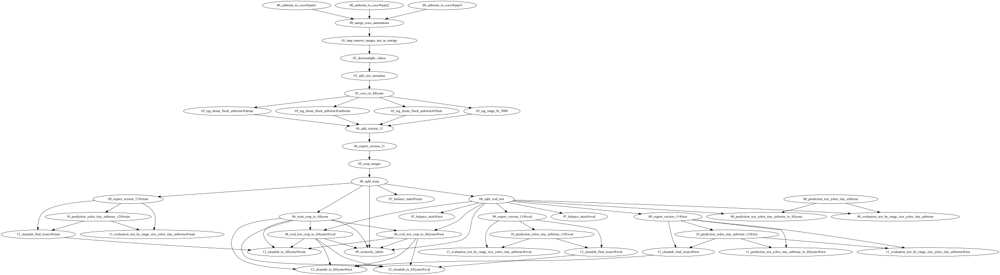

# IT.980 - Utilización de infraestructura de entrenamiento IA 

## Objeto y alcance 

El modelo de detección se enmarca dentro del Proyecto de Detect and Avoid (DAA). Su objetivo es la detección de aeronaves aire-aire, es decir, tanto nuestra aeronave como las aeronaves a detectar están en el aire. El procesado debe realizarse embarcado ya que debe ser capaz de operar de manera autónoma en escenarios de perdidas de conectividad con el piloto en tierra. Esto limita la capacidad de recursos de computación disponibles y latencias máximas . Las aeronaves a detectar se denominan intrusos, y la aeronave que incorpora el sistema DAA se denomina ownship.

## Descripción de actividades 

### Infraestructura
Para poder llevar a cabo el conjunto de tareas asociadas a la IA, entrenamiento, visualización y limpieza de datos, almacenamiento de datos, etc. Se ha preparado una infraestructura hardware/software usable para todo el departamento de Vision.
### Hardware
La infraestructura hace uso de:

- Servidor de vision: Equipo con una **RTX 5090** ideal para entrenamientos y procesado de datos, dispone de 16gb de RAM. Es importante tenerlo en cuenta, ya que la RAM es el mayor cuello de botella y si se hace uso del servidor para procesar datos o realizar otras tareas mientras se lleva a cabo un entrenamiento, es posible que el servidor se quede sin RAM y el entrenamiento muera. Para evitar esto se ha aumentado el espacio SWAP a modo de backup y mitigar el problema de RAM.
- El equipo monta un almacenamiento NAS de 32 TB a través de un enlace de 10giga ethernet de fibra óptica. El NAS se monta en la ruta */mnt/Pool_IA/IA_Dataset/*
- Servidor NAS: Equipo con **32 TB** almacenamiento a los que se puede acceder desde cualquier equipo de Vision. Ademas cuenta con una CPU mas potente y mas RAM que el servidor de Vision, en concreto 64gb de RAM. Es ideal para hacer procesados que no requieran GPU gracias a la CPU mas potente y el hecho de tener acceso directo a los datos del NAS.
### Software
En la parte software de la infraestructura existen herramientas desplegadas de manera continua como un servicio haciendo uso de contenedores docker en el servidor NAS y otras a integrar en cada uno de los repositorios o lanzar manualmente.
- CVAT: Desplegada en el NAS, permite la anotación o corrección de anotaciones. Las credenciales de acceso son root-root para el user y password. Actualmente no existen usuarios ni credenciales mas sofisticadas ya que se encuentra desplegado en la intranet y su uso se restringe a pocas personas, por lo que no es necesario disponer de usuarios personalizados. El despliegue del servicio ya contiene de todos los elementos necesarios para el despliegue de modelos de IA que se integrarían en CVAT y permitirían anotación semiautomática en la propia plataforma, sin embargo no se ha desplegado ningún modelo y el servidor no cuenta con GPU.
- MLflow: Desplegada en el NAS, permite la visualización, monitorizacion y versionado de entrenamientos.
- DVC: herramienta a integrar en cada repositorio, es el equivalente a GIT para el tracking de datos. Se usa conjuntamente junto a Git para el versionado de datos. Su funcionamiento consiste en calcular los hashes de los datos y guardar en git un puntero a la ubicación del fichero mas el hash, de esta manera el puntero permite localizar los datos y el hash verificar que los datos son los mismos que cuando se almaceno en git. Hace uso del NAS para el almacenamiento de los datos y de la cache de trabajo (ubicación donde se almacenan los datos mientras no se hace DVC push, equivalente a git push. **Importante**: Es importante ejecutar dvc push previo a **git commit** para que los datos se envien al almacenamiento remoto y Git haga correcto tracking del fichero de hash). DVC se puede usar como herramienta manual de tracking de datos mediante comandos *add/remove* de terminal, pero en el proyecto se hace uso del fichero *DVC.yaml* que permite definir secuencias de procesado de datos, DVC ayuda a definir las dependencias de cada secuencia (*stages*), hasheando no solo los datos de salida, si no tambien los datos de entrada, los parámetros de ejecución y los scripts de ejecución, de esta manera, si alguno de ellos cambia, DVC reprocesara todos los stages necesarios.
- Es importante tener en cuenta que modificaciones, mejoras o correcciones en los scripts serán detectadas como cambios por DVC, e intentara reprocesar los stages necesarios. Para evitar este comportamiento innecesario, se pueden congelar los stages añadiendo *frozen: true* en aquellos stages que se consideran consolidados y no necesitamos re-ejecutar de manera automática ante cambios en las dependencias, por ejemplo, la consolidación de un dataset.
- Fiftyone: plataforma a integrar en cada repositorio

**Nota importante**: Todos los servicios desplegados como docker en el NAS usan volumenes para que los datos almacenados en las plataformas sean accesibles desde fuera de los contenedores, de forma que se pueda hacer backup de los datos, migrar los contenedores a otro lugar, etc.

**Nota importante**: En el [README.md de sw_ai_detection](https://github.com/embention/DAA/blob/develop/items/sw/sw_daa/items/sw_ai/items/sw_ai_detection/docs/README.md) se encuentra más información sobre el despliegue de la infraestructura, incluye un script que crea los paths del NAS si no existen, y configura el DVC de cada proyecto para usar dichos paths. **Este script en el futuro se moverá a _sw_perception**
#### Esquema de conectividad


#### Rutas de acceso

| Servicio | Despliegue  | Acceso                   | Notas                                                 | Objetivo                                           |
| -------- | ----------- | ------------------------ | ----------------------------------------------------- | -------------------------------------------------- |
| CVAT     | NAS         | http://192.168.2.1:8080  |                                                       | Anotación y curado de datos                        |
| MLFlow   | NAS         | http://192.168.2.1:5000/ |                                                       | Tracking de experimentos                           |
| Fiftyone | Repositorio | http://localhost:5151/   | Para acceder a la GUI: *fiftyone app launch --remote* | Visualización y selección de datos                 |
| DVC      | Repositorio | -                        |                                                       | Tracking de datos y gestion del flujo de procesado |

### Troubleshooting
- NAS no disponible: Si el NAS se reinicia o se apaga, es posible que cuando vuelva a estar operativo el servidor de Vision no monte de manera automática el NAS de nuevo, en esos casos, lo mas sencillo es reiniciar el servidor de vision.
- Usuario CVAT: Si al introducir las credenciales de acceso no se puede hacer login, es posible que el usuario no este creado. Para solucionarlo basta con seguir la guía de registro de superusuarios de CVAT https://docs.cvat.ai/docs/administration/community/basics/admin-account/
## Pipeline de entrenamiento

### Ejemplo de uso con el primer dataset
El dataset proviene del [Amazon Airborne Object Tracking Dataset](https://www.aicrowd.com/challenges/airborne-object-tracking-challenge), dividido en 3 partes (`part1`, `part2`, `part3`). Cada parte contiene un fichero `groundtruth.json` en formato nativo Airborne que se convierte a formato **COCO extendido** (con soporte de `videos` y `tracks` además de `images`, `annotations` y `categories`) haciendo uso del módulo `src.dataset.airborne_tracking_dataset_to_coco`.
#### Clases

| Clase        |
| ------------ |
| `airborne`   |
| `helicopter` |
| `bird`       |
| `drone`      |
| `flock`      |

> **Nota**: Las clases `drone`, `flock` y `airborne` se excluyen del dataset de entrenamiento mediante filtrado en FiftyOne (ver sección de preprocesado).

#### Atributos de anotación
Cada detección incluye los siguientes atributos adicionales:

| Atributo | Tipo | Descripción |
|---|---|---|
| `range_m` | Numérico | Distancia al intruso en metros |
| `is_above_horizon` | Categórico (-1/0/1) | Posición relativa al horizonte |
| `size_category` | Categórico | Categoría de tamaño calculada a partir del área del bbox |
Los umbrales de `size_category` se definen en `configs/dvc_config.yaml`:

| Categoría | Rango de área (px²) |
| --------- | ------------------- |
| `small`   | ≤ 200               |
| `medium`  | 200 – 2500          |
| `large`   | > 2500              |
#### Filtrado

Se aplican los siguientes filtros al dataset original mediante etiquetado en FiftyOne:
- **Clases excluidas**: `drone`, `flock`, `airborne` — categorizadas como ruidosas o no relevantes para el caso de uso.
- **Rango excluido**: Objetos con `range_m > 3000` — etiquetados erróneamente con frecuencia o demasiado pequeños para ser útiles.
Estos filtros se aplican como tags en FiftyOne (versión 10), y se crea una versión filtrada (versión 11) que excluye las muestras taggeadas.

#### Preprocesado del dataset
- **Downsampling temporal**: Se conserva 1 de cada 10 frames por vídeo para reducir redundancia entre frames consecutivos.
- **Recorte (cropping)**: Se aplica una ventana deslizante de **960×960 px** con **25% de overlap** sobre las imágenes originales. Se generan parches de fondo (sin anotaciones) con un ratio de `bg_ratio=0.15` respecto a los parches anotados. Solo se conservan bboxes completamente visibles (`min_visibility=1.0`). Los parches de fondo se extraen únicamente de imágenes anotadas (`bg_source=annotated`).
#### Splits
La división se realiza **por ID de vuelo** para evitar data leakage (frames del mismo vuelo nunca aparecen en splits distintos):

| Split | Proporción |
|---|---|
| Train | 70% |
| Eval | 15% |
| Test | 15% |

Además se generan **subconjuntos mini** balanceados para iteración rápida, no se ha generado ningun entrenamiento con ellos, con los siguientes targets por clase:

| Split | Target por clase (airplane/helicopter/bird) | Imágenes vacías |
|---|---|---|
| Mini train | 10.000 | 3.000 |
| Mini eval | 2.000 | 600 |
| Mini test | 2.000 | 600 |

#### Almacenamiento

- **Imágenes originales**: NAS en `/mnt/Pool_IA/IA_Dataset/datasets/airborne-obj-detection-dataset/`
- **Imágenes recortadas**: `/mnt/Pool_IA/IA_Dataset/datasets/airborne-obj-detection-dataset/airborne_cropped_images/`
- **Anotaciones COCO**: Versionadas con DVC en el directorio `data/` del repositorio.

### Preprocesado de datos (DVC)

El pipeline de datos está orquestado con **DVC** y definido en `dvc.yaml`. Cada stage tiene sus dependencias (scripts, datos de entrada, parámetros) hasheadas, de forma que DVC detecta cambios y re-ejecuta solo lo necesario. Los stages consolidados tienen `frozen: true` para evitar re-ejecuciones innecesarias.

#### Diagrama del pipeline

A continuación se muestra el diagrama de ejecucion de los diferentes stages:



> **Nota**: El diagrama se puede obtener con el comando `dvc dag --dot | dot -Tsvg -o dag.svg` o `dvc dag --dot | dot -Tpng -o dag.png`
> Para la conversión a imagen, es necesario tener instalado graphviz.

#### Detalle de stages

El pipeline se encuentra descrito en el fichero [dvc.yaml](items/dvc.yaml):

| Stage                                 | Módulo                                             | Descripción                                                                       | Parámetros clave                                                                                             |
| ------------------------------------- | -------------------------------------------------- | --------------------------------------------------------------------------------- | ------------------------------------------------------------------------------------------------------------ |
| `00_airborne_to_coco`                 | `src.dataset.airborne_tracking_dataset_to_coco`    | Convierte `groundtruth.json` nativo a formato COCO extendido (por cada part1/2/3) | `--classes airborne helicopter bird drone flock ufo`                                                         |
| `00_merge_coco_annotations`           | `src.dataset.merge_coco_annotations`               | Fusiona las 3 partes COCO en un único fichero con remapeo de IDs                  | Rebasa paths de imágenes al NAS                                                                              |
| `01_tmp_remove_images_not_in_storage` | `src.dataset.remove_images_not_in_storage`         | Elimina referencias a imágenes no presentes en disco                              | -                                                                                                            |
| `02_downsample_videos`                | `src.preprocessing.downsampling_videos`            | Reduce frames por vídeo conservando 1 de cada N                                   | `--keep-every 10`                                                                                            |
| `03_add_size_metadata`                | `src.preprocessing.add_size_metadata`              | Calcula `area` y `size_category` por anotación                                    | `--small-threshold 200 --medium-threshold 2500`                                                              |
| `03_coco_to_fiftyone`                 | `src.fiftyone.load_data_to_fiftyone`               | Carga dataset a FiftyOne como versión 10                                          | `--version 10 --override`                                                                                    |
| `03_tag_drone_flock_airborne`         | `src.fiftyone.label_fiftyone`                      | Etiqueta en FiftyOne muestras con clases drone/flock/airborne                     | `--tag range_bt_3000_or_drone_flock_airborne`                                                                |
| `03_tag_range_bt_3000`                | `src.fiftyone.label_fiftyone`                      | Etiqueta en FiftyOne muestras con anotaciones `range_m > 3000`                    | `--filters "ground_truth.detections.range_m:>:3000"`                                                         |
| `04_add_version_11`                   | `src.fiftyone.label_fiftyone`                      | Crea versión 11 excluyendo muestras taggeadas                                     | `--exclude-tags range_bt_3000_or_drone_flock_airborne`                                                       |
| `04_export_version_11`                | `src.fiftyone.export_fiftyone_to_coco`             | Exporta versión 11 filtrada a COCO JSON                                           | —                                                                                                            |
| `05_crop_images`                      | `src.preprocessing.crop_images`                    | Recorta imágenes con ventana deslizante                                           | `--crop-width 960 --crop-height 960 --overlap 0.25 --bg-ratio 0.15 --min-visibility 1 --bg-source annotated` |
| `06_split_train`                      | `src.preprocessing.dataset_split_random_by_flight` | Divide por vuelo en train (70%) y eval_test (30%)                                 | `--split-b-ratio 0.3 --seed 42`                                                                              |
| `06_split_eval_test`                  | `src.preprocessing.dataset_split_random_by_flight` | Divide eval_test en eval (50%) y test (50%)                                       | `--split-b-ratio 0.5 --seed 42`                                                                              |
| `06_*_crop_to_fiftyone`               | `src.fiftyone.load_data_to_fiftyone`               | Carga splits recortados a FiftyOne con etiqueta de split                          | `--label split=train/eval/test`                                                                              |
| `07_balance_mini`                     | `src.preprocessing.sample_coco_dataset`            | Genera subconjuntos mini balanceados por clase                                    | Targets: 10k/2k/2k por clase + imágenes vacías                                                               |
| `08_prediction_test_*`                | `src.tools.run_docker`                             | Ejecuta inferencia del modelo v1 en Docker sobre test set                         | `--checkpoint best_*.pth`                                                                                    |
| `08_*_to_fiftyone`                    | `src.fiftyone.load_predictions_to_fiftyone`        | Carga predicciones v1 y ejecuta evaluación COCO en FiftyOne                       | `--evaluate --include-labels split=test`                                                                     |
| `08_evaluation_*_by_range_size`       | `src.tools.evaluate_offline`                       | Evaluación offline con desglose por rangos de distancia y bins de área             | `--range-bins 0 500 1000 ... 3500 --area-bins 0 100 200 ... --per-class`                                     |
| `09_reclassify_labels`                | `src.fiftyone.clone_and_reclassify_labels`         | Clona labels en FiftyOne y reclasifica detecciones con `area < 200` como `undetermined` | `--filters "ground_truth.detections.bbox_area:<:200" --new-category-name undetermined`                   |
| `09_export_version_11`                | `src.fiftyone.export_fiftyone_to_coco`             | Exporta dataset reclasificado (v11) a COCO por split (4 clases)                   | `--classes airplane helicopter bird undetermined`                                                             |
| `10_prediction_yolox_tiny_airborne_v2`| `src.tools.run_docker`                             | Inferencia del modelo v2 (FP32) sobre train/eval/test                             | `--quantization 0 --ann-file data/09_.../split.json`                                                         |
| `11_prediction_*_to_fiftyone`         | `src.fiftyone.load_predictions_to_fiftyone`        | Carga predicciones v2 en FiftyOne y evalúa contra `ground_truth_v11`              | `--gt-field ground_truth_v11 --evaluate`                                                                     |
| `11_evaluation_*_by_range_size`       | `src.tools.evaluate_offline`                       | Evaluación offline del modelo v2 por rango/tamaño (train/eval/test)               | `--range-bins ... --area-bins ... --per-class`                                                               |
| `12_cleanlab_find_issues`             | `src.cleanlab.find_label_issues`                   | Detecta problemas de etiquetado con Cleanlab (por split)                          | Genera `{split}_report.json`                                                                                 |
| `12_cleanlab_to_fiftyone`             | `src.fiftyone.load_cleanlab_scores_to_fiftyone`    | Carga scores de calidad de Cleanlab en FiftyOne                                   | `--score-field yolox_tiny_airborne_v2_...`                                                                   |

#### Ejecución del pipeline

```bash
# Ejecutar un stage específico (y sus dependencias si han cambiado)
dvc repro STAGE_NAME

# Ver qué stages se ejecutarían sin ejecutarlos
dvc repro --dry

# Ejecutar todo el pipeline
dvc repro
```

### Modelo

El entorno de entrenamiento esta basado en el framework de Texas Instruments para sus dispositivos, [Tensorlab](https://github.com/TexasInstruments/edgeai-tensorlab/tree/r11.1). En [sw_perception](https://github.com/embention/sw_perception/tree/develop/items/sw_ai/code/project/docker_edgeai_tensorlab) se encuentra el dockerfile que configura el entorno de entrenamiento. El entorno de Texas esta basado en el framework de OpenMMLab, sin embargo se encuentra desfasado y en una versión antigua, por lo que no es directamente compatible con la RTX 5090, se ha parcheado el entorno pero es susceptible de que aparezcan errores o bugs todavía no detectados.

El modelo actual es un yolox, en su versión tiny. A día de hoy no se conoce el rendimiento de la Jacinto 7, placa en la que se va a ejecutar el DAA. Y dada la resolución a manejar 120º grados de HFOV, 30 de VFOV y aproximadamente **2 cámaras de 5000x3000 px**, se comienza por el modelo tiny, un tamaño mayor de modelo probablemente no seria viable en tiempo real.

#### V1 — `yolox_tiny_airborne.py`

Primer modelo entrenado con QAT desde la epochs 0. Usa 7 clases (incluye `airborne`, `drone`, `flock`, `ufo`). Los parámetros de entrenamiento son:

| Parámetro                         | Valor                                                                                                                                                                                                                                                                                       |
| --------------------------------- | ------------------------------------------------------------------------------------------------------------------------------------------------------------------------------------------------------------------------------------------------------------------------------------------- |
| Modelo base                       | YOLOX Tiny Lite (edgeai-tensorlab r11.2). Los pesos se pueden descargar del [model zoo](https://github.com/TexasInstruments/edgeai-tensorlab/blob/main/edgeai-modelzoo/models/vision/detection/coco/edgeai-mmdet/yolox_tiny_lite_416x416_20220217_checkpoint.pth.link) de Texas Intrsuments |
| Resolución de entrada             | 960×960 px                                                                                                                                                                                                                                                                                  |
| Clases                            | `airborne`, `helicopter`, `bird`, `drone`, `flock`, `ufo`, `airplane` (7)                                                                                                                                                                                                                   |
| Batch size                        | 48                                                                                                                                                                                                                                                                                          |
| epochss máximas                    | 40                                                                                                                                                                                                                                                                                          |
| Últimos epochs (sin Mosaic)       | 5                                                                                                                                                                                                                                                                                           |
| Intervalo de validación           | Cada 2 epochs                                                                                                                                                                                                                                                                               |
| Optimizador                       | SGD (heredado de base)                                                                                                                                                                                                                                                                      |
| Learning rate                     | 0.012                                                                                                                                                                                                                                                                                       |
| LR scheduler                      | QuadraticWarmup (ep 0→3) → CosineAnnealing (ep 3→35, η_min=1e-5) → Constant (ep 35→40)                                                                                                                                                                                                      |
| Augmentaciones                    | Mosaic (960×960), RandomAffine (scale 0.8–1.5), YOLOXHSVRandomAug, RandomFlip (p=0.5)                                                                                                                                                                                                       |
| QAT (Quantization-Aware Training) | `model_surgery=1` (SiLU→ReLU, Focus→FocusLite), `quantization=1` (INT8-aware). Se entrena con surgery para reducir el GAP entre el modelo entrenado y el modelo compilado en Texas.                                                                                                         |
| Pesos preentrenados               | `yolox_tiny_lite_416x416_20220217_checkpoint.pth` (COCO)                                                                                                                                                                                                                                    |
| NMS                               | `iou_threshold=0.65`, `score_thr=0.01`, `max_per_img=300`                                                                                                                                                                                                                                   |
| EMA                               | ExpMomentumEMA, `momentum=0.0002`                                                                                                                                                                                                                                                           |
| Rangos de área (evaluación)       | small: [0, 200], medium: [200, 2500], large: [2500, +∞] px²                                                                                                                                                                                                                                 |
| Métricas                          | mAP, mAP_50, mAP_75, mAP_s/m/l, AR@100/300/1000, per-class AP, F1                                                                                                                                                                                                                           |
| Tracking de experimentos          | MLflow (custom hook unificado)                                                                                                                                                                                                                                                              |
| Checkpoint                        | Guarda los 3 últimos, selecciona best por `coco/bbox_mAP`                                                                                                                                                                                                                                   |

#### V2 — `yolox_tiny_airborne_v2.py`

Segunda iteración con mejoras significativas basadas en los problemas detectados en V1. Entrenamiento en dos fases: primero FP32 hasta convergencia, después QAT (pendiente). Principales cambios:

1. **Limpieza de clases**: De 7 a 4 clases efectivas (`airplane`, `helicopter`, `bird`, `undetermined`). Se eliminan `airborne`/`drone`/`flock`/`ufo` (sin muestras en dataset filtrado). Las detecciones con `area < 200 px²` se reclasifican como `undetermined` (stage 09).
2. **Data augmentation**: Se añade **MixUp** y se estrecha el rango de `RandomAffine` (0.9–1.2 vs 0.8–1.5) para evitar que el downscaling haga objetos sub-pixel.
3. **Loss y asignación**: Mayor peso en loss de bbox (`6.0` vs `5.0`), mayor `center_radius` en SimOTA (`3.5` vs `2.5`) para más anchors positivos en objetos pequeños.
4. **Schedule**: 30 epochs FP32, `eta_min=1e-4` (vs `1e-5`).
5. **EMA**: Momentum reducido a `0.0001` (vs `0.0002`) para suavizar actualizaciones.
6. **Score threshold**: Más bajo (`0.001` vs `0.01`) para mayor recall en evaluación.

| Parámetro | V1 | V2 |
|---|---|---|
| Clases | 7 (airborne, helicopter, bird, drone, flock, ufo, airplane) | 4 (airplane, helicopter, bird, undetermined) |
| epochs | 40 | 30 (FP32) |
| QAT | Desde epochs 0 | Dos fases: FP32 → QAT (pendiente) |
| RandomAffine scale | 0.8–1.5 | 0.9–1.2 |
| MixUp | No | Sí (ratio 0.8–1.6) |
| Loss bbox weight | 5.0 (base) | 6.0 |
| SimOTA center_radius | 2.5 (base) | 3.5 |
| LR eta_min | 1e-5 | 1e-4 |
| EMA momentum | 0.0002 | 0.0001 |
| Score threshold (test) | 0.01 | 0.001 |
| Datos de entrenamiento | `data/06_split/` (v1, 7 clases) | `data/09_changed_class_based_on_area/` (v11, 4 clases) |

#### V2 QAT — `yolox_tiny_airborne_v2_qat.py`

Segunda fase del entrenamiento V2: fine-tuning con Quantization-Aware Training sobre el mejor checkpoint FP32 (epoch 26). Usa `--quantization 2` (QAT v2).

| Parámetro | V2 FP32 | V2 QAT |
|---|---|---|
| Config base | `yolox_tiny_lite.py` (TI) | `yolox_tiny_airborne_v2.py` |
| Checkpoint de partida | COCO pretrained | `best_coco_bbox_mAP_epoch_26.pth` (FP32) |
| epochs | 30 | 5 |
| Learning rate | 0.012 | 0.001 |
| Augmentación | Mosaic + MixUp + RandomAffine | Simple (Resize + Pad + HSV + Flip) |
| `--quantization` | 0 | 2 |
| YOLOXModeSwitchHook | Sí (epochs 25→30) | No (sin Mosaic) |
| EMA momentum | 0.0001 | 0.0002 |

```bash
python -m src.tools.run_docker train \
    --quantization 2 \
    --config configs/experiments/yolox_tiny_airborne_v2_qat.py
```

El modelo se ha configurado para funcionar a una resolución de **960x960px**, superior a la resolución de diseño, 416x416. Esto es debido a la resolución de las cámaras para las que se diseña el modelo y la distancia de detección. Dado que se necesita detectar lo mas lejos posible, es necesario evitar en la medida de lo posible el re-escalado en inferencia que provoque perdidas de información en la imagen. Por lo tanto, es necesario hacer recortes de la imagen de la cámara a la resolución nativa del modelo, esta estrategia de inferencia se conoce como **SAHI (Slicing Aided Hyper Inference)**. Aumentar la resolución de inferencia reduce el numero de recortes necesarios, reduciendo la carga de GPU y el nº de inferencias por imagen. Ademas, el modelo tiny original esta entrenado con el dataset COCO, que dispone de 81 clases diferentes y gran diversidad de imágenes. Nuestro entorno de operación dispone de un menor numero de clases e imágenes mas homogéneas, por lo que se asume que aumentar la resolución no merma la capacidad de aprendizaje.
### Comandos

#### Entrenamiento
Lanza un contenedor Docker con GPU, monta el proyecto y el NAS (solo lectura), configura `PYTHONPATH` y la URI de MLflow, y crea un directorio de trabajo con timestamp bajo `experiments/`.

```bash
python -m src.tools.run_docker train \
    --config configs/experiments/yolox_tiny_airborne.py
```

Opciones:
- `--quantization 0` — Entrenamiento en FP32 (sin QAT)
- `--quantization 1` — Entrenamiento con QAT (por defecto, usa QuantTrainModule)
- `--quantization 2` — Entrenamiento con QAT, usa QATFxModule de Pytorch.

El contenedor se ejecuta en modo `--detach`. Los logs se pueden seguir con `docker logs -f <container_id>`.

#### Evaluación / Test

Ejecuta inferencia sobre el test set y genera un fichero de predicciones `predictions.bbox.json`.

```bash
python -m src.tools.run_docker test \
    --config configs/experiments/yolox_tiny_airborne.py \
    --checkpoint experiments/<run>/best_coco_bbox_mAP_epoch_XX.pth \
    --output-dir experiments/<run>
```

Opciones adicionales:
- `--output-prefix predictions_train` — Prefijo del fichero de salida (por defecto: `predictions`). MMDetection añade `.bbox.json` automáticamente.
- `--ann-file data/09_changed_class_based_on_area/train.json` — Sobreescribe el fichero de anotaciones del test_dataloader y test_evaluator. Permite ejecutar inferencia sobre splits de train o eval en lugar del test por defecto.
- `--quantization 0` — Inferencia en FP32 (debe coincidir con el modo de entrenamiento).

Ejemplo de inferencia v2 sobre el split de train:
```bash
python -m src.tools.run_docker test \
    --quantization 0 \
    --config configs/experiments/yolox_tiny_airborne_v2.py \
    --checkpoint experiments/yolox_tiny_airborne_v2_20260528_122830/best_coco_bbox_mAP_epoch_26.pth \
    --output-prefix predictions_train \
    --ann-file data/09_changed_class_based_on_area/train.json
```

#### Evaluación offline por rango y tamaño

Ejecuta evaluación COCO offline con desglose por bins de distancia (`range_m`) y área de bbox:

```bash
python -m src.tools.evaluate_offline \
    --gt data/09_changed_class_based_on_area/test.json \
    --predictions experiments/<run>/predictions_test.bbox.json \
    --range-bins 0 500 1000 1500 2000 2600 2800 3000 3100 3200 3300 3400 3500 \
    --area-bins 0 100 200 300 500 2500 1000000000000000 \
    --per-class \
    --report-dir data/<output_dir>/
```

#### Cleanlab — detección de errores de etiquetado

```bash
# Detectar problemas de etiquetado
python -m src.cleanlab.find_label_issues \
    --annotations-path data/09_changed_class_based_on_area/train.json \
    --predictions-path experiments/<run>/predictions_train.bbox.json \
    --output-path data/12_cleanlab/train_report.json

# Cargar scores en FiftyOne para inspección visual
python -m src.fiftyone.load_cleanlab_scores_to_fiftyone \
    --dataset-name airborne_tracking_cropped \
    --version 11 \
    --report-path data/12_cleanlab/train_report.json \
    --images-dir /mnt/Pool_IA/IA_Dataset/datasets/airborne-obj-detection-dataset/airborne_cropped_images/ \
    --score-field yolox_tiny_airborne_v2_20260528_122830 \
    --include-labels split=train
```

#### Crear un nuevo experimento

```bash
cp configs/experiments/yolox_tiny_airborne.py configs/experiments/mi_experimento.py
# Editar: max_epochs, lr, batch_size, paths de anotaciones, EXPERIMENT_NAME, etc.
python -m src.tools.run_docker train --config configs/experiments/mi_experimento.py
```

#### Pipeline DVC

```bash
# Ejecutar un stage específico
dvc repro STAGE_NAME

# Ver qué se ejecutaría sin ejecutar
dvc repro --dry

# Push de datos al NAS (ejecutar ANTES de git commit)
uv run dvc push

# Limpieza de cache DVC. Ejecutar con extremo cuidado.
dvc gc -w   # elimina ficheros no usados por el workspace actual
dvc gc -a   # elimina ficheros no usados por ningún commit/branch
```

#### FiftyOne

```bash
export FIFTYONE_DATABASE_URI=mongodb://192.168.2.1:27017/fiftyone
fiftyone app launch --remote
```

#### Setup inicial del repositorio en una nueva máquina

```bash
# Instalar dependencias Python
uv sync

# Crear directorios de persistencia en NAS y configurar DVC
bash scripts/setup_data_persistance.sh

# Instalar pre-commit hooks (opcional)
pre-commit install
```

### Herramientas de análisis de datos

Se han integrado en el pipeline de procesado de datos scripts que permiten explorar, analizar y comparar datasets haciendo uso de FiftyOne. Los scripts se encuentran en `items/src/fiftyone/` y comparten una infraestructura común de filtrado por versión (`--version`), etiquetas de clasificación (`--include-labels`, `--exclude-labels`) y tags de muestra (`--include-tags`, `--exclude-tags`). Todos los scripts requieren conexión a la instancia de MongoDB configurada en `FIFTYONE_DATABASE_URI`.

#### Carga de datos

El script `load_data_to_fiftyone.py` permite cargar datasets en FiftyOne en tres modos:

- **`coco`**: Carga un JSON de anotaciones COCO extendido (con campos `videos`, `tracks`, `airborne_metadata`). Cada anotación preserva atributos custom como `range_m`, `is_above_horizon`, `bbox_area`, etc.
- **`images`**: Carga imágenes de un directorio sin anotaciones, filtrando por extensiones.
- **`video_frames`**: Carga frames pre-extraídos de vídeo, agrupados por subdirectorio (cada subdirectorio = un vídeo).

Opciones adicionales de análisis durante la carga:
- `--compute-embeddings`: Calcula embeddings con el modelo especificado en `--embeddings-model` (por defecto `dinov2-vitb14-reg-torch`).
- `--compute-similarity`: Calcula similitud entre muestras usando embeddings (permite búsqueda por similitud en la UI).
- `--compute-duplicates`: Detecta near-duplicates en el dataset basándose en embeddings.
- `--compute-uniqueness`: Asigna un score de unicidad a cada muestra.
- `--compute-visualization`: Genera una proyección 2D del dataset para visualización en la UI.

```bash
# Carga de dataset COCO con embeddings y detección de duplicados
python -m src.fiftyone.load_data_to_fiftyone \
    --load-mode coco \
    --dataset-name airborne_tracking_cropped \
    --annotations-path data/09_changed_class_based_on_area/train.json \
    --images-dir /mnt/Pool_IA/IA_Dataset/datasets/airborne-obj-detection-dataset/airborne_cropped_images/ \
    --version 11 \
    --label split=train \
    --compute-embeddings \
    --compute-duplicates
```

#### Visualización de Predicciones

El script `load_predictions_to_fiftyone.py` carga predicciones en formato COCO (`*.bbox.json`) sobre un dataset existente en FiftyOne. Esto permite inspeccionar visualmente las predicciones del modelo superpuestas sobre las imágenes y compararlas con el ground truth.

Funcionalidades:
- Carga predicciones asociándolas a muestras por filepath (no por `image_id`), evitando colisiones entre exports COCO con IDs solapados.
- Evaluación automática COCO con `--evaluate`: calcula mAP, genera matriz de confusión y curvas PR.
- Guarda reportes en `--report-dir`: JSON del reporte, HTML de la matriz de confusión y HTML de las curvas PR.
- Soporta umbral IoU configurable con `--iou` (por defecto usa el estándar COCO 0.50:0.05:0.95).

```bash
# Cargar predicciones y evaluar contra ground truth
python -m src.fiftyone.load_predictions_to_fiftyone \
    --dataset-name airborne_tracking_cropped \
    --version 11 \
    --predictions-path experiments/yolox_tiny_airborne_v2_20260528_122830/predictions_test.bbox.json \
    --annotations-path data/09_changed_class_based_on_area/test.json \
    --images-dir /mnt/Pool_IA/IA_Dataset/datasets/airborne-obj-detection-dataset/airborne_cropped_images/ \
    --label-field yolox_v2_predictions \
    --evaluate \
    --gt-field ground_truth \
    --report-dir experiments/yolox_tiny_airborne_v2_20260528_122830/fiftyone_eval/ \
    --include-labels split=test
```

Tras la evaluación, FiftyOne anota cada muestra con campos `<label_field>_tp`, `<label_field>_fp` y `<label_field>_fn`, permitiendo filtrar en la UI por true positives, false positives y false negatives.

#### CleanLab

El script `load_cleanlab_scores_to_fiftyone.py` integra los scores de calidad de etiquetado generados por CleanLab en el dataset de FiftyOne. Esto permite inspeccionar visualmente las imágenes con peor calidad de anotación y priorizar la limpieza del dataset.

- Los scores se almacenan como campos `FloatField` con prefijo `cleanlab_` (e.g. `cleanlab_yolox_tiny_airborne_v2_20260528_122830`), agrupándose naturalmente en la UI de FiftyOne.
- Se pueden cargar múltiples scores de diferentes runs/modelos sobre el mismo dataset para compararlos.
- Soporta filtrado por labels para aplicar scores solo a un split (e.g. `--include-labels split=train`).

> **Nota**: Los comandos de generación del reporte CleanLab y carga en FiftyOne se documentan en la sección [Cleanlab — detección de errores de etiquetado](#cleanlab--detección-de-errores-de-etiquetado).

#### Comparativa de datasets

El script `compare_datasets.py` compara dos versiones de un dataset cargado en FiftyOne e identifica qué imágenes son exclusivas de cada versión y cuáles son comunes.

- Comparación por `filepath` (path completo) o `filename` (solo nombre de fichero).
- Asigna etiquetas de clasificación a cada muestra (`only_A`, `only_B`, `both`) para filtrar en la UI.
- Exporta resultados a JSON con `--output-json`.
- Soporta filtros independientes por versión (`--include-labels-a`, `--exclude-tags-b`, etc.).

> **Nota**: La comparativa es únicamente a nivel de qué imágenes contiene cada versión. No compara el contenido de las anotaciones: si una imagen existe en ambas versiones pero una detección cambia de categoría, bbox o área, el script la clasifica como `both` sin detectar diferencias. Para una comparativa mas en detalle, es necesario ampliar las funcionalidades del script.

```bash
# Comparar versiones 10 y 11 del dataset, solo split de train
python -m src.fiftyone.compare_datasets \
    --dataset-name airborne_tracking_cropped \
    --version-a 10 \
    --version-b 11 \
    --compare-by filename \
    --persist \
    --include-labels-a split=train \
    --include-labels-b split=train \
    --output-json data/comparisons/v10_vs_v11_train.json
```

#### Etiquetado y filtrado

El script `label_fiftyone.py` permite etiquetar muestras o detecciones individuales basándose en condiciones sobre sus campos. Opera en tres modos:

- **`sample`**: Etiqueta imágenes completas cuyas detecciones satisfacen una condición (e.g. marcar imágenes con objetos a más de 2000m).
- **`detection`**: Etiqueta detecciones individuales que cumplen la condición.
- **`add-version`**: Añade una nueva versión a las muestras que cumplen los filtros.

Los filtros usan formato `FIELD:OPERATOR:VALUE` con operadores `>`, `>=`, `<`, `<=`, `==`, `!=`. Múltiples filtros se combinan con lógica AND.

```bash
# Etiquetar muestras con detecciones a más de 3000m de distancia
python -m src.fiftyone.label_fiftyone \
    --dataset-name airborne_tracking_cropped \
    --version 11 \
    --mode sample \
    --tag exclude_range_3000 \
    --filters "ground_truth.detections.range_m:>:3000" \
    --include-labels split=train
```

#### Reclasificación de etiquetas

El script `clone_and_reclassify_labels.py` permite crear una nueva versión de las anotaciones reclasificando detecciones que cumplen ciertos criterios, sin modificar las anotaciones originales. Se usa para transformaciones del dataset como la reclasificación por área que se aplica en el stage 09 del pipeline DVC.

```bash
# Reclasificar detecciones con área < 200px² como "undetermined"
python -m src.fiftyone.clone_and_reclassify_labels \
    --dataset-name airborne_tracking_cropped \
    --source-version 10 \
    --source-label-field ground_truth \
    --target-label-field ground_truth_v11 \
    --target-version 11 \
    --filters "ground_truth.detections.bbox_area:<:200" \
    --new-category-name undetermined
```

#### Integración con CVAT

Se dispone de dos scripts para la integración bidireccional entre FiftyOne y CVAT:

- **`annotate_data_from_fiftyone.py`**: Sube una vista del dataset a CVAT para anotación manual. Soporta anotación de imágenes y de tracks de vídeo (`--video`). Permite definir el esquema de etiquetas mediante un JSON (`--label-schema-json`) y particionar la subida en tareas de tamaño configurable (`--task-size`).
- **`cvat_annotations_to_fiftyone.py`**: Descarga las anotaciones completadas en CVAT de vuelta al dataset de FiftyOne. Convierte automáticamente los atributos custom que CVAT devuelve como strings a sus tipos numéricos originales.

```bash
# Subir a CVAT para anotación
python -m src.fiftyone.annotate_data_from_fiftyone \
    --dataset-name airborne_tracking_cropped \
    --version 11 \
    --label-schema-json configs/cvat_label_schema.json \
    --include-labels split=train \
    --task-size 500

# Descargar anotaciones de CVAT
python -m src.fiftyone.cvat_annotations_to_fiftyone \
    --dataset-name airborne_tracking_cropped \
    --version 11
```

> **Nota**: La conexión con CVAT se configura mediante las variables de entorno `CVAT_URL`, `FIFTYONE_CVAT_USERNAME` y `FIFTYONE_CVAT_PASSWORD` definidas en el fichero `.env`.

#### Exportación a COCO

El script `export_fiftyone_to_coco.py` exporta un dataset de FiftyOne a formato COCO JSON extendido, incluyendo los campos `videos` y `tracks`. Todos los IDs se regeneran secuencialmente para producir un fichero COCO válido incluso cuando el dataset se construyó a partir de múltiples imports con IDs solapados.

```bash
python -m src.fiftyone.export_fiftyone_to_coco \
    --dataset-name airborne_tracking_cropped \
    --version 11 \
    --output-path data/exports/v11_train.json \
    --images-dir /mnt/Pool_IA/IA_Dataset/datasets/airborne-obj-detection-dataset/airborne_cropped_images/ \
    --classes airplane helicopter bird undetermined \
    --label-field ground_truth \
    --include-labels split=train \
    --exclude-tags remove_flock
```

## Despliegue en Jacinto 7 (TIDL)

### Visión general

El despliegue de modelos en la placa Jacinto 7 (SoC J784S4/AM69A) de Texas Instruments sigue el flujo **QAT (Quantization-Aware Training)** como flujo principal de despliegue. El modelo se entrena primero en FP32 hasta convergencia, se realiza un fine-tuning con QAT, y después se exporta y compila para los aceleradores del SoC:


> **PTQ (sin QAT)**: También es posible desplegar directamente un modelo FP32, en cuyo caso TIDL aplica Post-Training Quantization durante la compilación. Este flujo omite el paso de entrenamiento QAT pero puede tener mayor degradación de precisión. Es útil para prototipos rápidos.

El proceso consta de las siguientes fases:

1. **Entrenamiento QAT**: Fine-tuning de 5 epochs sobre el mejor checkpoint FP32, con `--quantization 2`.
2. **Conversión PyTorch → ONNX**: Exporta el checkpoint QAT a ONNX, aplicando *model surgery* (SiLU → ReLU, Focus → FocusLite) para compatibilidad con TIDL.
3. **Compilación ONNX → TIDL**: Compila el ONNX para los aceleradores DSP C7x, preservando los rangos de cuantización aprendidos durante QAT.

Cada fase de conversión/compilación usa un contenedor Docker independiente:

| Contenedor | Imagen Docker | Propósito | Repo upstream |
|---|---|---|---|
| `edgeai-tensorlab` | `edgeai-tensorlab-tidl:r11.1` | Conversión PyTorch/MMDetection → ONNX | [edgeai-tensorlab](https://github.com/TexasInstruments/edgeai-tensorlab) |
| `edgeai-tidl-tools` | `edgeai_tidl_tools_x86_ubuntu_22_gpu` | Compilación ONNX → TIDL + inferencia PC | [edgeai-tidl-tools](https://github.com/TexasInstruments/edgeai-tidl-tools) |

### Checkpoints y model surgery

El proceso de entrenamiento genera checkpoints `.pth` en el directorio `experiments/<config_stem>_<timestamp>/`. El hook de checkpoint guarda los **3 últimos** y marca el mejor según la métrica `coco/bbox_mAP`.

Todos los modelos (FP32 y QAT) entrenados hasa el momento se hacen  con `model_surgery=1` (`convert_to_lite_model = dict(model_surgery=1)` en la config). Esto reemplaza operaciones no soportadas por TIDL:
- **SiLU → ReLU**: Activación compatible con el acelerador DSP C7x.
- **Focus → FocusLite**: Operación de downsampling compatible con TIDL.

La conversion durante el entrenamiento y reduce el gap con el despliegue. El surgery garantiza que la arquitectura exportada a ONNX sea directamente compilable por TIDL sin capas no soportadas. El script `torch2onnx.py` lee `convert_to_lite_model` de la config del modelo para aplicar automáticamente model surgery durante la exportación.

### Estructura del repositorio

Los ficheros de despliegue se encuentran dentro de `_sw_perception/items/sw_ai/`:

```
_sw_perception/items/sw_ai/
├── code/project/
│   ├── docker_edgeai_tensorlab/          # Docker: conversión a ONNX
│   │   ├── Dockerfile
│   │   ├── docker_build.sh
│   │   ├── docker_run.sh
│   │   └── patches/
│   │       ├── sitecustomize.py          # Fix torch.load weights_only (PyTorch ≥2.6)
│   │       └── torch2onnx.py            # Script parcheado de conversión
│   └── docker_edgeai_tidl_tools/         # Docker: compilación TIDL
│       ├── Dockerfile
│       ├── docker_build.sh
│       ├── docker_run.sh
│       ├── docker_setup.sh               # Entrypoint con configuración SOC
│       └── patches/
│           └── osrt_setup.sh
└── items/
    ├── sw_edgeai_tensorlab/items/
    │   ├── edgeai-tensorlab/             # Repo TI clonado (gitignored)
    │   └── outputs/                      # Salidas de conversión
    └── sw_edgeai_tidl_tools/
        ├── code/project/test/            # Código C++ de inferencia para Jacinto
        └── items/
            ├── edgeai-tidl-tools/        # Repo TI clonado (gitignored)
            └── example/                  # Scripts de compilación/inferencia
                ├── config.yaml           # Configuración de modelos TIDL
                ├── run_tidl.py           # Script principal (compilación + inferencia)
                ├── compilation_tidl.py   # Lógica de compilación
                ├── inference_tidl.py     # Lógica de inferencia en PC
                ├── inference_onnx_texas.py   # Inferencia en Jacinto 7
                └── utils.py
```

### Compilación del modelo

#### Paso 1: Construcción de los contenedores

Ambos contenedores se construyen ejecutando `docker_build.sh` en su respectivo directorio. Cada script clona automáticamente el repositorio de TI correspondiente (si no existe) en el tag correcto y construye la imagen Docker:

```bash
# Contenedor 1: edgeai-tensorlab (conversión ONNX)
cd _sw_perception/items/sw_ai/code/project/docker_edgeai_tensorlab/
./docker_build.sh
# → Genera imagen: edgeai-tensorlab-tidl:r11.1

# Contenedor 2: edgeai-tidl-tools (compilación TIDL)
cd _sw_perception/items/sw_ai/code/project/docker_edgeai_tidl_tools/
./docker_build.sh
# → Genera imagen: edgeai_tidl_tools_x86_ubuntu_22_gpu
```

> **Nota**: La construcción de `edgeai-tensorlab` compila MMCV con soporte CUDA, lo que puede tardar bastante. Requiere GPU NVIDIA y `nvidia-smi` funcional en el host.

#### Paso 2: Conversión PyTorch → ONNX

1. Iniciar el contenedor de tensorlab:
```bash
cd _sw_perception/items/sw_ai/code/project/docker_edgeai_tensorlab/
./docker_run.sh
```

##### Validación del entorno tensorlab

Se puede verificar que el contenedor tiene las dependencias correctas con:

```bash
python -c "from mmdeploy.apis import torch2onnx; from mmdeploy.apis.onnx import export; print('Importación de MMDeploy OK')"
```

Versiones esperadas del stack:

| Paquete | Versión |
|---|---|
| mmcv | 2.2.0 |
| mmdeploy | 1.3.1 |
| mmdet | 3.3.0 |
| mmengine | 0.10.7 |
| onnx | 1.16.0 |
| onnxruntime-gpu | 1.17.1 |
| torch | 2.7.0+cu128 |
| torchvision | 0.22.0+cu128 |


2. Dentro del contenedor, configurar el script de exportación en `/workspace/edgeai-tensorlab/edgeai-mmdetection/run_detection_export.sh`:
   - `CONFIG_FILE`: Path de la configuración del modelo con surgery para compatibilidad TIDL. Las configuraciones disponibles se encuentran en `/workspace/edgeai-tensorlab/edgeai-mmdetection/configs_edgeailite/`.
   - `CHECKPOINT_FILE`: Ruta o URL del fichero `.pth` del modelo entrenado.
   - `DEPLOY_CONFIG`: Configuración de despliegue (onnx, tensorRT, fp32, fp16...). Se encuentran en `/workspace/edgeai-tensorlab/edgeai-mmdeploy/configs`.
   - `EXPORT_PATH`: Directorio de salida para los ficheros generados.

3. Ejecutar la conversión:
```bash
cd /workspace/edgeai-tensorlab/edgeai-mmdetection
./run_detection_export.sh
```

   Para el modelo **YOLOX tiny airborne v2 QAT**, se configura de la siguiente manera:
```bash
CONFIG_FILE="../conversion_modelo/yolox_tiny_airborne_v2_qat.py"
CHECKPOINT_FILE="../conversion_modelo/best_coco_bbox_mAP_epoch_5.pth"
DEPLOY_CONFIG="../edgeai-mmdeploy/configs/mmdet/detection/detection_onnxruntime_static.py"
```

   > **Importante**: Usar la config QAT (`yolox_tiny_airborne_v2_qat.py`), no la FP32. La config QAT hereda de la FP32 y `torch2onnx.py` necesita resolver la cadena de herencia de configs para aplicar correctamente el model surgery.

   > **Nota**: El script `torch2onnx.py` lee `convert_to_lite_model` de la config del modelo para aplicar automáticamente model surgery. No es necesario pasar `--model-surgery` explícitamente si la config ya lo define.

   > **Nota**: Es necesario eliminar o comentar los custom imports definidos en la configuración de entrenamiento.

   > **PTQ**: Si la cuantizacion es Post-Training usar la config y checkpoint FP32 (`yolox_tiny_airborne_v2.py` + `best_coco_bbox_mAP_epoch_26.pth`).

Esto genera en `EXPORT_PATH`:
- `<modelo>.onnx` — Modelo en formato ONNX (con `ir_version=8` para compatibilidad TIDL)
- `<modelo>.prototxt` — Metadatos de la arquitectura para la decodificación de salidas en TIDL

> **Nota**: El script `torch2onnx.py` ha sido parcheado respecto al original de TI para:
> - Compatibilidad con PyTorch ≥2.6 (fix de `weights_only=True` en `torch.load`)
> - Simplificación automática con `onnxsim`
> - Renombrado de capas para TIDL (`prune_layer_names`)
> - Forzado de `ir_version=8` (TIDL soporta hasta IR 9)

El archivo `.prototxt` generado tiene la forma:

```
name: "yolox"
tidl_yolo {
  yolo_param {
    input: "164"
    anchor_width: 8.0
    anchor_height: 8.0
  }
  yolo_param {
    input: "177"
    anchor_width: 16.0
    anchor_height: 16.0
  }
  yolo_param {
    input: "190"
    anchor_width: 32.0
    anchor_height: 32.0
  }
  detection_output_param {
    num_classes: 4
    share_location: true
    background_label_id: -1
    nms_param {
      nms_threshold: 0.45
      top_k: 200
    }
    code_type: CODE_TYPE_YOLO_X
    keep_top_k: 200
    confidence_threshold: 0.3
  }
  name: "yolox"
  in_width: 960
  in_height: 960
  output: "dets"
  output: "labels"
  framework: "MMDetection"
}
```
Para ajustar la ejecución del modelo, se pueden modificar los siguientes parámetros:
- `detection_output_param.nms_param.nms_threshold`
- `detection_output_param.nms_param.top_k`
- `detection_output_param.confidence_threshold`
- `detection_output_param.keep_top_k`

En este caso, se puede modificar `detection_output_param.keep_top_k` y `detection_output_param.nms_param.top_k` a 10, ya que no se espera mas de 10 elementos detectados simultaneamente en el aire para DAA.

#### Paso 3: Compilación ONNX → TIDL

1. Salir del contenedor de tensorlab e iniciar el de TIDL tools:
```bash
cd _sw_perception/items/sw_ai/code/project/docker_edgeai_tidl_tools/
./docker_run.sh          # Por defecto usa CPU para compilación TIDL
./docker_run.sh --gpu    # Usa GPU para compilación (si disponible)
```

2. Al iniciar, el contenedor pregunta `¿Deseas configurar el entorno para el SOC j784s4? (y/n):`. Responder `y` para activar las variables de entorno y las rutas de TIDL tools.

3. Configurar el modelo en `/workspace/example/config.yaml`:
   - `paths.model_path`: Ruta al fichero `.onnx` convertido en el paso anterior.
   - `settings.model_config_key`: Clave del modelo a compilar (e.g., `od-ort-yolox-tiny-airborne`).
   - En `model_configs.<clave_seleccionada>.session.meta_layers_names_list`: Ruta al fichero `.prototxt` generado en el paso anterior.

   Para el modelo YOLOX tiny airborne (960×960) v2, se proporciona un  especifico.
 ``

   Opciones clave del `config.yaml` para **QAT**:
   - `accuracy_level: 0` — Evita que TIDL recalibre los rangos de cuantización. Los rangos ya están embebidos en el ONNX como nodos fake-quantize.
   - `advanced_options:quantization_scale_type: 1` — Power-of-2 quantization, para coincidir con el modo usado por `edgeai-torchmodelopt` durante el entrenamiento QAT.
   - `advanced_options:calibration_frames: 2` — Solo se necesitan 1-2 frames para inicializar el grafo (no modifica rangos con `accuracy_level=0`).

   > **PTQ**: Usar `accuracy_level: 1` y `advanced_options:calibration_frames: 50-200` con imágenes representativas del dataset. Usar `advanced_options:quantization_scale_type: 0` (non-power-of-2). Un mayor número de frames mejora la calidad de la cuantización.

4. Ejecutar la compilación:
```bash
cd example/
python3 run_tidl.py -f CONFIG_FILE.yaml -c
```

La salida esperada indica el éxito de la compilación:
```
********************************************************************************
ETAPA 1: COMPILACIÓN COMPLETADA CON ÉXITO
********************************************************************************
ONNX model: ./<nombre_modelo>/model/<nombre_modelo>.onnx
```

La estructura de salida generada:
```
<nombre_modelo>/
├── artifacts/     # Artefactos compilados para TIDL (.bin, param.yaml, etc.)
├── binaries/      # Tensores de salida de inferencia (vacío hasta inferencia)
├──model/         # Copia del modelo ONNX
├──dataset.yaml
└──param.yaml

```

#### Paso 4: Inferencia en PC (validación)

Para validar el modelo compilado antes de desplegarlo en la placa:

```bash
python3 run_tidl.py -f config.yaml -i
```

Esto ejecuta inferencia usando `TIDLExecutionProvider` en el PC, genera la imagen de test con las detecciones sobreimpresas y guarda los tensores de salida en `binaries/`. Las imágenes de test se configuran en `config.yaml` bajo `paths.test_images`.

> **Nota:** Para hacer la inferencia con el modelo recién compilado, es necesario cambiar la ruta del modelo al generado en el paso anterior.

> **Nota**: La inferencia en PC sirve como referencia para validar que el modelo compilado produce resultados correctos. Se puede comparar la salida con la inferencia posterior en Jacinto 7 para verificar que la cuantización no introduce degradación excesiva.

#### Paso 5: Inferencia en Jacinto 7

1. Copiar la carpeta generada (`artifacts/` + `model/`) a la placa Jacinto 7.

2. Configurar `inference_onnx_texas.py`:
   - `tidl_tools_path`: Establecer como `/usr/lib` (ubicación de las librerías TIDL compiladas en Jacinto).
   - `artifacts_folder`: Ruta a la carpeta `artifacts/` copiada en la placa.
   - Adaptar `input_data` al formato esperado por el modelo. Para YOLOX tiny airborne (imágenes 960×960 a color):

```python
# Opción 1: Imagen aleatoria (solo verifica que el modelo carga y ejecuta)
rng = np.random.default_rng()
input_data = rng.uniform(0, 256, size=(1, 3, 960, 960)).astype(np.float32)

# Opción 2: Imagen real (permite validar detecciones contra inferencia PC)
img = cv2.imread(image_path)
img_resized = cv2.resize(img, (960, 960))
img_resized = np.transpose(img_resized, (2, 0, 1))  # HWC -> CHW
input_data = np.expand_dims(img_resized, axis=0).astype(np.float32)
```

3. Ejecutar:
```bash
python3 inference_onnx_texas.py
```

4. Verificar en la salida los mensajes que confirman el uso de los aceleradores de IA:
```
libtidl_onnxrt_EP loaded 0x366dd3e0
...
VX_ZONE_INFO: [tivxPlatformCreateTargetId:169] Added target MPU-0
VX_ZONE_INFO: [tivxPlatformCreateTargetId:169] Added target MPU-1
VX_ZONE_INFO: [tivxPlatformCreateTargetId:169] Added target MPU-2
VX_ZONE_INFO: [tivxPlatformCreateTargetId:169] Added target MPU-3
```

El primer mensaje confirma que las librerías TIDL se han cargado correctamente. Los mensajes `MPU-X` indican que los aceleradores de IA están activos.

##### Opciones de compilación TIDL

Las opciones de compilación se configuran en `config.yaml` bajo la sección `tidl_options`. Los valores por defecto están optimizados para **QAT**:

| Opción | Descripción | Valor QAT | Valor PTQ ⚠️ |
|---|---|---|---|
| `tensor_bits` | Precisión de cuantización (8 o 16 bits) | 8 | 8 |
| `accuracy_level` | 0 = sin recalibración, 1 = recalibración PTQ | **0** | **1** |
| `advanced_options:calibration_frames` | Frames para calibración | **2** | **50-200** |
| `advanced_options:calibration_iterations` | Iteraciones de calibración | 1 | **10-20** |
| `advanced_options:quantization_scale_type` | 0 = non-power-of-2, 1 = power-of-2 | **1** | **0** |
| `advanced_options:num_cores` | Cores del acelerador a usar | 1 | 1 |
| `advanced_options:add_data_convert_ops` | Conversión automática de datos de entrada | 3 | 3 |

Cada modelo se define bajo `model_configs` con su preprocesado, normalización y postprocesado específicos. El fichero `config.yaml` incluye configuraciones predefinidas para varios modelos (YOLOX, YOLOv7, YOLOv10, ResNet, DeepLab, MiDaS, NanoTrack).

> **Nota sobre calibración QAT vs PTQ**: Con QAT (`accuracy_level=0`), TIDL usa los rangos de cuantización embebidos en el ONNX y solo necesita 1-2 frames para inicializar el grafo. Con PTQ (`accuracy_level=1`), TIDL necesita imágenes representativas del dataset para calcular los rangos — un mayor número de `calibration_frames` mejora la calidad de la cuantización.

### Flujo completo resumido


> **Referencia**: La issue [#2610](https://github.com/embention/DAA/issues/2610) contiene el historial detallado de la primera puesta en marcha del flujo de despliegue TIDL, incluyendo troubleshooting y validaciones intermedias.

### Comparativa QAT vs FP32 (PTQ)

| Aspecto | QAT + compilación TIDL | FP32 + PTQ (compilación TIDL) |
|---|---|---|
| Flujo | Entrenamiento FP32 → QAT (5ep) → ONNX → TIDL | Entrenamiento FP32 → ONNX → TIDL |
| Precisión esperada | Mínima degradación (~1% mAP) | Posible degradación INT8 (1-5% mAP) |
| `accuracy_level` | 0 (sin recalibración) | 1 (recalibración PTQ) |
| `quantization_scale_type` | 1 (power-of-2) | 0 (non-power-of-2) |
| `calibration_frames` | 2 (solo inicialización) | 50-200 (imágenes representativas) |
| Complejidad | Mayor (dos fases de entrenamiento) | Menor (un solo entrenamiento) |
| Recomendado para | **Producción**, máxima precisión en dispositivo | Prototipos rápidos, validación de flujo |

> **Recomendación**: Para máximo rendimiento en Jacinto 7, usar el flujo QAT. El flujo FP32+PTQ es útil para validaciones rápidas del pipeline de despliegue.

## Responsables

- [Vision Engineer](https://documentation.embention.net/282/es/020/index.md#vie)
