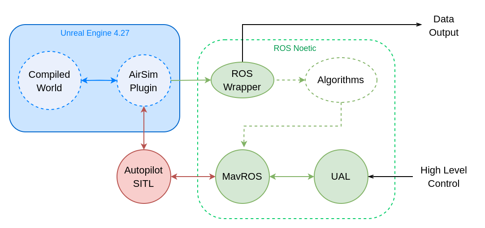
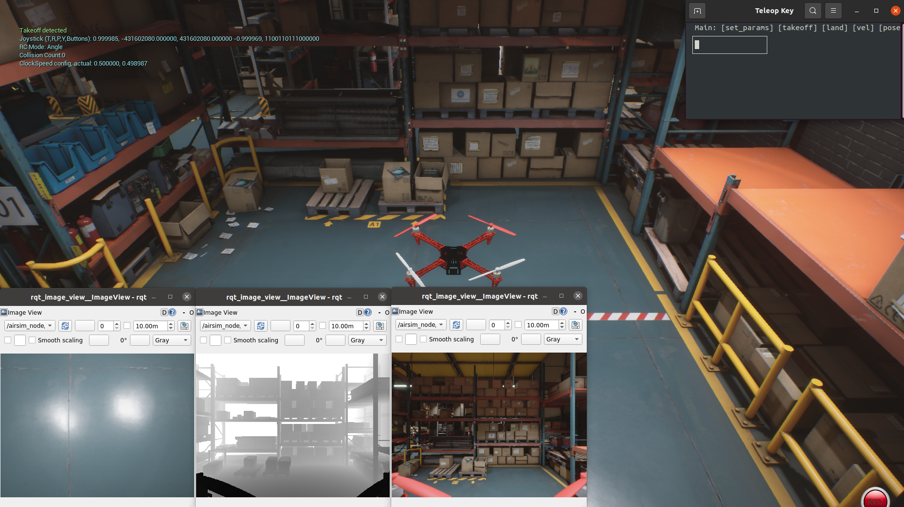

# SIMULATOR DOCKER DEPLOYMENT

This package contains the Dockerfiles and the necessary files to deploy the simulator in Docker containers. By this way, all the specific dependencies of each program are packaged and the simulator is ready to be used.

## Instaling and using the Simulator
### System minimum requirements
Linux OS and Nvidia GPU. Tested under Ubuntu 20.04 and Nvidia GTX 1650 using NVIDIA driver metapackage from nvidia-driver-470.

### System minimun installation

- [Tmux](https://github.com/tmux/tmux/wiki)
```
    sudo apt-get install tmux
```

- [Docker](https://docs.docker.com/desktop/install/ubuntu/)
```
    sudo apt-get update

    sudo apt-get install ca-certificates curl gnupg lsb-release

    sudo mkdir -p /etc/apt/keyrings

    curl -fsSL https://download.docker.com/linux/ubuntu/gpg | sudo gpg --dearmor -o /etc/apt/keyrings/docker.gpg

    echo \
    "deb [arch=$(dpkg --print-architecture) signed-by=/etc/apt/keyrings/docker.gpg] https://download.docker.com/linux/ubuntu \
    $(lsb_release -cs) stable" | sudo tee /etc/apt/sources.list.d/docker.list > /dev/null

    sudo apt-get update

    sudo apt-get install docker-ce docker-ce-cli containerd.io docker-compose-plugin
```

- Add user to [docker group](https://docs.docker.com/engine/install/linux-postinstall/) to run without sudo
```
    sudo groupadd docker
    sudo usermod -aG docker $USER
    newgrp docker
```

- Setting up [nvidia container toolkit](https://docs.nvidia.com/datacenter/cloud-native/container-toolkit/install-guide.html) for docker
```
    distribution=$(. /etc/os-release;echo $ID$VERSION_ID) && curl -fsSL https://nvidia.github.io/libnvidia-container/gpgkey | sudo gpg --dearmor -o /usr/share/keyrings/nvidia-container-toolkit-keyring.gpg && curl -s -L https://nvidia.github.io/libnvidia-container/$distribution/libnvidia-container.list | sed 's#deb https://#deb [signed-by=/usr/share/keyrings/nvidia-container-toolkit-keyring.gpg] https://#g' | sudo tee /etc/apt/sources.list.d/nvidia-container-toolkit.list

    sudo apt-get install -y nvidia-docker2
    sudo systemctl restart docker

```

- [ROS Noetic](http://wiki.ros.org) only necessary to work with the topics in your host, but you can get the data through the docker containers.


### Load compiled docker images

After depndencies have been installed, please run the following script to uncompress and load the docker images, this process may take a while:

```
    ./setup.sh
```
### Running simulator

To execute the simulator, you have to run the following script:

```
    ./launch.sh 
```

To see all the launching options you can type:

```
    ./launch.sh --help
```

For example, to execute the simulator with a pop-up window to manual control the UAV through keyboard, you have to run the following script:

```
    ./launch.sh --keyboard_control
```

The default indoor industrial world will be launched. Another worlds can be launched if placed in the simulator wolder. To do so, you can change the launched world with the following command:

```
    ./launch.sh -w <world_name>
```

Note: configure properly the .json files to change the simulator configuration: [sensors.json](settings/sensors.json) and [config_simulation.json](settings/config_simulation.json)

A custom simulation will be launched, with the following characteristics:
- Industrial store world is the default map.
- F450 UAV with a pointing down camera and a pointing forward rgbd camera are the default sensors. This can be changed modifying the [sensors.json](settings/sensors.json) file.
- PX4 SITL is the simulated autopilot which interacts with directly with the airsim API.
- UAL (UAV abstraction layer) is used to control the UAV
- A wrapper will be launched to expose all the embedded data through ROS topics.
- Safety pilot is simulated to let the UAV arm and take-off autonomously.
- A new window will be launched to control the UAV with the keyboard if --keyboard_control flag is set.
- Several windows to visualize the image data from the UAV.
- Through ros topics, the data can be accessed easily from the host if ROS is installed.

| Topic  | Message Type                                                               |          Description                          |
| ------------------------------------- | -------------------------------------------------------------------------- | --------------------------------------------- |
| /airsim_node/PX4/odom                 | [nav_msgs/Odometry](http://docs.ros.org/en/api/nav_msgs/html/msg/Odometry.html)       | Uses as ground truth of the UAV pose.          |
| imu/imu              | [sensor_msgs/Imu](http://docs.ros.org/en/api/sensor_msgs/html/msg/Imu.html)             | IMU data.                                     |
| camera_down/Scene    | [sensor_msgs/Image](http://docs.ros.org/en/api/sensor_msgs/html/msg/Image.html)         | Image data from the pointing down camera.      |
| camera_forward/Scene | [sensor_msgs/Image](http://docs.ros.org/en/api/sensor_msgs/html/msg/Image.html)         | Image data from the pointing forward camera.   |
| camera_forward_d/DepthPerspective | [sensor_msgs/Image](http://docs.ros.org/en/api/sensor_msgs/html/msg/Image.html) | Depth data from the pointing forward camera.   |

### Exiting simulator

To exit the simulator, you have to press 'Ctrl+b' and then 'd' in the terminal where the simulator was launched.
After 5s, the simulator will be stopped.

### Compiling from source
Alternativally, you can compile the docker images from source. To do so, you have to run the following script to compile the base images:

```
    cd Dockerfiles/base
    ./build_base_files.sh
```
After that, you can compile the top level images with the modificable entrypoint:

```
    ./build_images.sh
```

After that, you can launch the simulator in the exact same way. 

You can also save the compiled version of the images with the following script:

```
    ./save_images.sh
```

Note: in the parent directory of this package must be located all the source code dependencies as: airsim, airsim_ros_wrapper and grvc-ual. 

## Assets 
### Dynamic Assets 
Movable assets can be added to the world and controlled through predefined trajectories in the [settings/assets/dynamic.json](settings/assets/dynamic.json) file. Add a new item for each asset you want to add to the world. Take care that the "name" of item must be compiled in the UnReal world before adding it to the dynamic.json file.

Right now, the following objects are available in the IndustrialF450 world:
- **walker\<i\>**: a walking person. From walker0 to walker29.

The following code is necessary for each new item:

```
    "walker0":
    {
        "velocity": 1.25,
        "acceleration": 2.5,
        "cyclic": true,
        "waypoints":[[6.2,  6.9,  0],
                     [6.2,  26.2, 0],
                     [3.2,  26.2, 0],
                     [-0.1, 8.08, 0],
                     [-0.1, 26.2, 0],
                     [6.2,  26.2, 0],
                     [6.2,  6.9,  0]]
    }
```
These values of velocity and acceleration are the recommended ones for the walker. Generates a "realistic" trajectory within the walking animation velocity.

All the fields are:
- **"velocity"**: velocity of the asset in m/s.

- **"acceleration"**: acceleration of the asset in m/s^2.

- **"cyclic"**: if true, the asset will respawn when it finishes its trajectory. If false, the assets will dessapear when it finishes its trajectory.

- **"waypoints"**: list of waypoints in the form [x, y, z] in meters. The asset will follow the trajectory defined by the waypoints. The reference frame used will be the UAV reference frame in the take-off position (x: forward, y: left, z: up). In our case, the topic **/airsim_node/PX4/odom** can be used to retrieve positions in this reference frame. 

- **"type"**: type of the asset. You can add this field to spawn a new object of this type, instead of using the compiled ones. However, the spawned object will not be animated, so using this field is not recommended for the walker.

The trajectories will be generated through a linear-parabolic interpolation between the waypoints. The velocity and acceleration will be used to generate the 3D trajectory. The asset will start and finish with a zero velocity, and will use its acceleration to reach the desired cruising velocity. The acceleration will be also used to change the velocity direction when the asset changes its trajectory direction.

The acceleration must be **enough** to reach the desired velocity in each segment of the trajectory. Otherwise, the trajectory could be generated with errors and jumps.

Only are needed the positions of the waypoints, the orientation will be generated automatically. The orientation of the asset (pith&yaw) will point forward within the movement direction.

The generated trajectories of the last assets simulation will be saved in the [settings/assets/graphs/](settings/assets/graphs/) folder.

### Static Assets
A special type of movable asset are the static markers. They can be added to the world in static positions and orientations which will be configured in the [settings/assets/static.json](settings/assets/static.json) file following the next structure for each marker:

```
    "marker0":
    { 
        "type": "marker",
        "texture": "/aruco_markers_6x6/id_1.png",   
        "position":[2.0,  2.0,  0],
        "orientation":[0, 0, 45],
        "size": 1.0        
    }
```

The previous code will add a marker in the position [2.0, 2.0, 0] with a size of 1.0m on each side (square marker) and an orientation of 45º in the z axis with an aruco id of 0.

So, the required fields are:
- **"type"**: type of the asset. The name of the static asset you want to create a new instance. Only "marker" is tested.

- **"texture"**: path to the texture of the marker. The texture must be a png file. The texture will be placed in the [settings/assets/textures/](settings/assets/textures/) folder. The path must be relative to this folder.

- **"position"**: position of the marker in the form [x, y, z] in meters. The reference frame used will be the UAV reference frame in the take-off position (x: forward, y: left, z: up). In our case, the topic **/airsim_node/PX4/odom** can be used to retrieve positions in this reference frame.

- **"orientation"**: orientation of the marker in the form [pith, roll, yaw] in degrees. The reference frame used will be the same as in the position field.

- **"size"**: size of the length of the marker in meters.

Right now, the following markers are available in the IndustrialF450 world:
- **marker\<i\>**: an aruco marker with an id of \<i\> with a size of 6x6 pixels. From marker0 to marker30. The used aruco dictorionary is **DICT_6X6_250**.

#### Dummy UAVS
These are a special type of movable object. We can add dummy UAVs which will follow a trajectory in a realistic way. These UAVs don't simulate dynamics nor collisions, so they are computationally cheap. This could be de output of a multi UAV trajectory generation algorithm.

They can be configured in the [settings/assets/dummy_uavs.json](settings/assets/dummy_uavs.json) file following the next structure for each UAV:

```
    "uav_0": {
        "route": [
            {
                "x": 1.0,
                "y": 0.0',
                "z": 0.0
            },
            {
                "x": 1.0,
                "y": 1.0,
                "z": 1.0
            }
        ],
        "takeoff_time": 0.0,
        "max_vel": 0.25,
        "max_acc": 1.0,
        "cyclic": true
    }
```

So, the required fields are:
- **"route"**: list of waypoints in the form. The UAV will follow the trajectory defined by the waypoints. The reference frame used will be the UAV reference frame in the take-off position (x: forward, y: left, z: up). 
- **"takeoff_time"**: time in seconds to wait before the UAV starts to follow the trajectory. This is useful to avoid collisions with the main UAV or other assets.
- **"max_vel"**: maximum velocity of the UAV in m/s.
- **"max_acc"**: maximum acceleration of the UAV in m/s^2.
- **"cyclic"**: if true, the UAV will restart when it finishes its trajectory. If false, the UAV will remains in the floor when it finishes its trajectory.


**Note:** the UAV will be spawned at the first waypoint in the floor, then will take-off to the first waypoint. So, the first waypoint must be at certein height (take-off height).

**Note:** all the movable objects (dynamic assets and dummy UAVs) will publish their poses in ROS topics following the next structure: **/airsim_node/\<name\>/pose**. So, the pose of the uav_0 will be published in the topic **/airsim_node/uav_0/pose**. The reference frame of these poses will be the take-off position of the main UAV (PX4/odom).

## Markers detector node
This node is in charge of detect markers and publish estimate TFs and poses from the camera link. 

### Input
- Image: [sensor_msgs/Image](http://docs.ros.org/en/api/sensor_msgs/html/msg/Image.html) 
  
### Output
- TFs: named as "marker_id".
- Poses: topic **/aruco_target_detector_node/markersarray_pose**. This topic publish an array of all the markers that are recognized in the input image.
- Detection image: **/aruco_target_detector_node/target_image**. This image shows the detection of the markers.

### Parameters
These parameters can be configured in [aruco_detector_node.launch](settings/algorithms/aruco_ros_detector/launch/aruco_detector_node.launch).
- *Input image topic* 
- *Camera frame id* 
- *markers size:* Size of the markers. (Maybe in a future could be a vector with different sizes depending of ID).
- *cam matrix:* Intrinsic parameters from camera.
- *dist coeffs:* Distorsion coefficients from camera.

## COLIBRI Simulation
\TODO


## Structure of the simulator

The simulator is composed by the following nodes:




The following view shows the simulator running:


