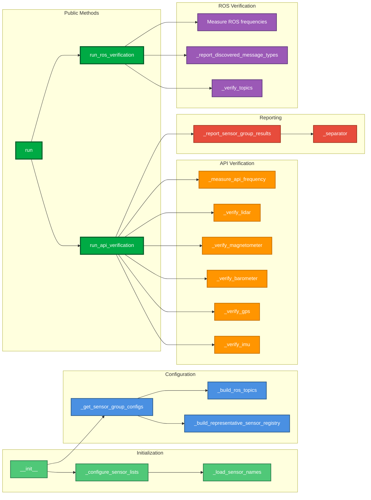

# Verify_sensors - Methods Organization

---

## Colors legend

| Color | Category | Description |
|-------|-----------|-------------|
| 🟢 Light Green | **Initialization** | Initial load from JSON |
| 🔵 Blue | **Configuration** | Registers configuration and mapping |
| 🟠 Orange | **API Verification** | Verification via AirSim API |
| 🟣 Purple | **ROS Verification** | Verification via ROS topics |
| 🔴 Red | **Reporting** | Reports Generation |
| 🟢 Dark Green | **Public Methods** | Methods of public entry |

## Relaciones

- **Initialization** → **Configuration**: The initial methods prepare configurations
- **Public Methods** → **API Verification**: `run_api_verification()` uses all the API verification methods
- **Public Methods** → **ROS Verification**: `run_ros_verification()` uses all the ROS verification method
- **Public Methods** → **Reporting**: Both verifications use report methods
