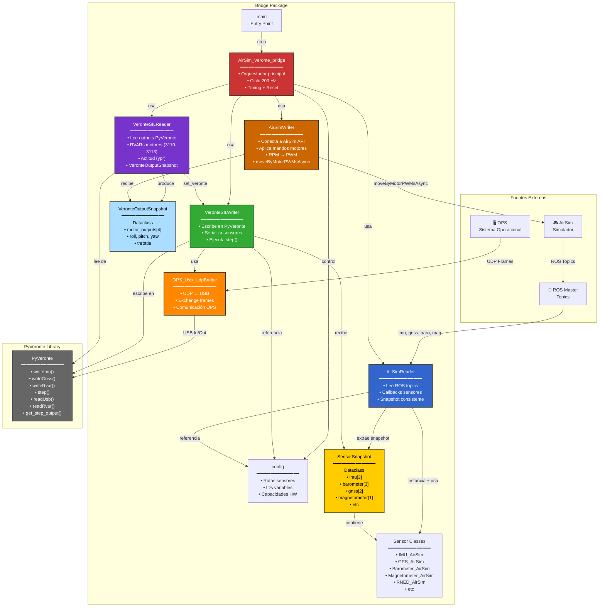
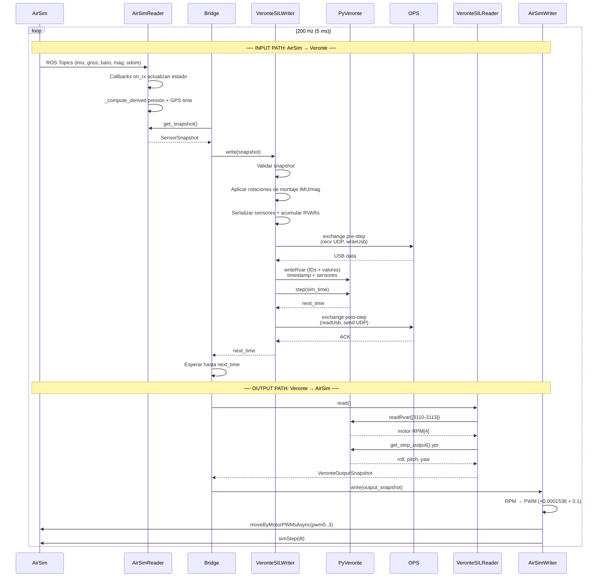

# Bridge AirSim ↔ Veronte SIL - Arquitectura de Clases

Diagrama de arquitectura mostrando clases principales, interacciones y responsabilidades.

El sistema implementa **dos pipelines complementarios**:
- **Input path:** AirSim → `AirSimReader` → `VeronteSILWriter` → PyVeronte (sensores)
- **Output path:** PyVeronte → `VeronteSILReader` → `AirSimWriter` → AirSim (mandos motores)

---

## Arquitectura General



---

## Responsabilidades por Clase

### 1. **AirSim_Veronte_bridge** 🎯
**Rol:** Orquestador principal

**Tareas:**
- ✅ Inicializa sistema (reader + writer + verontesil_reader + airsim_writer)
- ✅ Ciclo principal a 200 Hz
- ✅ Espera timing correcto entre steps
- ✅ Obtiene snapshot de AirSim
- ✅ Escribe sensores en Veronte
- ✅ Ejecuta step de Veronte
- ✅ Lee outputs de Veronte (motores, actitud)
- ✅ Escribe outputs en AirSim
- ✅ Logging periódico (cada 5s)
- ✅ Detecta reset de Veronte
- ✅ Maneja SIGINT/SIGTERM

**Métodos:**
- `__init__(args)` - Crea airsim_reader + verontesil_writer + verontesil_reader + airsim_writer
- `start()` - Inicia ROS subscribers + PyVeronte + AirSim writer
- `step_callback()` - Ciclo 200 Hz
- `_log_status()` - Print sensor data
- `_handle_reset_request()` - Reinicia si Veronte lo pide
- `stop()` - Cleanup

**Frecuencia:** 200 Hz (5 ms por ciclo)

---

### 2. **AirSim_reader** 📖
**Rol:** Extrae datos de AirSim

**Tareas:**
- ✅ Se suscribe a ROS topics (IMU, GPS, Barometer, Magnetometer, Odometry)
- ✅ Callbacks actualizan estado interno
- ✅ Computa sensores derivados (presión dinámica, GPS time)
- ✅ Mantiene snapshot consistente
- ✅ Protege con locks contra race conditions

**ROS Topics Suscritos:**
```
/airsim_node/Veronte/imu/Imu_ADIS          → IMU_AirSim[0]
/airsim_node/Veronte/imu/Imu_Secondary     → IMU_AirSim[1]
/airsim_node/Veronte/imu/Imu_BMI           → IMU_AirSim[2]

/airsim_node/Veronte/gnss/Gps_1            → GPS_AirSim[0]
/airsim_node/Veronte/gnss/Gps_2            → GPS_AirSim[1]

/airsim_node/Veronte/barometer/Baro_*      → Barometer_AirSim[0..2]
/airsim_node/Veronte/magnetometer/...      → Magnetometer_AirSim[0]
/airsim_node/Veronte/odom                  → RNED + GNSS velocity
```

**Métodos:**
- `start()` - Suscribirse + timers
- `stop()` - Desuscribirse
- `get_snapshot()` - Retorna copia consistente
- `_build_callback()` - Factory de callbacks
- `_on_odom()` - Actualiza velocidad + RNED
- `_compute_derived()` - Timer-driven sensors

---

### 3. **VeronteSILWriter** ✍️
**Rol:** Escribe sensores en Veronte SIL

**Tareas:**
- ✅ Inicializa PyVeronte library
- ✅ Recibe SensorSnapshot
- ✅ Valida datos
- ✅ Aplica rotaciones de montaje IMU y magnetómetro (IMU_MOUNT_ROT_MAT)
- ✅ Serializa cada sensor (writeImu, writeGnss, writeRvar, etc)
- ✅ Acumula RVARs pendientes
- ✅ Ejecuta step de Veronte
- ✅ Exchange USB con OPS (pre + post step)
- ✅ Sanitiza valores RVAR (arrays → scalars)
- ✅ Lee outputs para debug

**Métodos:**
- `start()` - Init PyVeronte + OPS bridge
- `stop()` - Libera PyVeronte
- `reset_if_requested()` - Reinicia SIL si Veronte lo solicita
- `write(snapshot)` - Serializa sensores
- `step(sim_time)` - Ejecuta Veronte + OPS exchange
- `_collect_var_ids()` - Agrega IDs de variables
- `_validate_snapshot()` - Valida estructura
- `_read_outputs()` - Debug logging

**Serialización de Sensores:**
```
IMU           → veronte.writeImu(id, acc, gyr, temp)  [con rotación de montaje]
Barometer     → veronte.writeRvar([502], [pressure_Pa])
Dyn Pressure  → veronte.writeRvar([512], [pressure_Pa]) + TAS calculado
Magnetometer  → veronte.writeMag(id, field, temp)  [con rotación de montaje]
               + veronte.writeRvar([RVARs], [Bx, By, Bz])
GNSS          → veronte.writeGnss(id, fix, pos, vel, accuracy)
RNED          → veronte.writeRnedRaw(id, fix, pos_cm, pos_dmm, acc)
GPS Time      → veronte.writeGnssTime(week, tow_s)
```

---

### 4. **VeronteSILReader** 📤
**Rol:** Lee outputs de control de PyVeronte

**Tareas:**
- ✅ Lee RVARs de motores (3110–3113) tras cada step
- ✅ Lee actitud estimada (roll, pitch, yaw) via `get_step_output().ypr`
- ✅ Calcula throttle medio a partir de los cuatro motores
- ✅ Produce `VeronteOutputSnapshot` con todos los outputs
- ✅ Soporte de callbacks opcionales

**Métodos:**
- `start()` - Pre-push RVAR request de motores
- `stop()` - Marca como inactivo
- `set_veronte(veronte)` - Adjunta instancia PyVeronte (llamado tras reset)
- `read()` - Lee motores + actitud + throttle → `VeronteOutputSnapshot`
- `register_callback(fn)` - Registra callback post-read

**Outputs leídos:**
```
RVAR 3110-3113  → motor_outputs[4]  (RPM, float)
step_output.ypr → roll, pitch, yaw  (rad)
media motores   → throttle          (0.0–1.0)
```

---

### 5. **AirSimWriter** 🎮
**Rol:** Aplica los outputs de Veronte a AirSim

**Tareas:**
- ✅ Conecta a AirSim API (MultirotorClient)
- ✅ Habilita API control + arma el vehículo
- ✅ Convierte RPM → PWM (escala 1/6500 + offset 0.1)
- ✅ Envía PWM a AirSim via `moveByMotorPWMsAsync`
- ✅ Avanza reloj de simulación (`simStep`)
- ✅ Alternativa: control por actitud (`moveByRollPitchYawThrottleAsync`)

**Métodos:**
- `start()` - Conecta AirSim, habilita API control
- `stop()` - Desarma, libera control
- `write(snapshot)` - Aplica `_write_motor_pwm()`
- `_write_motor_pwm(snapshot)` - RPM[4] → PWM[4] → AirSim
- `_write_motor_ypr(snapshot)` - Actitud + throttle → AirSim (alternativa)

**Conversión RPM → PWM:**
```
pwm = (rpm * 0.0001538) + 0.1  si rpm > 50
pwm = 0.0                       si rpm ≤ 50
pwm = min(pwm, 1.0)             (clampeado a 1.0)
```

---

### 6. **OPS_Usb_UdpBridge** 📡
**Rol:** Comunica con OPS

**Tareas:**
- ✅ Abre socket UDP
- ✅ Recibe frames UDP de OPS
- ✅ Escribe USB input en PyVeronte
- ✅ Lee USB output de PyVeronte
- ✅ Envía frames UDP a OPS
- ✅ Logging estadístico

**Métodos:**
- `start()` - Abre socket UDP
- `stop()` - Cierra socket
- `exchange(veronte, send_output, process_input)` - Ciclo completo

**Flujo USB:**
```
Pre-Step:
  UDP recv (1024 bytes) → _in_udp_buff
  _in_udp_buff → veronte.writeUsb()

Post-Step:
  veronte.readUsb() → out_data
  out_data → UDP send
```

---

### 7. **SensorSnapshot** 📦
**Rol:** Contenedor de datos de sensores AirSim → Veronte

**Estructura:**
```python
@dataclass
class SensorSnapshot:
    imu: List[IMU_AirSim]                    # [0], [1], [2]
    barometer: List[Barometer_AirSim]        # [0], [1], [2]
    dynamic_pressure: Dynamic_pressure_AirSim # Computado
    magnetometer: List[Magnetometer_AirSim]  # [0]
    gnss: List[GPS_AirSim]                   # [0], [1]
    rned: List[RNED_AirSim]                  # [0], [1]
    lidar: List[Lidar_AirSim]                # [0..4] (deshabilitado)
    gps_time: GPS_Time_AirSim                # Computado
```

---

### 8. **VeronteOutputSnapshot** 📦
**Rol:** Contenedor de outputs Veronte → AirSim

**Estructura:**
```python
@dataclass
class VeronteOutputSnapshot:
    motor_outputs: List[float]  # [0..3] RPM motores (RVAR 3110-3113)
    roll: float                 # rad (de step_output.ypr)
    pitch: float                # rad
    yaw: float                  # rad
    throttle: float             # 0.0-1.0 (media de los 4 motores escalada)
```

---

### 9. **Sensor Classes** 🔌
**Rol:** Datos de sensores individuales

**Clases:**
- `IMU_AirSim` - Aceleración + Giroscopio
- `GPS_AirSim` - Posición + Velocidad GNSS
- `Barometer_AirSim` - Presión estática
- `Magnetometer_AirSim` - Campo magnético
- `Dynamic_pressure_AirSim` - Presión dinámica (computada)
- `GPS_Time_AirSim` - Tiempo GPS (computado)
- `RNED_AirSim` - Posición relativa NED
- `Lidar_AirSim` - Distancia mínima (deshabilitado)

**Interfaz común:**
```python
class Sensor:
    def on_rx(msg) → Dict  # Procesa ROS message
    def to_dict() → Dict   # Retorna datos normalizados
```

---

### 10. **config** ⚙️
**Rol:** Configuración centralizada

**Contenido:**
```python
VEHICLE_NAME = "Veronte"

BAROMETERS = ["Baro_HSC", "Baro_MS56", "Baro_DPS310"]
IMUS = ["Imu_ADIS", "Imu_Secondary", "Imu_BMI"]
GPS_SENSORS = ["Gps_1", "Gps_2"]
MAGNETOMETERS = ["Magnetometer_LIS", ...]
LIDARS = ["Lidar_1", ..., "Lidar_5"]

VER_N_IMU = 3       # Veronte capacidad
VER_N_STP = 1       # Barometers
VER_N_GNSS = 2      # GPS receivers
VER_N_MAG = 1       # Magnetometers
VER_N_RNED = 2      # RNED sensors
VER_N_LIDAR = 5     # Lidar sensors

AIRSIM_TOPIC_BASE = "/airsim_node/Veronte"
AIRSIM_IMU_TOPICS = [f"{AIRSIM_TOPIC_BASE}/imu/{name}" for name in IMUS]
# ... etc
```

---

## Flujo de Datos Principal



---

## Dependencias entre Clases

```
AirSim_Veronte_bridge
├── crea → AirSimReader
│   ├── usa → config (topic names, capacidades)
│   ├── suscribe a → ROS Topics
│   └── retorna → SensorSnapshot
│       └── contiene → Sensor classes
│
├── crea → VeronteSILWriter
│   ├── usa → config (IDs variables, rotaciones)
│   ├── crea → OPS_Usb_UdpBridge
│   ├── usa → PyVeronte library
│   └── recibe → SensorSnapshot
│
├── crea → VeronteSILReader
│   ├── set_veronte() ← recibe PyVeronte de VeronteSILWriter
│   ├── lee de → PyVeronte (RVARs motores, step_output.ypr)
│   └── retorna → VeronteOutputSnapshot
│
├── crea → AirSimWriter
│   ├── conecta a → AirSim API (MultirotorClient)
│   └── recibe → VeronteOutputSnapshot
│
└── ejecuta ciclo 200 Hz
    ├── airsim_reader.get_snapshot()
    ├── verontesil_writer.write(snapshot)
    ├── verontesil_writer.step(sim_time)  ← step ejecutado aquí
    ├── verontesil_reader.read()          ← outputs leídos DESPUÉS del step
    └── airsim_writer.write(output_snapshot)
```

---

## Tabla Resumen: Clases y Tareas

| Clase | Rol | Entrada | Salida | Llamadas a |
|-------|-----|---------|--------|-----------|
| **AirSim_Veronte_bridge** | Orquestador | args | next_time | airsim_reader, verontesil_writer, verontesil_reader, airsim_writer, config |
| **AirSimReader** | Lectura sensores | ROS topics | SensorSnapshot | config |
| **VeronteSILWriter** | Escritura sensores | SensorSnapshot | next_time | PyVeronte, OPS_Usb_UdpBridge, config |
| **VeronteSILReader** | Lectura outputs | PyVeronte (post-step) | VeronteOutputSnapshot | PyVeronte |
| **AirSimWriter** | Escritura mandos | VeronteOutputSnapshot | — | AirSim API |
| **OPS_Usb_UdpBridge** | Comunicación | UDP socket | USB data | socket, PyVeronte |
| **SensorSnapshot** | Contenedor input | (constructor) | Datos sensores | sensor classes |
| **VeronteOutputSnapshot** | Contenedor output | (constructor) | motor_outputs, ypr, throttle | — |
| **Sensor classes** | Datos input | ROS msg | Dict normalizado | — |
| **config** | Config | (global) | Constantes | reader, writer |

---

## Ciclo Completo en Pseudocódigo

```python
def main():
    bridge = AirSim_Veronte_bridge(args)
    bridge.main()

def bridge.main():
    bridge.start()  # airsim_reader.start() + verontesil_writer.start()
                    # + verontesil_reader.start() + airsim_writer.start()
    while running:
        bridge.step_callback()

def bridge.step_callback():
    # WAIT PHASE
    while sim_time < next_time:
        sleep(remaining_time)
        sim_time = now()
    
    # ── INPUT PATH ──
    # READ PHASE
    snapshot = airsim_reader.get_snapshot()
    
    # WRITE PHASE
    verontesil_writer.write(snapshot)   # serializa sensores + rotaciones montaje
    
    # STEP PHASE
    next_time = verontesil_writer.step(sim_time)   # ejecuta PyVeronte + OPS exchange
    
    # ── OUTPUT PATH ──
    # READ VERONTE OUTPUTS (post-step)
    output_snapshot = verontesil_reader.read()   # motores + actitud
    
    # WRITE TO AIRSIM
    airsim_writer.write(output_snapshot)   # RPM → PWM → AirSim
    
    # LOG PHASE
    if time_since_last_log >= 5s:
        bridge._log_status(snapshot)
    
    # RESET CHECK
    if verontesil_writer.reset_if_requested():
        verontesil_reader.set_veronte(verontesil_writer._veronte)
        verontesil_reader.start()

def airsim_reader.get_snapshot():
    return self._snapshot.copy()   # copia thread-safe del snapshot interno

def verontesil_writer.write(snapshot):
    veronte.writeImu(...)          # acc/gyr con rotación de montaje
    veronte.writeRvar(...)         # barometro, presión dinámica + TAS
    veronte.writeMag(...)          # campo magnético con rotación de montaje
    veronte.writeGnss(...)
    veronte.writeRnedRaw(...)
    veronte.writeGnssTime(...)

def verontesil_writer.step(sim_time):
    ops_bridge.exchange(veronte, send_output=False, process_input=True)
    veronte.writeRvar([3140] + pending_rvar_ids, [sim_time] + pending_rvar_vals)
    next_time = veronte.step(sim_time)
    ops_bridge.exchange(veronte, send_output=True, process_input=False)
    return next_time

def verontesil_reader.read():
    motor_outputs = veronte.readRvar([3110, 3111, 3112, 3113])   # RPM
    roll, pitch, yaw = veronte.get_step_output().ypr
    throttle = mean(motor_outputs) * 0.0001538
    return VeronteOutputSnapshot(motor_outputs, roll, pitch, yaw, throttle)

def airsim_writer.write(output_snapshot):
    pwm[i] = clamp(rpm[i] * 0.0001538 + 0.1, 0.0, 1.0)  if rpm[i] > 50 else 0.0
    client.moveByMotorPWMsAsync(pwm0, pwm1, pwm2, pwm3, dt)
    client.simStep(dt)
```

---

**Última actualización:** 1 de junio de 2026  
**Branch:** feature/2964_data_from_pyveronte_into_airsim
