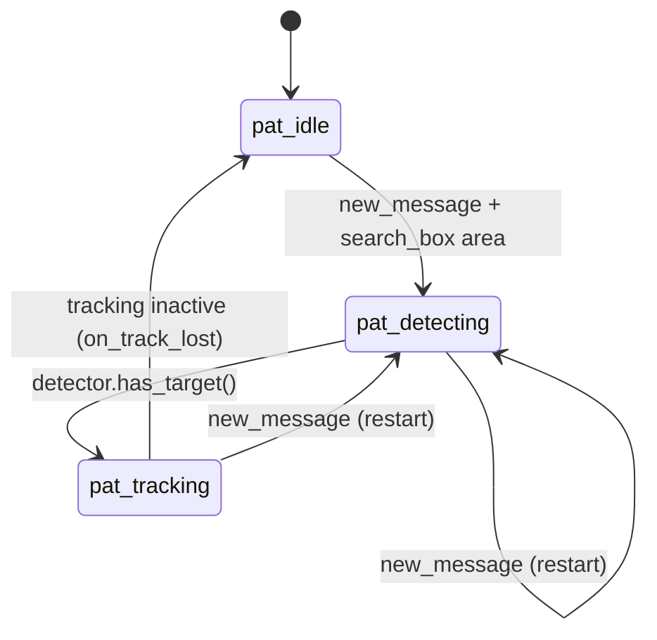

# Point and Track (PAT) Pipeline

> Scope: the Point-and-Track functionality **from `Ppoint_track` downwards**, at a high/medium level.
> It covers how an operator selection arrives, how the `System_pat` state machine reacts, which
> components make up the detection and tracking systems, and how the whole thing hooks into the
> inference infrastructure.
>
> For everything about the ONNX inference engine, abstraction layers and runner orchestration, see
> [`Inference_architecture.md`](../../../code/docs/Inference_architecture.md). This document references
> that one rather than duplicating it.
>
> Namespace `Vbn`, cross-compiled aarch64, static memory (`Base::Memmgr`), JSF++ constraints.

## 1. What PAT does

PAT locks onto a single operator-selected object and keeps reporting its line-of-sight (LOS) rates so
the platform can steer toward it (proportional navigation). It runs as an independent process,
`Ppoint_track`, fed by the same `Pcapturing` frame stream as SLAM and visual odometry.

```
MAVLink rect ─▶ Mavlink_subscriber ─▶ Pmavlink_listener ─┐
                                                         ├─▶ search_box + new_message
Pcapturing ─▶ Llhpframe stream ─▶ Ppoint_track.Run() ────┘
                                       │
                                       ├─▶ System_pat (state machine)
                                       ├─▶ IDetection_system           (detecting)
                                       ├─▶ ITracking_system            (tracking)
                                       ├─▶ Los_rate_estimator          (LOS rates)
                                       └─▶ Debug_msgs_pub.publish_pat_state(...) + visualization
```

## 2. Entry point: operator selection over MAVLink

1. A ground message carrying a **normalized** rectangle (`[0,1]` in image coordinates) is received by
   `Mavlink_subscriber` (UDP, MAVLink transport).
2. `Pmavlink_listener::run()` (its own thread) reads the last `Mavlink_msg_rect`, denormalizes it
   against the current frame size, writes it into the shared `search_box` (`Rrect`), and raises the
   `volatile bool new_message` flag:

   ```
   search_box.set_x(msg->rect.get_x() * frame_width);   // and y / width / height
   new_message = true;
   ```

3. `search_box` and `new_message` are shared by reference with `Ppoint_track` / `System_pat`; they are
   the only inputs needed to (re)start the pipeline.

## 3. State machine: `System_pat`

`System_pat` owns the PAT control logic. It has three states:

| State | Meaning | Exit condition |
|---|---|---|
| `pat_idle` | Waiting for a selection | A new MAVLink rectangle arrives |
| `pat_detecting` | Detection system searching inside `search_box` | Detection system produces a target |
| `pat_tracking` | Tracking system locked on the target | Tracking system goes inactive (track lost) |

`step()` is called once per frame and works in two parts:

1. **Priority override** — if `new_message` is set and `search_box` has area, `on_new_selection()`
   runs regardless of the current state: it clears the flag, calls `detector.reset()` (which
   propagates into `IDetection_system`) and resets the tracking system, then switches to
   `pat_detecting`.
2. **State dispatch**:
   - `pat_idle`: do nothing.
   - `pat_detecting`: if `detector.has_target()`, call `on_detection_acquired()` — take the target
     via `detector.get_target()`, initialize the focus/context windows around it
     (`init_tracking_windows`), and switch to `pat_tracking`.
   - `pat_tracking`: if `!tracking.is_active()`, call `on_track_lost()` — reset and return to
     `pat_idle`.



The helpers `can_step_detector()` / `can_step_tracking()` expose the state so the process only runs
the heavy stages that the current state requires.

## 4. Process orchestration: `Ppoint_track::Run()`

Per new frame (gated on `frame_counter` to skip already-processed frames):

1. Copy the latest `Llhpframe` from the reader into `curr_lpf`.
2. `sys_pat->step()` — advance the state machine.
3. If `can_step_detector()` → `detection_system->step()` and read timing from
   `detection_system->get_last_stats().time_total_ms` into `time_detector_ms`.
4. If `can_step_tracking()` → `tracking->step()` then `los_rate_estimator_->step()`; otherwise
   `los_rate_estimator_->reset()` to avoid stale LOS state.
5. `log_pat_entry(...)` — record timestamp, detector time, the tracking system's
   `Pat_tracking_stats`, and the PAT status.
6. `publisher_msgs.publish_pat_state(los_p, los_q, los_r, confidence, status)` — broadcast the unified
   PAT output (LOS rates, confidence, status). Confidence is zeroed when the LOS output is not valid.
7. `draw_visualization()` — render the crosshair/boxes onto an output frame for streaming.
8. Roll `curr_lpf`/`curr_window` into `prev_lpf`/`prev_window` for the next iteration.

## 5. PAT components and interfaces

The process holds every component behind an interface and wires them in the constructor; everything is
pre-allocated from `Base::Memmgr`.

| Role | Interface | Notes |
|---|---|---|
| Frame source | `ILlhpframe_reader` | Shared `Pcapturing` stream |
| Detection system | `IDetection_system` | Wraps one or more detectors + selection policy; searched during `pat_detecting` |
| Tracking system | `ITracking_system` | Pluggable: `Tracking_system_lightfc` or `Tracking_system_dcf` |
| LOS rate estimator | `Los_rate_estimator` | Turns target image motion + extrinsics into LOS rates for guidance |
| Working windows | `Visual_window_dual` | Focus + context ROIs around the target |
| Ego-motion | `Egomotion_compensator` | Compensates camera motion for the tracking stage |

### 5.1 `IDetection_system` contract

```
step()  reset()  has_target()  get_target()  get_last_stats()  set_debug_stream()
```

`System_pat` and `Ppoint_track` only ever talk to the `IDetection_system` interface — they have no
knowledge of which detectors are active underneath. `get_last_stats()` returns a `Detection_stats`
value type (time, confidence, target area, active detector index) used for logging and timing.
`set_debug_stream()` has a default no-op implementation; concrete classes override it to forward the
stream to the relevant sub-detector.

### 5.2 `Detection_system_traditional` (classical CV)

The current concrete implementation. Built by `Ppoint_track` and passed to `System_pat` as an
`IDetection_system&`.

It owns a fixed vector of `Iobject_detector*` and a size threshold that drives active-detector
selection:

```
detectors[0]  ─  Object_detector_spectral   (small/distant objects; always built)
detectors[1]  ─  Object_detector_mser       (larger/closer objects; multi mode only)

switch_threshold  ─  configured via GetPatDetectorSizeThreshold()
```

**Single mode** (`GetPatMultiDetectorEnabled() == false`): only `detectors[0]` is built;
`active_detector` is fixed to it for the lifetime of the session.

**Multi mode**: both detectors are built. On every `reset()` call, `select_active()` compares the
larger side of `search_box` (in pixels) against `switch_threshold`:

- `metric <= switch_threshold` → `detectors[0]` (spectral, for small objects)
- `metric > switch_threshold`  → `detectors[1]` (MSER, for larger objects)

`step()` runs only the `active_detector`, then snapshots timing and confidence into `Detection_stats`.
All detectors are reset on each `reset()` regardless of which one is active.

#### `Object_detector_spectral`

Frequency-domain saliency detector aimed at small/distant objects. Uses a log-spectrum residual to
find statistically anomalous regions against the background; does not use MSER or gradient features.

#### `Object_detector_mser`

Maximally Stable Extremal Regions detector for larger or closer objects. Pipeline:
MedianBlur → adaptive CLAHE → MSER detection → region filtering (extent, aspect, centrality,
boundary penalty) → seed + merge → intensity-weighted centroid.

All OpenCV working state (`cv::Ptr<MSER>`, `cv::Ptr<CLAHE>`, region lists, scratch matrices) is
isolated inside an opaque `Mser_workspace` struct defined in the `.cpp` (PIMPL), so the class header
and method signatures are free of OpenCV and `std::` types.

### 5.3 `ITracking_system` contract

`step()`, `reset()`, `is_active()`, `get_confidence()`, `get_last_stats()`. The state machine only ever
asks `is_active()` (to detect track loss) and reads `get_confidence()` / `get_last_stats()` for
output and logging — it never knows the concrete implementation.

### 5.4 `Tracking_system_lightfc` (AI-based)

The LightFC tracking system uses a LightFC AI single-object tracker as the **sole primary measurement
source**, complemented by an EKF (no optical-flow stage). Internally it holds an array of
`Itracker_sot*`:

- `vtrackers[0]` — the LightFC primary tracker (`Tracker_sot_lightfc`).
- `vtrackers[1]` — the EKF tracker.

Each `step()`:
1. Runs the primary tracker, recording its phase timing into `Pat_tracking_stats`
   (`time_primary_preproc_ms` / `infer_ms` / `postproc_ms`). The timing is read **polymorphically**
   through `Itracker_sot::get_last_timing()` — no downcast to the concrete LightFC type.
2. Feeds the result to the EKF gate, producing the fused `target` measurement and confidence.

`Tracking_system_dcf` is the alternative classic implementation (DCF + optical flow), interchangeable
through the same `ITracking_system` contract.

## 6. Outputs

- **`Detection_stats`** — per-step snapshot from the detection system (time, confidence, active
  detector index) read by `Ppoint_track` for timing logs.
- **`Pat_tracking_stats`** — per-step snapshot (primary/EKF timings, box areas, EKF velocity,
  confidence, measurement source) logged via `log_pat_entry`.
- **`publish_pat_state`** — LOS rates + confidence + status pushed onto the debug/CAN message bus
  (`Debug_msgs_pub`).
- **Visualization** — `draw_crosshair` / `draw_visualization_rgb` overlay the target box and the
  focus/context windows for the RTSP/TCP stream.

## 7. How PAT hooks into the AI inference infrastructure

PAT itself contains **no ONNX or provider code**. The link is one layer deep, through interfaces:

```
Tracking_system_lightfc
   └─ Itracker_sot*  (Tracker_sot_lightfc)            ← PAT-level tracker abstraction
        └─ create_tracking_runner(...)  → Itracking_runner*   ← inference factory + neutral contract
             └─ Lightfc_cuda_runner (Graph_runner<Detection> + Itracking_runner)
                  └─ Onnx_inference_engine ×3 (template / search / head)
```

Key points (all detailed in [`Inference_architecture.md`](../../../code/docs/Inference_architecture.md)):

- `Tracker_sot_lightfc` does **not** name a concrete runner. It calls the build-selected
  `create_tracking_runner(...)` factory and holds the result as an `Itracking_runner*`, so the same
  PAT code will drive a future TI runner unchanged.
- Diagnostics cross the boundary as the generic, provider-agnostic `Inference_timing` and
  `Tracking_score_info` value types; the tracking system surfaces them in `Pat_tracking_stats`
  without any LightFC- or CUDA-specific knowledge.
- The runner internally orchestrates the three ONNX engines (template backbone, search backbone,
  fusion head) via `tensor_link`; that orchestration is owned entirely by the inference layer.
